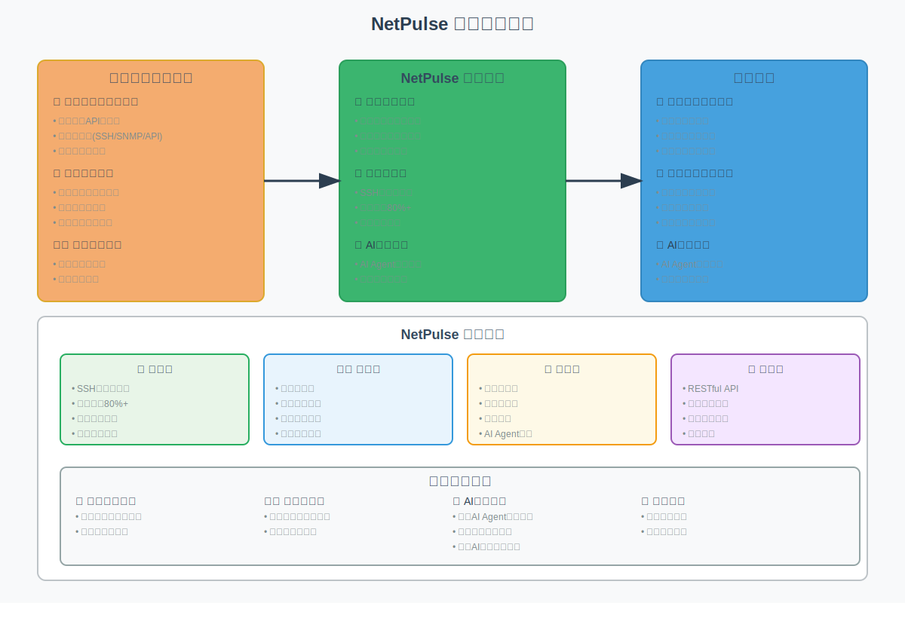

# NetPulse

[](https://hub.docker.com)
[](https://python.org)
[](LICENSE)
[](https://netpulse.readthedocs.io/)

简体中文 | [English](README.md)

NetPulse 是一个专为现代网络自动化设计的高性能分布式网络设备管理API框架。它通过长连接技术提供统一接口，并通过插件机制无缝集成Netmiko、NAPALM等主流开源工具和PyEAPI等厂商API，让网络设备管理变得简单、高效、可靠。

## 为什么选择 NetPulse？



## 系统特性

* **高性能**: 通过持久化SSH连接技术，使设备连接响应速度和成功率大幅提升，资源消耗降低。相比传统的逐次建连方式，NetPulse 可以将设备操作响应时间从 2-5 秒降低到 0.5-0.9 秒。

* **分布式架构**: 采用可扩展的多主节点设计，支持横向扩展。每个节点都可以独立处理设备连接和命令执行，通过 Redis 集群实现节点间的任务协调，系统可基于docker和k8s部署实现高可用性。

* **统一接口**: 提供统一的 RESTful API，屏蔽不同厂商设备的差异。无论是 Cisco、华为还是其他厂商的设备，都可以通过相同的 API 接口进行操作，大大简化了网络自动化的开发工作。

### 技术架构


### 插件系统

NetPulse 提供了强大的插件系统，支持多种功能扩展：

* **设备驱动**: 
  - 支持 Netmiko (Cisco/Huawei/Juniper等)
  - 支持 NAPALM (配置管理/状态检查)
  - 支持 PyEAPI (Arista EOS)
  - 支持 Paramiko (Linux服务器)
  - 支持自定义协议扩展

* **模板引擎**: 
  - Jinja2 配置模板
  - TextFSM/TTP 结构化解析
  - 自定义解析器支持

* **调度器**: 负载均衡、设备亲和性、自定义策略

* **Webhook**: 事件通知、外部触发、数据同步

## 快速开始

NetPulse 提供了详细的文档，包括快速入门、架构说明、API参考和最佳实践等。访问我们的文档站点获取完整指南：

* [📖 快速入门](https://netpulse.readthedocs.io/zh/latest/getting-started/quick-start.html) - 5分钟快速上手
* [🏗️ 架构设计](https://netpulse.readthedocs.io/zh/latest/architecture/architecture-overview.html) - 系统架构概览
* [🔌 API 参考](https://netpulse.readthedocs.io/zh/latest/api/api-overview.html) - 完整的 RESTful API 文档
* [⚙️ 插件开发](https://netpulse.readthedocs.io/zh/latest/reference/development-guide.html) - 构建自定义驱动和插件
* [🚀 部署指南](https://netpulse.readthedocs.io/zh/latest/getting-started/deployment-guide.html) - 生产环境部署说明

### Docker 一键部署

```bash
# 克隆项目
git clone https://github.com/scitix/netpulse.git
cd netpulse

# 一键部署
bash ./scripts/docker_auto_deploy.sh
```

### 手动配置部署

```bash
# 1. 生成环境配置
bash ./scripts/setup_env.sh generate

# 2. 配置必要的环境变量
cat << EOF > .env
NETPULSE_REDIS__PASSWORD=your_secure_redis_password
NETPULSE_SERVER__API_KEY=your_secure_api_key
TZ=Asia/Shanghai
EOF

# 3. 启动服务
docker compose up -d

### 快速API测试

部署完成后，使用简单的健康检查测试API：

```bash
# 测试健康检查端点
curl -H "X-API-KEY: your_secure_api_key" http://localhost:9000/health

# 测试设备命令（请替换为您的设备详情）
curl -X POST http://localhost:9000/device/execute \
  -H "X-API-KEY: your_secure_api_key" \
  -H "Content-Type: application/json" \
  -d '{
    "driver": "netmiko",
    "connection_args": {
      "device_type": "cisco_ios",
      "host": "192.168.1.1",
      "username": "admin",
      "password": "admin123"
    },
    "command": "show version"
  }'
```

## 参与贡献

我们欢迎任何形式的贡献！以下是参与项目的方式：

1. Fork 本仓库
2. 创建您的特性分支 (`git checkout -b feature/AmazingFeature`)
3. 提交您的改动 (`git commit -m 'Add some AmazingFeature'`)
4. 推送到分支 (`git push origin feature/AmazingFeature`)
5. 创建一个 Pull Request

详细信息请参考 [贡献指南](CONTRIBUTING.md)。

## 社区与支持

* 📚 **[文档](https://netpulse.readthedocs.io/)** - 完整指南和API参考
* 🐛 **[问题反馈](https://github.com/scitix/netpulse/issues)** - 报告bug和请求功能

## 开源协议

本项目采用 MIT 协议 - 详见 [LICENSE](LICENSE) 文件。

## 作者

* **Locus Li** – 项目发起人 & 维护者
* **Yongkun Li** – 首席开发者

查看 [AUTHORS.md](AUTHORS.md) 了解所有贡献者信息。

---

**NetPulse** - 让网络设备管理更简单、更高效、更可靠。 