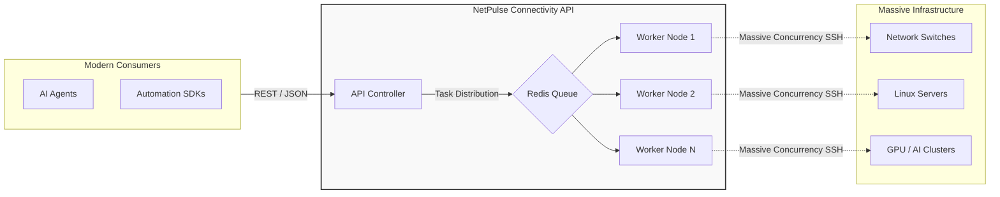

# NetPulse

[](https://hub.docker.com)
[](https://python.org)
[](LICENSE)
[](ai-docs/llms.txt)

**NetPulse** is a high-performance **Infrastructure Connectivity API** designed to bridge the gap between legacy SSH-based CLI and modern programmable environments. It transforms traditional network switches and Linux servers into **AI-programmable assets**, providing a robust connectivity layer for managing large-scale AI clusters and high-density GPU infrastructure.

## 🎯 Positioning: The SSH-to-API Bridge

NetPulse abstracts the complexity of manual SSH session management into a standardized RESTful API. It acts as the high-concurrency "actuator" that allows AI Agents and automation frameworks to interact with physical hardware as if they were cloud-native services.



## 🛠 Core Capabilities

*   **SSH-to-API Abstraction**: Converts raw CLI interactions from multi-vendor network devices (Cisco, Huawei, Arista, etc.) and Linux servers into structured JSON data.
*   **Massive Concurrency**: Distributed worker architecture designed to maintain thousands of persistent SSH sessions simultaneously across high-density clusters.
*   **Infrastructure Connectivity**: Beyond traditional SSH, NetPulse implements deep self-healing probes and persistent session pools to ensure zero-drop reliability in RDMA and GPU environments.
*   **Linux Mastery**: Native support for server-side operations, including sudo elevation, SFTP management, and persistent detached background tasks.
*   **Agent-Ready Context**: Optimized for direct LLM integration via specialized documentation (`llms.txt`) and unified result modeling.

## 🏗 Distributed Architecture

NetPulse offloads interaction logic to a fleet of distributed Workers. This ensures the central API remains responsive even when managing tens of thousands of infrastructure nodes.

- **Pinned Sessions**: Reuses existing connections to eliminate handshake overhead.
- **Self-Healing Probes**: Automatically detects and restores stalled sessions without interrupting client logic.

## 📥 Quick Start

### One-Click Deployment
```bash
# Clone and deploy using the automated script
git clone https://github.com/scitix/netpulse.git
cd netpulse
bash ./scripts/docker_auto_deploy.sh
```

### API Examples

#### Network Switch Execution
```bash
curl -X POST http://localhost:9000/device/exec \
  -H "X-API-KEY: your_api_key" \
  -d '{
    "driver": "netmiko",
    "connection_args": {"device_type": "cisco_ios", "host": "10.0.1.1", "username": "admin", "password": "pass"},
    "command": ["show ip interface brief"],
    "parsing": {"name": "textfsm"}
  }'
```

#### Linux Detached Task
```bash
curl -X POST http://localhost:9000/device/exec \
  -d '{"driver": "paramiko", "host": "10.0.10.1", "detach": true, "command": ["yum update -y"]}'
```

## 📖 Resources

* 🤖 **[Agent Guide (llms.txt)](llms.txt)** - Standardized context for LLM integration.
* 🔌 **[API Manual](ai-docs/API_REFERENCE.md)** - Simplified reference for AI parsing.
* 👷 **[Issues](https://github.com/scitix/netpulse/issues)** - Bug reports and feature requests.

---

**NetPulse** - Bridging the gap between legacy infrastructure and the AI era.