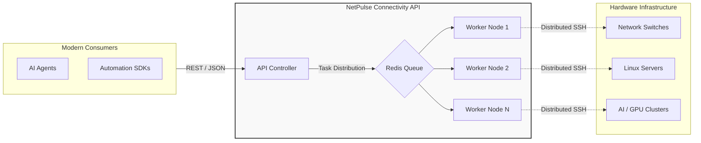

# NetPulse

[](https://hub.docker.com)
[](https://python.org)
[](LICENSE)
[](ai-docs/llms.txt)

**NetPulse** is a high-performance **Infrastructure Connectivity API** designed to bridge the gap between legacy SSH-based CLI and modern programmable environments. It transforms traditional network switches and Linux servers into **AI-programmable assets**, providing a reliable connectivity layer for modern high-performance clusters.

## 🎯 Positioning: The SSH-to-API Bridge

NetPulse abstracts the complexity of human-oriented CLI interactions into a standardized, machine-oriented RESTful API. It acts as the "actuator" that allows AI Agents and automation frameworks to interact with physical hardware via structured data models.



## 🛠 Core Capabilities

*   **SSH-to-API Abstraction**: Seamlessly converts multi-vendor CLI interactions (Cisco, Arista,HP_comware etc.) and Linux shell commands into structured JSON responses.
*   **Self-Healing Connectivity**: Proactively maintains session integrity via background **deep probes** to detect and automatically restore stalled SSH connections.
*   **High-Concurrency Session Pooling**: Implements "Pinned Workers" to reuse persistent sessions, eliminating the overhead of frequent SSH handshakes.
*   **Linux Mastery**: Advanced server management supporting sudo elevation, SFTP file synchronization, and persistent detached background tasks.
*   **Agent-Ready Context**: Engineered for LLM integration via specialized documentation (`llms.txt`) and unified result modeling for consistent AI parsing.

## 🏗 Distributed Architecture

NetPulse utilizes a **Controller-Worker** model to offload execution tasks to a scalable fleet of workers. This ensures high availability and responsiveness even when managing thousands of nodes.

- **Redis-Backed Dispatch**: Global task coordination and status management.
- **Dynamic Resource Handling**: Workers manage their own session lifecycle and self-cleaning staging environments.

## 📥 Quick Start

### One-Click Deployment
```bash
# Clone and deploy using the automated script
git clone https://github.com/scitix/netpulse.git
cd netpulse
bash ./scripts/docker_auto_deploy.sh
```

### API Examples

#### A. Network Switch Interface
```bash
curl -X POST http://localhost:9000/device/exec \
  -H "X-API-KEY: your_api_key" \
  -d '{
    "driver": "netmiko",
    "connection_args": {"device_type": "cisco_ios", "host": "10.0.1.1", "username": "admin", "password": "pass"},
    "command": ["show ip interface brief"],
    "parsing": {"name": "textfsm"}
  }'
```

#### B. Linux Detached Task
```bash
curl -X POST http://localhost:9000/device/exec \
  -d '{"driver": "paramiko", "host": "10.0.10.1", "detach": true, "command": ["yum update -y"]}'
```

## 📖 Resources

* 🤖 **[Agent Guide (llms.txt)](llms.txt)** - Essential prompt context for AI integration.
* 🔌 **[API Manual](ai-docs/API_REFERENCE.md)** - Technical reference optimized for machine parsing.
* 👷 **[Issues](https://github.com/scitix/netpulse/issues)** - Bug reporting and feature requests.

---

**NetPulse** - Bridging the gap between legacy infrastructure and the AI era.