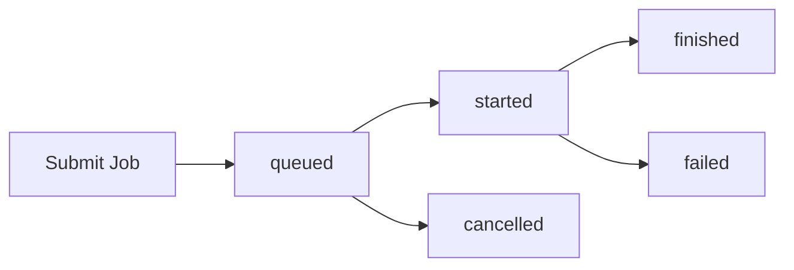

# Job Management API

## Overview

Job Management API provides job status query, job cancellation, and Worker management functions, which are core components of NetPulse's asynchronous processing system.

## API Endpoints

### GET /job

Query job status and results.

**Function Description**:
- Supports querying by job ID, queue, status, node, host, and other conditions
- Returns detailed job information, including execution time, results, error information
- Supports pagination and filtering

**Query Parameters**:

| Parameter | Type | Description |
|-----------|------|-------------|
| id | string | Query by job ID (highest priority) |
| queue | string | Query by queue name |
| status | string | Query by status (queued, started, finished, failed) |
| node | string | Query by node name |
| host | string | Query by host name |

**Request Example**:

```bash
# Query by job ID
curl -X GET "http://localhost:9000/job?id=job_123456" \
  -H "X-API-KEY: your_key"

# Query by queue
curl -X GET "http://localhost:9000/job?queue=pinned_192.168.1.1" \
  -H "X-API-KEY: your_key"

# Query by status
curl -X GET "http://localhost:9000/job?status=finished" \
  -H "X-API-KEY: your_key"

# Query by host
curl -X GET "http://localhost:9000/job?host=192.168.1.1" \
  -H "X-API-KEY: your_key"
```

**Response Example**:

```json
{
  "code": 200,
  "message": "success",
  "data": [
    {
      "id": "job_123456",
      "status": "finished",
      "queue": "pinned_192.168.1.1",
      "created_at": "2024-01-01T12:00:00+08:00",
      "enqueued_at": "2024-01-01T12:00:01+08:00",
      "started_at": "2024-01-01T12:00:02+08:00",
      "ended_at": "2024-01-01T12:00:05+08:00",
      "worker": "worker_001",
      "result": {
        "type": "success",
        "retval": "Cisco IOS Software, Version 15.2...",
        "error": null
      },
      "duration": 3.0,
      "queue_time": 1.0
    }
  ]
}
```

### DELETE /job

Cancel job.

**Function Description**:
- Can only cancel tasks that have not started execution
- Supports batch cancellation by job ID, queue, host, and other conditions
- Tasks that have started execution cannot be cancelled

**Query Parameters**:

| Parameter | Type | Description |
|-----------|------|-------------|
| id | string | Cancel by job ID |
| queue | string | Cancel by queue name |
| host | string | Cancel by host name |

**Request Example**:

```bash
# Cancel specific job
curl -X DELETE "http://localhost:9000/job?id=job_123456" \
  -H "X-API-KEY: your_key"

# Cancel all jobs in queue
curl -X DELETE "http://localhost:9000/job?queue=pinned_192.168.1.1" \
  -H "X-API-KEY: your_key"

# Cancel all jobs for host
curl -X DELETE "http://localhost:9000/job?host=192.168.1.1" \
  -H "X-API-KEY: your_key"
```

**Response Example**:

```json
{
  "code": 200,
  "message": "success",
  "data": {
    "cancelled_count": 5,
    "cancelled_jobs": [
      "job_123456",
      "job_123457",
      "job_123458"
    ]
  }
}
```

### GET /worker

Query Worker status.

**Function Description**:
- Returns information about all active Worker nodes
- Includes Worker status, number of processed tasks, performance metrics, etc.
- Used for system monitoring and performance tuning

**Query Parameters**:

| Parameter | Type | Description |
|-----------|------|-------------|
| queue | string | Filter by queue name (highest priority) |
| node | string | Filter by node name |
| host | string | Filter by host name |

**Request Example**:

```bash
curl -X GET "http://localhost:9000/worker" \
  -H "X-API-KEY: your_key"
```

**Response Example**:

```json
{
  "code": 200,
  "message": "success",
  "data": [
    {
      "name": "worker_001",
      "status": "busy",
      "pid": 12345,
      "hostname": "worker-node-1",
      "queues": ["FifoQ"],
      "last_heartbeat": "2024-01-01T12:00:00+08:00",
      "birth_at": "2024-01-01T10:00:00+08:00",
      "successful_job_count": 150,
      "failed_job_count": 2
    },
    {
      "name": "worker_002",
      "status": "idle",
      "pid": 12346,
      "hostname": "worker-node-2",
      "queues": ["pinned_192.168.1.1"],
      "last_heartbeat": "2024-01-01T12:00:00+08:00",
      "birth_at": "2024-01-01T11:00:00+08:00",
      "successful_job_count": 75,
      "failed_job_count": 1
    }
  ]
}
```

### DELETE /worker

Delete Worker.

**Function Description**:
- Forcefully stop specified Worker node
- Tasks being executed will be interrupted
- Use with caution, may cause task loss

**Query Parameters**:

| Parameter | Type | Description |
|-----------|------|-------------|
| name | string | Worker name (highest priority) |
| queue | string | Filter by queue name |
| node | string | Filter by node name |
| host | string | Filter by host name |

**Request Example**:

```bash
curl -X DELETE "http://localhost:9000/worker?name=worker_001" \
  -H "X-API-KEY: your_key"
```

**Response Example**:

```json
{
  "code": 200,
  "message": "success",
  "data": ["worker_001"]
}
```

> **Note**: Returns a list of terminated Worker names.

## Job Status Description

### Job Status

| Status | Description | Notes |
|--------|-------------|-------|
| queued | Queued | Task has been submitted to queue, waiting for execution |
| started | Executing | Task is being executed by Worker |
| finished | Completed | Task executed successfully, has results |
| failed | Execution failed | Task execution failed, has error information |

### Job Lifecycle



## Response Model Details

### GetJobResponse

Job query response.

```json
{
  "code": 200,
  "message": "success",
  "data": [
    {
      "id": "job_123456",
      "status": "finished",
      "queue": "pinned_192.168.1.1",
      "created_at": "2024-01-01T12:00:00+08:00",
      "enqueued_at": "2024-01-01T12:00:01+08:00",
      "started_at": "2024-01-01T12:00:02+08:00",
      "ended_at": "2024-01-01T12:00:05+08:00",
      "worker": "worker_001",
      "result": {
        "type": "success",
        "retval": "Command output content",
        "error": null
      },
      "duration": 3.0,
      "queue_time": 1.0
    }
  ]
}
```

### DeleteJobResponse

Job cancellation response.

```json
{
  "code": 200,
  "message": "success",
  "data": {
    "cancelled_count": 5,
    "cancelled_jobs": [
      "job_123456",
      "job_123457"
    ]
  }
}
```

### GetWorkerResponse

Worker query response.

```json
{
  "code": 200,
  "message": "success",
  "data": [
    {
      "name": "worker_001",
      "status": "busy",
      "pid": 12345,
      "hostname": "worker-node-1",
      "queues": ["FifoQ", "pinned_192.168.1.1"],
      "last_heartbeat": "2024-01-01T12:00:00+08:00",
      "birth_at": "2024-01-01T10:00:00+08:00",
      "successful_job_count": 150,
      "failed_job_count": 2
    }
  ]
}
```

### DeleteWorkerResponse

Worker deletion response.

```json
{
  "code": 200,
  "message": "success",
  "data": {
    "worker": "worker_001",
    "status": "stopped",
    "interrupted_jobs": 1
  }
}
```

## Usage Examples

### 1. Query Job Status

```python
import requests
import time

def check_job_status(job_id, api_key):
    """Query job status"""
    response = requests.get(
        f"http://localhost:9000/job?id={job_id}",
        headers={"X-API-KEY": api_key}
    )
    
    if response.status_code == 200:
        job_data = response.json()["data"][0]
        return job_data["status"], job_data.get("result")
    else:
        print(f"Query failed: {response.status_code}")
        return None, None

# Usage example
job_id = "job_123456"
api_key = "your_key"

while True:
    status, result = check_job_status(job_id, api_key)
    
    if status == "finished":
        print(f"Job completed: {result['retval']}")
        break
    elif status == "failed":
        print(f"Job failed: {result['error']}")
        break
    elif status in ["queued", "started"]:
        print(f"Job status: {status}")
        time.sleep(2)
    else:
        print(f"Unknown status: {status}")
        break
```

### 2. Batch Query Jobs

```python
# Query all finished jobs
response = requests.get(
    "http://localhost:9000/job?status=finished",
    headers={"X-API-KEY": "your_key"}
)

if response.status_code == 200:
    jobs = response.json()["data"]
    for job in jobs:
        print(f"Job ID: {job['id']}, Execution time: {job['duration']} seconds")
```

### 3. Cancel Job

```python
# Cancel specific job
response = requests.delete(
    "http://localhost:9000/job?id=job_123456",
    headers={"X-API-KEY": "your_key"}
)

if response.status_code == 200:
    result = response.json()["data"]
    print(f"Cancelled job count: {result['cancelled_count']}")
```

### 4. Monitor Worker Status

```python
# Query Worker status
response = requests.get(
    "http://localhost:9000/worker",
    headers={"X-API-KEY": "your_key"}
)

if response.status_code == 200:
    workers = response.json()["data"]
    for worker in workers:
        print(f"Worker: {worker['name']}, Status: {worker['status']}, "
              f"Completed jobs: {worker['successful_job_count']}, Failed jobs: {worker['failed_job_count']}")
```

### 5. Process Job Results

```python
def process_job_result(job_id, api_key):
    """Process job results"""
    response = requests.get(
        f"http://localhost:9000/job?id={job_id}",
        headers={"X-API-KEY": api_key}
    )
    
    if response.status_code == 200:
        job_data = response.json()["data"][0]
        
        if job_data["status"] == "finished":
            result = job_data["result"]
            if result["type"] == "success":
                return result["retval"]
            else:
                return f"Execution failed: {result['error']}"
        else:
            return f"Job status: {job_data['status']}"
    else:
        return "Query failed"

# Usage example
result = process_job_result("job_123456", "your_key")
print(result)
```

## Best Practices

### 1. Job Status Polling

```python
def wait_for_job_completion(job_id, api_key, timeout=300, interval=2):
    """Wait for job completion"""
    import time
    
    start_time = time.time()
    while time.time() - start_time < timeout:
        status, result = check_job_status(job_id, api_key)
        
        if status == "finished":
            return result["retval"]
        elif status == "failed":
            raise Exception(f"Job execution failed: {result['error']}")
        elif status in ["queued", "started"]:
            time.sleep(interval)
        else:
            raise Exception(f"Unknown job status: {status}")
    
    raise Exception("Job timeout")

# Usage example
try:
    result = wait_for_job_completion("job_123456", "your_key")
    print(f"Job result: {result}")
except Exception as e:
    print(f"Job exception: {e}")
```

### 2. Batch Job Management

```python
def monitor_batch_jobs(job_ids, api_key):
    """Monitor batch jobs"""
    import time
    
    completed_jobs = []
    failed_jobs = []
    
    while len(completed_jobs) + len(failed_jobs) < len(job_ids):
        for job_id in job_ids:
            if job_id not in completed_jobs and job_id not in failed_jobs:
                status, result = check_job_status(job_id, api_key)
                
                if status == "finished":
                    completed_jobs.append(job_id)
                    print(f"Job {job_id} completed")
                elif status == "failed":
                    failed_jobs.append(job_id)
                    print(f"Job {job_id} failed: {result['error']}")
        
        time.sleep(2)
    
    return completed_jobs, failed_jobs
```

### 3. Worker Monitoring

```python
def monitor_workers(api_key):
    """Monitor Worker status"""
    response = requests.get(
        "http://localhost:9000/worker",
        headers={"X-API-KEY": api_key}
    )
    
    if response.status_code == 200:
        workers = response.json()["data"]
        
        busy_workers = [w for w in workers if w["status"] == "busy"]
        idle_workers = [w for w in workers if w["status"] == "idle"]
        
        print(f"Busy Workers: {len(busy_workers)}")
        print(f"Idle Workers: {len(idle_workers)}")
        
        for worker in workers:
            print(f"Worker {worker['name']}: {worker['successful_job_count']} completed, "
                  f"{worker['failed_job_count']} failed")
```

## Notes

1. **Job Timeout**: Long-running tasks may timeout, need to set TTL appropriately
2. **Job Cancellation**: Can only cancel tasks that haven't started, tasks that have started cannot be cancelled
3. **Worker Management**: Use caution when deleting Workers, may cause task loss
4. **Status Polling**: Avoid polling too frequently, recommend interval 2-5 seconds
5. **Error Handling**: Properly handle job failures and system errors

## Performance Optimization

### 1. Batch Query

```python
# Batch query multiple jobs
job_ids = ["job_123456", "job_123457", "job_123458"]
for job_id in job_ids:
    status, result = check_job_status(job_id, api_key)
    # Process results
```

### 2. Conditional Filtering

```python
# Only query jobs with specific status
response = requests.get(
    "http://localhost:9000/job?status=finished",
    headers={"X-API-KEY": "your_key"}
)
```

### 3. Async Processing

```python
import asyncio
import aiohttp

async def check_job_status_async(session, job_id, api_key):
    """Async query job status"""
    async with session.get(
        f"http://localhost:9000/job?id={job_id}",
        headers={"X-API-KEY": api_key}
    ) as response:
        if response.status == 200:
            data = await response.json()
            return data["data"][0]
        return None

async def monitor_jobs_async(job_ids, api_key):
    """Async monitor jobs"""
    async with aiohttp.ClientSession() as session:
        tasks = [check_job_status_async(session, job_id, api_key) 
                for job_id in job_ids]
        results = await asyncio.gather(*tasks)
        return results
```

## Worker Management Examples

### 1. Query Worker Status

```python
import requests

def get_all_workers():
    url = "http://localhost:9000/worker"
    headers = {"X-API-Key": "your-api-key-here"}
    response = requests.get(url, headers=headers)
    if response.status_code == 200:
        return response.json()['data']
    return []

def get_workers_by_queue(queue):
    url = f"http://localhost:9000/worker?queue={queue}"
    headers = {"X-API-Key": "your-api-key-here"}
    response = requests.get(url, headers=headers)
    if response.status_code == 200:
        return response.json()['data']
    return []

def get_workers_by_host(host):
    url = f"http://localhost:9000/worker?host={host}"
    headers = {"X-API-Key": "your-api-key-here"}
    response = requests.get(url, headers=headers)
    if response.status_code == 200:
        return response.json()['data']
    return []

# Usage example
workers = get_all_workers()
fifo_workers = get_workers_by_queue('FifoQ')
```

### 2. Terminate Worker

```python
def terminate_worker(worker_name):
    url = f"http://localhost:9000/worker?name={worker_name}"
    headers = {"X-API-Key": "your-api-key-here"}
    response = requests.delete(url, headers=headers)
    return response.status_code == 200

def terminate_workers_by_queue(queue):
    url = f"http://localhost:9000/worker?queue={queue}"
    headers = {"X-API-Key": "your-api-key-here"}
    response = requests.delete(url, headers=headers)
    return response.status_code == 200

def terminate_workers_by_host(host):
    url = f"http://localhost:9000/worker?host={host}"
    headers = {"X-API-Key": "your-api-key-here"}
    response = requests.delete(url, headers=headers)
    return response.status_code == 200

# Usage example
if workers:
    worker_name = workers[0]['name']
    terminate_worker(worker_name)
```

### 3. Worker Monitoring Script

```bash
#!/bin/bash
# Worker monitoring script

API_KEY="your-api-key-here"
API_URL="http://localhost:9000/worker"
LOG_FILE="/var/log/netpulse-workers.log"

# Get all Workers
response=$(curl -s -H "X-API-KEY: $API_KEY" "$API_URL")

if [ $? -eq 0 ]; then
    total_workers=$(echo "$response" | jq '.data | length')
    busy_workers=$(echo "$response" | jq '.data[] | select(.status == "busy") | .name' | wc -l)
    dead_workers=$(echo "$response" | jq '.data[] | select(.status == "dead") | .name' | wc -l)
    
    timestamp=$(date '+%Y-%m-%d %H:%M:%S')
    echo "[$timestamp] Total Workers: $total_workers, Busy: $busy_workers, Stopped: $dead_workers" >> "$LOG_FILE"
    
    # If there are stopped Workers, send alert
    if [ "$dead_workers" -gt 0 ]; then
        echo "[$timestamp] Warning: Found stopped Workers ($dead_workers)" >> "$LOG_FILE"
    fi
    
    # If too few busy Workers, send alert
    if [ "$busy_workers" -lt 2 ]; then
        echo "[$timestamp] Warning: Too few busy Workers ($busy_workers)" >> "$LOG_FILE"
    fi
else
    echo "[$timestamp] Worker monitoring failed" >> "$LOG_FILE"
fi
```

## Worker Status Description

### Worker Status
- `busy`: Processing tasks
- `idle`: Idle, waiting for tasks
- `suspended`: Suspended
- `dead`: Stopped

### Queue Types
- `FifoQ`: FIFO queue Worker
- `pinned_{device_host}`: Device-bound queue Worker

## Worker Management Best Practices

### 1. Worker Monitoring
- Regularly check Worker status
- Monitor number of running Workers
- Set alert thresholds

### 2. Worker Management
- Terminate error Workers promptly
- Allocate Worker resources reasonably
- Avoid Worker overload

### 3. Performance Optimization
- Adjust Worker count based on task volume
- Monitor Worker load
- Use queue strategies appropriately

## System Health Check

### GET /health

Check overall system health status, used to monitor NetPulse service running status and health of various components.

**Request Example**:

```bash
curl -H "X-API-KEY: your-api-key-here" \
  http://localhost:9000/health
```

**Response Example**:

```json
{
  "code": 200,
  "message": "success",
  "data": "ok"
}
```

### Health Check Items

#### 1. API Service Status
- Whether service is running normally
- Whether response time is normal
- Whether error rate is within acceptable range

#### 2. Redis Connection Status
- Whether Redis service is reachable
- Whether connection pool is normal
- Memory usage

#### 3. Worker Process Status
- Number of active Workers
- Worker heartbeat status
- Task queue status

### Usage Examples

#### Python Example

```python
import requests
import json

def check_system_health():
    url = "http://localhost:9000/health"
    headers = {"X-API-Key": "your-api-key-here"}
    
    try:
        response = requests.get(url, headers=headers, timeout=10)
        if response.status_code == 200:
            data = response.json()
            return data['data']
        else:
            return {"status": "error", "message": f"HTTP {response.status_code}"}
    except Exception as e:
        return {"status": "error", "message": str(e)}

def monitor_health():
    """Continuously monitor system health status"""
    import time
    
    while True:
        health = check_system_health()
        print(f"Health Status: {health}")
        print("-" * 50)
        time.sleep(60)  # Check every minute

# Usage example
if __name__ == "__main__":
    health_status = check_system_health()
    print(json.dumps(health_status, indent=2))
```

### Monitoring Integration

#### Prometheus Integration

```yaml
# prometheus.yml
scrape_configs:
  - job_name: 'netpulse'
    static_configs:
      - targets: ['localhost:9000']
    metrics_path: '/health'
    scrape_interval: 30s
```

### Troubleshooting

#### Common Issues

1. **API Service No Response**
   - Check if service is started
   - Check if port is occupied
   - View service logs

2. **Redis Connection Failed**
   - Check Redis service status
   - Verify connection configuration
   - Check network connectivity

#### Debug Commands

```bash
# Check service status
docker compose ps

# View service logs
docker compose logs api

# Check port occupancy
netstat -tlnp | grep 9000

# Test Redis connection
redis-cli ping
```

### Health Check Best Practices

1. **Monitoring Strategy**
   - Set reasonable check interval (recommend 30 seconds)
   - Configure alert thresholds
   - Establish fault escalation process

2. **Log Management**
   - Record health check results
   - Set log rotation
   - Configure log level

3. **Performance Optimization**
   - Cache health check results
   - Execute checks asynchronously
   - Set timeout

4. **Security Considerations**
   - Limit health check access
   - Use HTTPS
   - Configure access control

---

## Related Documentation

- [API Overview](./api-overview.md) - Learn about all API interfaces
- [Device Operation API](./device-api.md) - Core device operation interfaces
