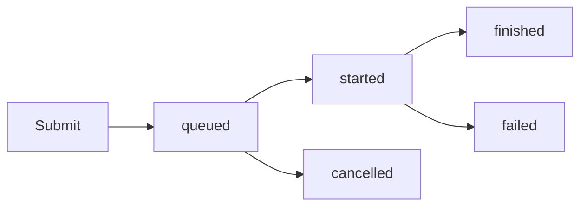

# Job Management API

All device operations are async. Use these endpoints to poll results, cancel jobs, and monitor workers.

## GET /job

Query job status and results.

**Query parameters** (all optional, `id` takes priority):

| Parameter | Description |
|-----------|-------------|
| `id` | Job ID |
| `queue` | Filter by queue name |
| `status` | Filter by status: `queued`, `started`, `finished`, `failed` |
| `node` | Filter by node name |
| `host` | Filter by device host |

```bash
curl "http://localhost:9000/job?id=job_123456" -H "X-API-KEY: your_key"
curl "http://localhost:9000/job?status=finished" -H "X-API-KEY: your_key"
curl "http://localhost:9000/job?host=192.168.1.1" -H "X-API-KEY: your_key"
```

**Response:**
```json
{
  "code": 200,
  "message": "success",
  "data": [{
    "id": "job_123456",
    "status": "finished",
    "queue": "pinned_192.168.1.1",
    "created_at": "2024-01-01T12:00:00+08:00",
    "started_at": "2024-01-01T12:00:02+08:00",
    "ended_at": "2024-01-01T12:00:05+08:00",
    "worker": "worker_001",
    "result": {
      "type": "success",
      "retval": {"show version": "Cisco IOS Software..."},
      "error": null
    },
    "duration": 3.0,
    "queue_time": 1.0
  }]
}
```

**Job statuses:**

| Status | Meaning |
|--------|---------|
| `queued` | Waiting for a worker |
| `started` | Executing |
| `finished` | Done — result available |
| `failed` | Error — check `result.error` |


```mermaid
graph LR
    A[Submit] --> B[queued] --> C[started] --> D[finished]
    C --> E[failed]
    B --> F[cancelled]
```

## DELETE /job

Cancel queued jobs (cannot cancel already-started jobs).

```bash
curl -X DELETE "http://localhost:9000/job?id=job_123456" -H "X-API-KEY: your_key"
curl -X DELETE "http://localhost:9000/job?host=192.168.1.1" -H "X-API-KEY: your_key"
```

**Response:**
```json
{"code": 200, "message": "success", "data": {"cancelled_count": 2, "cancelled_jobs": ["job_123456", "job_123457"]}}
```

## GET /worker

List active workers and their status.

```bash
curl "http://localhost:9000/worker" -H "X-API-KEY: your_key"
curl "http://localhost:9000/worker?host=192.168.1.1" -H "X-API-KEY: your_key"
```

**Query parameters:** `queue`, `node`, `host`

**Response:**
```json
{
  "code": 200, "message": "success",
  "data": [{
    "name": "worker_001",
    "status": "busy",
    "pid": 12345,
    "hostname": "worker-node-1",
    "queues": ["FifoQ"],
    "successful_job_count": 150,
    "failed_job_count": 2
  }]
}
```

**Worker statuses:** `busy`, `idle`, `suspended`, `dead`

**Queue types:**
- `FifoQ` — FIFO worker
- `pinned_{host}` — Pinned worker bound to a device

## DELETE /worker

Forcefully stop a worker. **Running jobs will be interrupted.**

```bash
curl -X DELETE "http://localhost:9000/worker?name=worker_001" -H "X-API-KEY: your_key"
```

## GET /health

Quick liveness check.

```bash
curl "http://localhost:9000/health" -H "X-API-KEY: your_key"
# {"code": 200, "message": "success", "data": "ok"}
```

## Polling Pattern

```python
import requests, time

def wait_for_job(job_id, api_key, timeout=300, interval=2):
    deadline = time.time() + timeout
    while time.time() < deadline:
        r = requests.get(f"http://localhost:9000/job?id={job_id}",
                         headers={"X-API-KEY": api_key})
        job = r.json()["data"][0]
        if job["status"] == "finished":
            return job["result"]["retval"]
        if job["status"] == "failed":
            raise RuntimeError(job["result"]["error"])
        time.sleep(interval)
    raise TimeoutError(f"Job {job_id} timed out")
```
