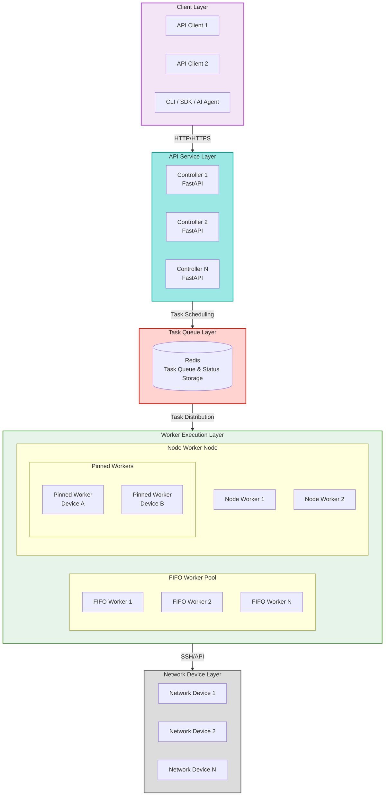
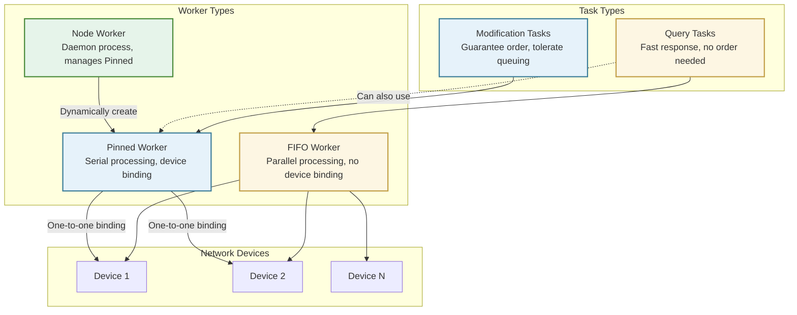
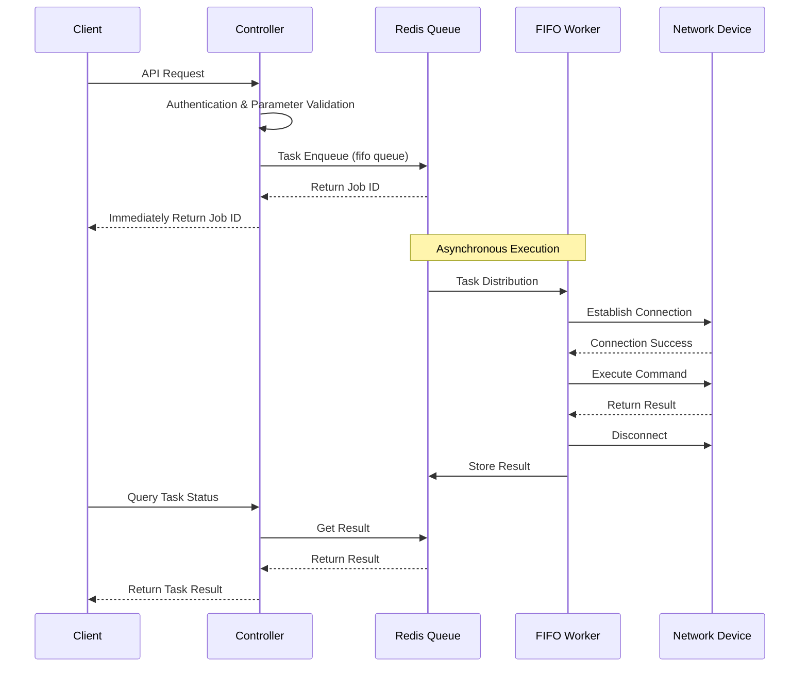
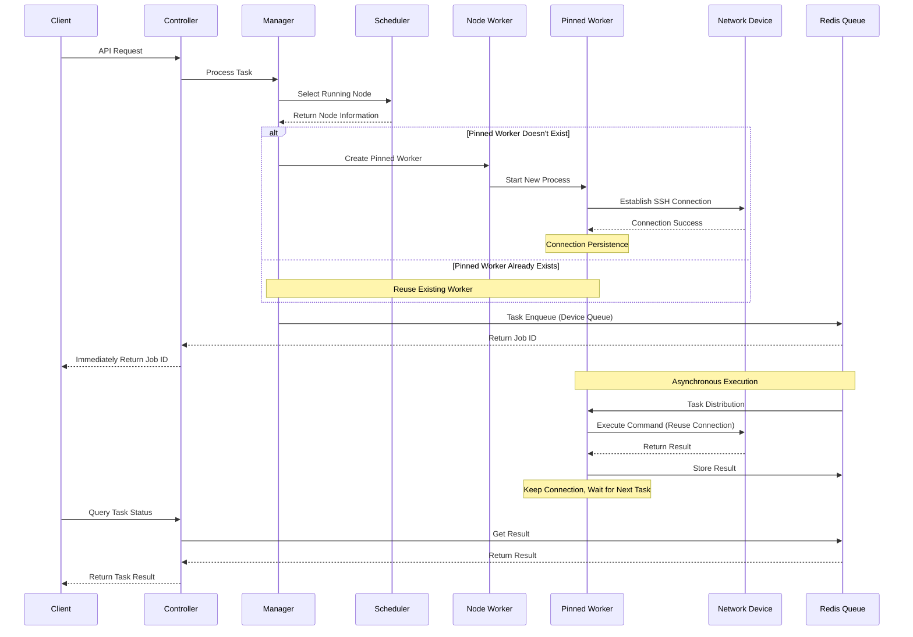

# Technical Architecture

!!! info "About This Document"
    This document introduces NetPulse's technical architecture, design philosophy, and implementation details. If you just want to **use** NetPulse for network device management, you can skip this section and directly view [Quick Start](../getting-started/quick-start.md), [API Reference](../api/api-overview.md), and [Driver Selection](../drivers/index.md) chapters, which won't affect your normal use.
    
    But if you are a **tech enthusiast**, interested in distributed system design, high-performance network programming, plugin architecture, and other topics, or want to deeply understand NetPulse's technical implementation logic, then welcome to read this document. We are very open to sharing our design philosophy, technology choices, and architectural thinking, hoping to resonate with you who also love technology, and welcome valuable opinions and suggestions.

---

NetPulse adopts a distributed architecture design, aiming to provide high-availability, high-performance network device management services. This document introduces the system's technical architecture, design philosophy, core components, and key technical implementations.

## Architecture Overview

NetPulse adopts a layered architecture design, from client to network devices, including API layer, task queue layer, Worker layer, and device layer:

### Architecture Layers

NetPulse technical architecture is divided into four main layers:

## Design Philosophy

### Task Types and Worker Division

NetPulse's design philosophy is based on analysis of network operations task characteristics. Network operations tasks are usually divided into two types:

| Task Type | Characteristics | Execution Requirements | Typical Scenarios |
|-----------|-----------------|------------------------|-------------------|
| **Query Tasks** | Read-only operations, don't change device state | No need to guarantee order, pursue fast response | Pull device status, check configuration information |
| **Modification Tasks** | Write operations, change device state | Must guarantee execution order on single device | Push configuration, apply changes |

Based on the different characteristics of these two task types, NetPulse designs three types of Workers:

### Worker Characteristics Description

**FIFO Worker**
- **Characteristics**: No device binding, only one can run per node (guaranteed using file lock)
- **Advantages**: Parallel processing, reduce queuing time
- **Limitations**: Task order not strictly guaranteed; single instance limit per node
- **Applicable**: Query tasks, pursue fast response
- **Scaling**: Achieve horizontal scaling by deploying multiple nodes

**Pinned Worker**
- **Characteristics**: One-to-one binding with device, serial execution
- **Advantages**: Guarantee task order, support connection persistence
- **Applicable**: Modification tasks, scenarios requiring order guarantee

**Node Worker**
- **Function**: Daemon process, dynamically creates and manages Pinned Worker
- **Reason**: Cannot predict which devices users will operate, Pinned Worker must be created on demand

!!! tip "Connection Persistence"
    Utilizing the one-to-one characteristic of Pinned Worker with devices, SSH Session persistence is implemented, which helps improve performance (refer to [Long Connection Technology](./driver-system.md#long-connection-technology)).

## Core Components

1. **RESTful API**
    - Built on FastAPI
    - Handles incoming requests, validates and queues tasks

2. **Message Queue**
    - Redis-based task queue (based on RQ)
    - Used for state synchronization in multi-master multi-slave architecture
    - Temporarily stores task status and task execution results

3. **Worker Nodes**
    - Three types of Workers designed to handle different types of tasks
    - FIFO Worker node: Process tasks in order
    - Node Worker node: Serves as daemon process to manage Pinned Worker and node status
    - Pinned Worker node: Maintains connection with single device, serially executes tasks for that device

4. **Plugin System**
    - Extensible plugin system includes device drivers, schedulers, template engines, and Webhooks
    - Clear interface definitions, convenient for secondary development and integration
    - Adopts lazy loading mechanism, loads plugins on demand, doesn't affect system startup performance
    - Supports runtime dynamic plugin selection, no need to restart service

## Data Flow

### 1. FIFO Worker Task Flow

FIFO Worker handles query tasks, adopts "connect on use" mode:

### 2. Pinned Worker Task Flow

Pinned Worker handles modification tasks, adopts "connection persistence" mode:

## Technical Features

NetPulse improves system performance, availability, and scalability through the following three core designs:

| Feature Dimension | Core Feature | Actual Effect |
|------------------|--------------|---------------|
| **Performance Optimization** | Persistent SSH Connection | In frequent operation scenarios, can reduce connection establishment time, improve response speed |
| **Availability** | Distributed Multi-Node Architecture | Supports multi-node deployment, when single point fails, can continue service through other nodes |
| **Scalability** | Plugin Architecture | Extend functionality through plugin mechanism, no need to modify core code |

### Performance Optimization: Persistent Connection Technology

**Background**: Traditional methods need to establish new connection for each operation, connection establishment process usually takes 2-5 seconds.

**Implementation**: Pinned Worker maintains persistent SSH connection with device, reuses connection to execute tasks.

**Effect**:
- In scenarios where the same device is frequently operated, can avoid overhead of repeated connection establishment
- Actual performance improvement depends on network environment, device response speed, and other factors
- Helps improve connection success rate (reduce failures that may be caused by frequent connections)
- Reduce resource consumption (reduce overhead of connection establishment)

### Availability: Distributed Architecture Design

**Core Capabilities**:
- **Multi-Node Deployment**: Supports multi-Controller, multi-Worker node deployment
- **Fault Handling**: When Worker fails, cleanup and reassignment will be performed
- **State Synchronization**: Multi-node state synchronization based on Redis

**Deployment Methods**: Supports Docker Compose and Kubernetes deployment.

### Scalability: Plugin Architecture

**Design Philosophy**: Extend functionality through plugin mechanism, drivers are one type of plugin.

**Supported Extensions**:
- **Device Drivers**: Can add new device drivers (currently supports Netmiko, NAPALM, PyEAPI, Paramiko, etc.)
- **Template Engines**: Can add new template formats (currently supports Jinja2, TextFSM, TTP, etc.)
- **Scheduling Algorithms**: Can add new scheduling strategies (currently supports greedy, minimum load, etc.)
- **Notification Mechanisms**: Can add new Webhook implementations
- **Credential Management**: Can add new credential providers (currently supports HashiCorp Vault)

**Extension Method**: Inherit corresponding base class, create class in plugin directory, system will automatically discover and load.

### Credential Management: Vault Integration

**Design Philosophy**: Through a plugin-based credential management system, support dynamically obtaining device authentication information from external credential storage (such as Vault).

**Core Capabilities**:
- **Credential Provider Plugins**: Support multiple credential storage backends (currently supports HashiCorp Vault)
- **Credential Resolution**: Automatically resolve `credential_ref` and inject credentials before device operations
- **Credential Caching**: Automatically cache credentials to avoid repeated reads and improve performance
- **Secure Storage**: Passwords are not directly exposed in API requests, improving security

**Workflow**:
1. Client uses `credential_ref` in `connection_args` to reference Vault path
2. After Controller receives request, it resolves credential reference through CredentialResolver
3. CredentialResolver calls corresponding credential provider (e.g., VaultProvider) to get credentials
4. Credentials are injected into `connection_args`, replacing `credential_ref`
5. Worker uses injected credentials to establish device connection

**Supported Credential Providers**:
- **Vault**: HashiCorp Vault (supports KV v2 engine, version control, metadata management)

See: [Vault Credential Management API](../api/credential-api.md) | [Basic Concepts](../getting-started/basic-concepts.md#4-credential-management) | [Plugin System](./plugin-system.md)

## Design Decision Explanations

### Why Three Types of Workers?

**Question**: Why can't we use only one type of Worker to handle all tasks?

**Answer**: Network operations tasks have two different characteristic requirements:
- **Query Tasks**: Need fast response, can be processed in parallel, don't need strict order
- **Modification Tasks**: Need to guarantee order, can tolerate queuing, but must execute serially

If only one type of Worker is used, either query performance is sacrificed (serial execution), or configuration security is sacrificed (parallel execution may cause configuration conflicts).

### Why Only One FIFO Worker Per Node?

**Reason**: FIFO Worker uses RQ's `Worker` class, which forks child processes. To avoid resource competition and state confusion, file lock is used to ensure only one FIFO Worker instance per node. If more concurrent processing capability is needed, horizontal scaling can be achieved by deploying multiple nodes.

### Why Do Pinned Workers Need Dynamic Creation?

**Reason**: Cannot predict which devices users will operate. If all possible Pinned Workers are pre-created, it will waste a lot of resources (most Workers may never be used). Dynamic creation can allocate resources on demand, improve resource utilization.

### Why Choose Redis + RQ Instead of Other Message Queues?

**Reason**:
- **Simple and Efficient**: RQ is based on Redis, no need for additional message queue middleware
- **State Management**: Redis can store both task status and results, simplifying architecture
- **Mature and Stable**: RQ is a mature task queue solution in Python ecosystem
- **Easy to Debug**: Can directly view task status through Redis, convenient for troubleshooting
