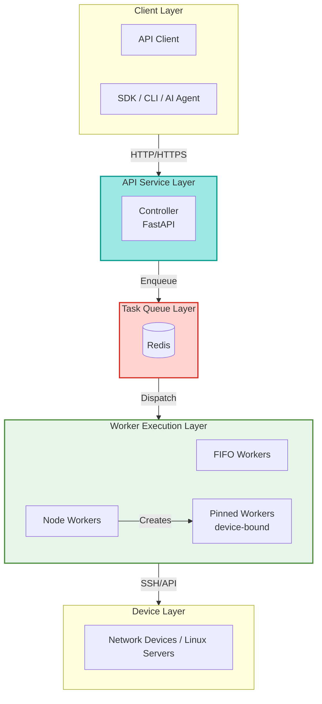
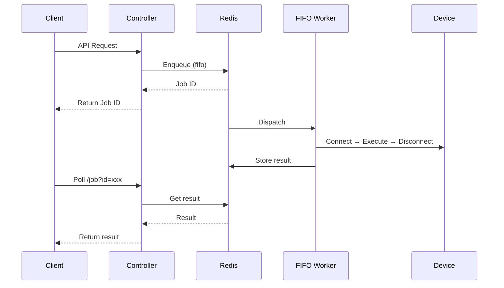
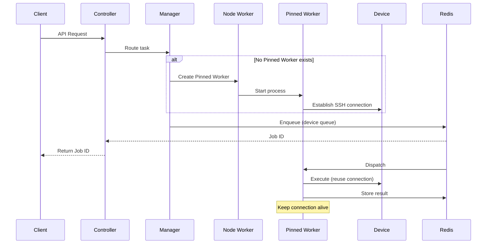

# Technical Architecture

!!! info
    This section covers NetPulse's internal design. If you just want to **use** the API, see [Quick Start](../getting-started/quick-start.md) and [API Reference](../api/api-overview.md) instead.

## Architecture Layers

NetPulse is a four-layer distributed system:

```mermaid
flowchart TB
    subgraph Layer1[Client Layer]
        Client1[API Client]
        Client2[SDK / CLI / AI Agent]
    end

    subgraph Layer2[API Service Layer]
        Controller[Controller<br/>FastAPI]
    end

    subgraph Layer3[Task Queue Layer]
        Redis[(Redis)]
    end

    subgraph Layer4[Worker Execution Layer]
        FIFO[FIFO Workers]
        Node[Node Workers]
        Pinned[Pinned Workers<br/>device-bound]
    end

    subgraph Layer5[Device Layer]
        Devices[Network Devices / Linux Servers]
    end

    Layer1 -->|HTTP/HTTPS| Layer2
    Layer2 -->|Enqueue| Layer3
    Layer3 -->|Dispatch| Layer4
    Layer4 -->|SSH/API| Layer5

    Node -->|Creates| Pinned

    style Layer2 fill:#9ce8e4,stroke:#05998b,stroke-width:2px
    style Layer3 fill:#FFD3D0,stroke:#D82C20,stroke-width:2px
    style Layer4 fill:#E6F4EA,stroke:#4B8B3B,stroke-width:2px
```

**Request flow**: Client → Controller → Redis queue → Worker executes on device → Result stored in Redis → Client polls for result.

## Worker Types

Network operations fall into two categories with different requirements:

| Task Type | Characteristics | Worker |
|-----------|----------------|--------|
| **Query** | Read-only, parallelizable, fast response needed | FIFO Worker |
| **Modification** | Write ops, must be ordered per device | Pinned Worker |

### FIFO Worker
- No device binding — connects fresh each time
- One instance per node (file-lock enforced), scale by adding nodes
- Best for: stateless queries, HTTP-based drivers (PyEAPI), long-running tasks

### Pinned Worker
- Bound 1:1 to a device, serial execution
- Maintains persistent SSH session for connection reuse
- Created on-demand by Node Worker (cannot predict which devices users will target)

### Node Worker
- Daemon process that dynamically creates and manages Pinned Workers
- Monitors Pinned Worker health and handles cleanup

## Data Flow

### FIFO Task Flow

```mermaid
sequenceDiagram
    Client->>Controller: API Request
    Controller->>Redis: Enqueue (fifo)
    Redis-->>Controller: Job ID
    Controller-->>Client: Return Job ID

    Redis->>FIFO Worker: Dispatch
    FIFO Worker->>Device: Connect → Execute → Disconnect
    FIFO Worker->>Redis: Store result

    Client->>Controller: Poll /job?id=xxx
    Controller->>Redis: Get result
    Redis-->>Controller: Result
    Controller-->>Client: Return result
```

### Pinned Task Flow

```mermaid
sequenceDiagram
    Client->>Controller: API Request
    Controller->>Manager: Route task

    alt No Pinned Worker exists
        Manager->>Node Worker: Create Pinned Worker
        Node Worker->>Pinned Worker: Start process
        Pinned Worker->>Device: Establish SSH connection
    end

    Manager->>Redis: Enqueue (device queue)
    Redis-->>Controller: Job ID
    Controller-->>Client: Return Job ID

    Redis->>Pinned Worker: Dispatch
    Pinned Worker->>Device: Execute (reuse connection)
    Pinned Worker->>Redis: Store result
    Note over Pinned Worker: Keep connection alive
```

## Core Design Decisions

**Why three worker types?**
A single worker type forces a tradeoff: serialize everything (slow queries) or parallelize everything (unsafe config ordering). Separating them optimizes both.

**Why create Pinned Workers dynamically?**
Pre-creating workers for all possible devices wastes resources. Dynamic creation allocates on demand.

**Why Redis + RQ?**
Simple, no extra middleware. Redis handles both the queue and result storage. RQ is mature in the Python ecosystem.

## Deep Dives

- [Plugin System](./plugin-system.md) — Extensible driver, template, scheduler, webhook architecture
- [Driver System](./driver-system.md) — Driver implementations and persistent connection technology
- [Template System](./template-system.md) — Jinja2, TextFSM, TTP rendering and parsing
- [Scheduler System](./scheduler-system.md) — Load balancing algorithms for worker selection
- [Webhook System](./webhook-system.md) — Event notification for task results
