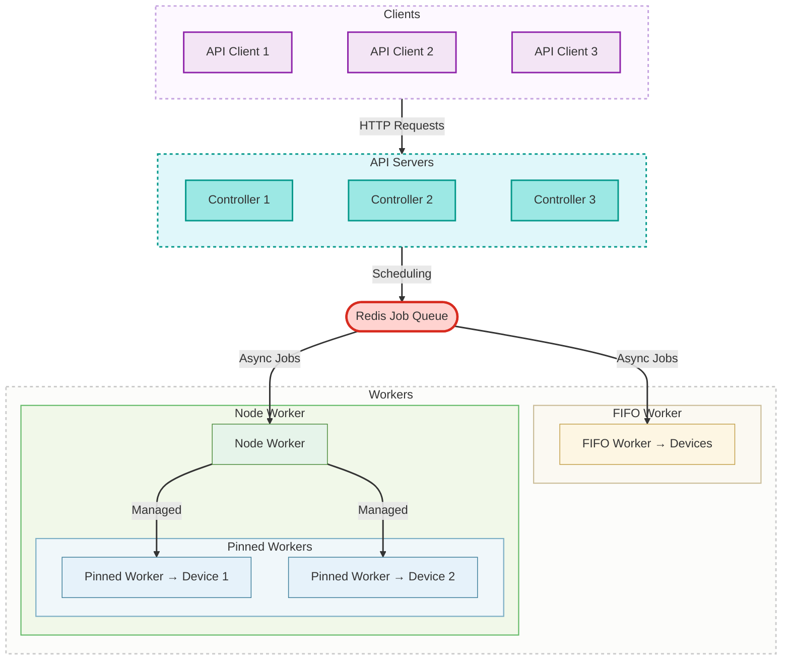
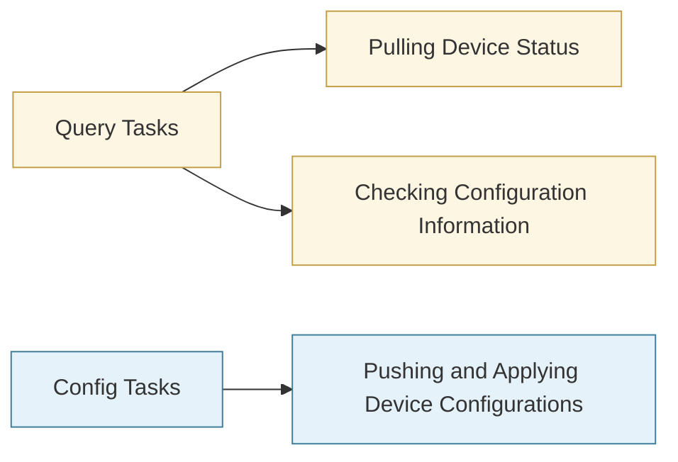
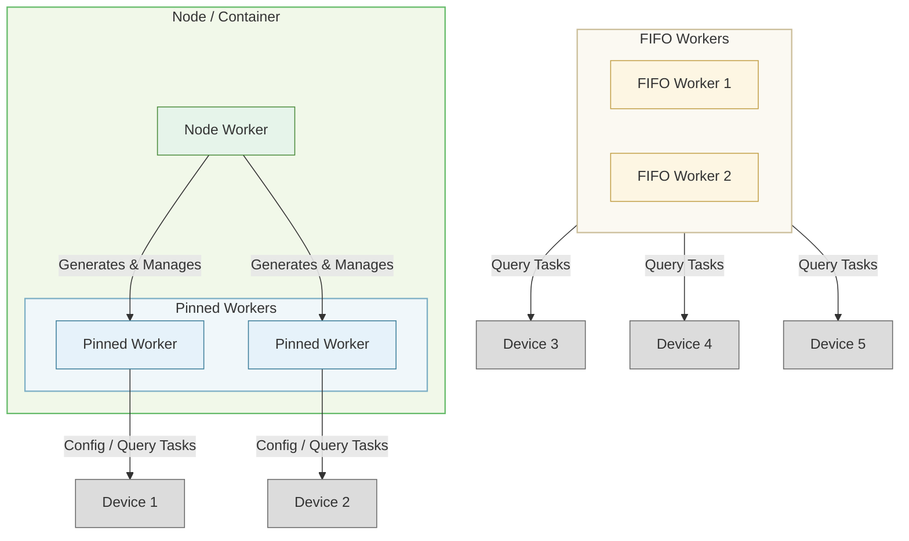

# Architecture Overview

NetPulse is a distributed RESTful proxy for network device operations, built on a modular architecture with the following key components:

## Core Components

1. **RESTful API**
    - Built on FastAPI
    - Handles incoming requests, validates and queues tasks

2. **Message Queue**
    - Redis-based task queue (based on RQ)
    - Used for state synchronization in multi-master multi-slave architecture
    - Stores task states and execution results

3. **Worker Nodes**
    - Three types of Workers designed to handle different types of tasks
    - FIFO Worker: Processes tasks in order
    - Node Worker: Acts as a daemon managing Pinned Workers and node state
    - Pinned Worker: Maintains connection with a single device, executes tasks for that device serially

4. **Plugin System**
    - Extensible plugin system including device drivers, schedulers, template engines, and webhooks
    - Clear interface definitions for easy secondary development and integration

## Design Philosophy

NetPulse's core design philosophy lies in the division of labor among three types of Workers.

In network operations, there are typically two types of tasks:

- **Query Tasks:** Pulling device status, checking configuration information, etc.
- **Configuration Tasks:** Pushing and applying device configurations

These two types of tasks present different requirements for operators. Simply put, query tasks often do not require a specific order, while configuration tasks must guarantee order on a single device. Moreover, users often expect query tasks to execute quickly, while configuration tasks can tolerate queuing. This leads to the necessity of designing two types of Workers: Pinned Workers and FIFO Workers.

Pinned Workers are specifically responsible for connecting to one device, maintaining a one-to-one relationship with the device. Therefore, when clients send tasks to Pinned Workers, they can guarantee that tasks are executed strictly in order on the device. This makes Pinned Workers very suitable for handling configuration tasks.

FIFO Workers have no binding relationship with devices. A system can deploy multiple FIFO Workers. Multiple FIFO Workers simultaneously retrieve tasks from Redis and execute them as quickly as possible. This parallelism shortens task queuing time but also means there is no strict guarantee of order between tasks. Therefore, FIFO Workers are very suitable for completing query tasks.

During deployment, we can pre-start a specified number of FIFO Workers, but it's impossible to pre-start Pinned Workers because we cannot predict which devices users will operate on. Therefore, Pinned Workers must be generated dynamically, and Node Workers serve as "daemon processes" to dynamically generate Pinned Workers within containers and nodes.

In addition to the above basic design considerations, we further utilize the characteristic that a single Pinned Worker is only associated with one device to implement SSH Session persistence in Pinned Workers, further improving task execution stability and reducing latency (refer to [SSH Keepalive](./drivers.md)).

# Feature Comparison

Compared to existing projects like NetPalm, NetPulse has the following significant advantages:

## Streamlined Functionality

NetPulse conducted in-depth analysis of business requirements during its initial design and fully considered functionality universality. Compared to NetPalm, NetPulse focuses on the core functionality of command execution, leaving auxiliary functions like template management and scheduled task triggers to upper-layer business systems. This streamlined design philosophy makes NetPulse easier to maintain while better integrating into existing infrastructure environments.

## Excellent Performance

NetPulse achieves significant performance improvements through three key technologies:

- **Connection Keepalive Mechanism**: By maintaining long connections, it greatly reduces execution delays caused by repeatedly establishing connections, achieving rapid command execution.
- **Diverse Scheduling Algorithms**: Provides multiple scheduling strategies such as load balancing and resource centralization, performing better than NetPalm's single greedy algorithm.
- **Batch Command Interface**: Supports batch command execution, effectively reducing duplicate request overhead during large-scale device operations. Combined with batch scheduling algorithms, the performance advantages are even more pronounced.

## High Availability

NetPulse's distributed architecture design provides excellent scalability and fault tolerance capabilities. Through the multi-master multi-slave architecture, the system can maintain stable operation even when some nodes fail, ensuring business continuity.

## Flexible Extension

The plugin system design allows users to easily extend NetPulse's functionality according to their needs. Whether adding new device drivers, implementing custom scheduling algorithms, or integrating with existing systems, it can be achieved through plugins.

---

For more detailed information about specific components, see:
- [Driver System](drivers.md)
- [Template System](templates.md)
- [Scheduler System](schedulers.md)
- [Plugin System](plugins.md)
- [Webhook System](webhooks.md) 