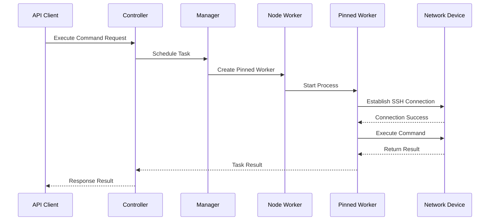
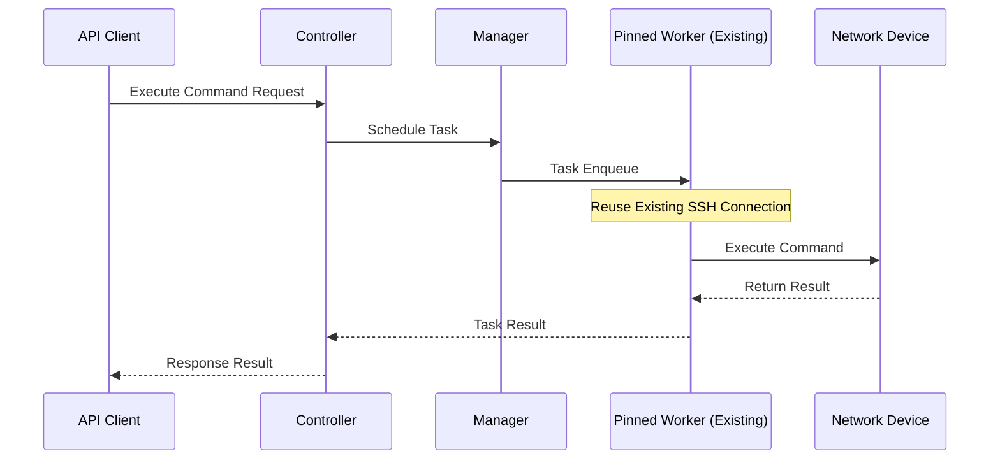

# Device Driver System

NetPulse provides extensible driver support through its plugin system. Users can use the three built-in supported drivers, or develop custom drivers as needed.

## Core Drivers

| Driver   | Protocol      | Vendor Support              | Key Features                              | Dependencies      |
|----------|---------------|-----------------------------|-------------------------------------------|-------------------|
| Netmiko  | SSH/Telnet    | 30+ vendors                 | CLI command execution, **SSH keepalive** | netmiko~=4.5.0    |
| NAPALM   | API/SSH       | Multi-vendor (Cisco/Juniper/Arista) | Configuration management, state collection | napalm~=5.0.0     |
| pyeAPI   | HTTP/HTTPS    | Arista EOS only             | Native EOS API access, HTTP-based eAPI | pyeapi~=1.0.4     |

## Specify Device Driver

In /device/execute and /device/bulk APIs, use the `driver` field to specify the driver to be used for this task:

```json
{
  "driver": "netmiko",
  "connection_args": {
    "device_type": "cisco_ios",
    "host": "192.168.1.1",
    "username": "admin",
    "password": "password123"
  },
  ...
}
```

Note that when selecting different drivers, fields in `connection_args` may change. Please refer to the driver documentation for details.


## Custom Driver Development

To add support for new protocols/vendors, implement custom drivers through the following steps:

1. Create a new directory in `netpulse/plugins/drivers/`
2. Inherit `BaseDriver` class and implement required methods
   ```python
   class CustomDriver(BaseDriver):
       driver_name = "custom"

       def connect(self):
       # ...

       # For specific methods, please refer to BaseDriver class
   ```
4. Register driver in `__init__.py`
   ```python
    __all__ = [CustomDriver]
   ```

For detailed introduction to the plugin system, please refer to [Plugin System](./plugin-system.md).

## Netmiko

Netmiko driver is a mature and stable driver in NetPulse, supporting 30+ network device types. Netmiko driver uses SSH and Telnet protocols to communicate with devices, supporting CLI command execution.

When using [Pinned Worker](./architecture-overview.md) with Netmiko driver, the Worker will create a new SSH connection and periodically send keepalive commands and KeepAlive packets. This maintains connection activity at both TCP connection and application layer protocol levels, thereby avoiding delays caused by SSH connection disconnection and reconnection.

Users can configure SSH keepalive time through the `keepalive` parameter. When SSH keepalive fails, Pinned Worker will automatically exit. When tasks are sent again, a new Pinned Worker will be created to connect to the device.

## Long Connection Technology

### Technology Overview

Long connection technology refers to maintaining connection state after establishing SSH connection with network devices, rather than disconnecting after each command execution. This technology can:

- **Reduce Connection Overhead**: Avoid overhead of repeated connection establishment, can improve response speed in frequent operation scenarios
- **Improve Operation Efficiency**: When frequently operating the same device, can reduce connection establishment time
- **Reduce Resource Consumption**: Reduce resource consumption related to connection establishment
- **Improve Connection Stability**: Reduce connection failures that may be caused by frequent connections

### Connection Lifecycle

#### 1. Connection Establishment Phase

When creating a Pinned Worker for a device for the first time, the Worker will establish SSH connection and persist the connection:



#### 2. Connection Reuse Phase

Subsequent requests to the same device will reuse the existing Pinned Worker and its SSH connection:



#### 3. Connection Maintenance Phase

Pinned Worker maintains connection activity by periodically executing the following operations through monitoring thread:

- **Health Check**: Call `session.is_alive()` to check connection status
- **Application Layer Keepalive**: Periodically send carriage return (RETURN) to keep session active
- **Auto Recovery**: When connection is disconnected, Pinned Worker automatically exits, will be recreated on next request

When connection health check fails or keepalive fails, Pinned Worker will actively exit (suicide), ensuring that connection can be re-established on next request.

## Design Considerations

### Why Only Implement Long Connection in Pinned Worker?

**Reasons**:
1. **Device Binding**: Pinned Worker has one-to-one binding with device, connection can be reused long-term
2. **Order Guarantee**: Serial execution ensures connection state consistency
3. **Resource Efficiency**: Avoid overhead of establishing new connection for each task

FIFO Worker doesn't implement long connection because:
- No device binding, low connection reuse rate
- Parallel execution, complex connection state management
- "Connect on use" mode is simpler and more reliable

### Keepalive Mechanism Design

Keepalive mechanism works at two levels:
1. **TCP Layer**: Keep TCP connection active through SSH KeepAlive option
2. **Application Layer**: Periodically send carriage return (RETURN) to keep SSH session active

This dual keepalive mechanism can handle timeout settings of network intermediate devices (such as NAT, firewalls), ensuring connections won't be disconnected due to idle.

### Auto Recovery Mechanism

When connection fails, Pinned Worker will actively exit (suicide), rather than attempting to reconnect. Reasons for this design:
- **Simplify Logic**: Avoid complex reconnection logic and state management
- **Fast Recovery**: New Worker will be created on next request, automatically establishing new connection
- **State Consistency**: Ensure Worker state is consistent with connection state
