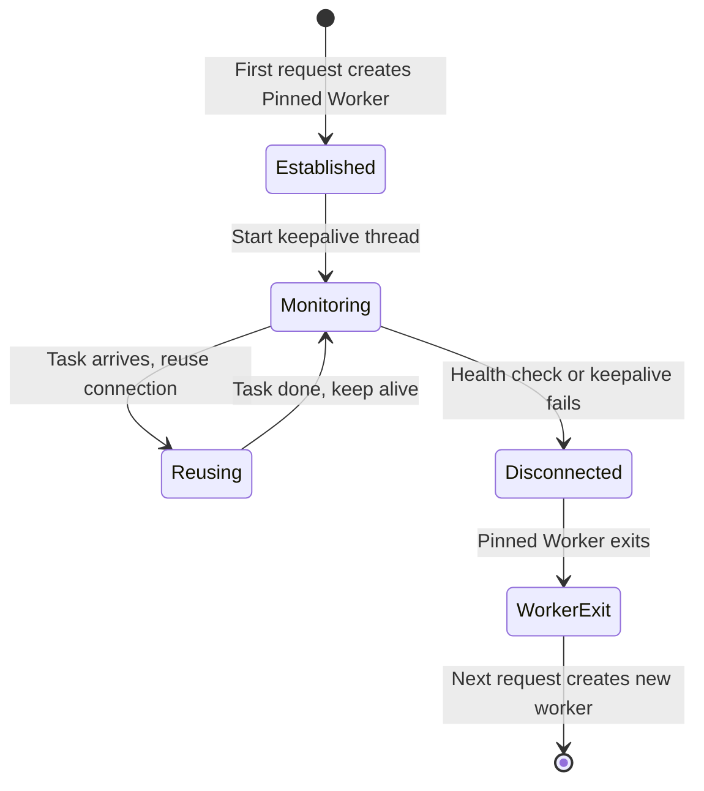

# Driver System

NetPulse provides extensible driver support through its plugin system.

## Built-in Drivers

| Driver | Protocol | Vendor Support | Key Features | Dependency |
|--------|----------|---------------|--------------|------------|
| Netmiko | SSH/Telnet | 30+ vendors | CLI execution, **SSH keepalive** | netmiko~=4.5.0 |
| NAPALM | API/SSH | Multi-vendor | Config merge/replace/rollback | napalm~=5.0.0 |
| PyEAPI | HTTP/HTTPS | Arista EOS only | Native eAPI, JSON output | pyeapi~=1.0.4 |
| Paramiko | SSH | Linux servers | File transfer, proxy, sudo | paramiko~=3.0.0 |

Specify the driver via the `driver` field in API requests:

```json
{
  "driver": "netmiko",
  "connection_args": {
    "device_type": "cisco_ios",
    "host": "192.168.1.1",
    "username": "admin",
    "password": "password"
  },
  "command": "show version"
}
```

See [Driver Selection Guide](../drivers/index.md) for detailed parameters and selection advice.

## Persistent Connection Technology

Persistent connections are NetPulse's core performance optimization. Pinned Workers maintain SSH sessions between tasks, avoiding repeated connection establishment.

### Performance Impact

| Scenario | Without Persistence | With Persistence | Improvement |
|----------|-------------------|-----------------|-------------|
| First connection | 2-5s | 2-5s | — |
| Subsequent operations | 2-5s | 0.5-0.9s | **60-80%** |
| 10 operations on same device | 20-50s | 5-9s | **75-82%** |

### How It Works

1. **First request** to a device → Node Worker creates a Pinned Worker → SSH connection established and persisted
2. **Subsequent requests** → Routed to the existing Pinned Worker → Connection reused (no handshake)
3. **Keepalive** — Dual mechanism maintains connection liveness:
   - **SSH layer**: Netmiko `keepalive` parameter sends protocol-level keepalive packets
   - **Application layer**: Monitor thread periodically sends RETURN to prevent device idle disconnect
4. **Recovery** — If connection dies, the Pinned Worker exits ("suicide"). A new one is auto-created on the next request.

### Connection Lifecycle


```mermaid
stateDiagram-v2
    [*] --> Established: First request creates Pinned Worker
    Established --> Monitoring: Start keepalive thread
    Monitoring --> Reusing: Task arrives, reuse connection
    Reusing --> Monitoring: Task done, keep alive
    Monitoring --> Disconnected: Health check or keepalive fails
    Disconnected --> WorkerExit: Pinned Worker exits
    WorkerExit --> [*]: Next request creates new worker
```

### Concurrency Safety

Netmiko's `BaseConnection` is not thread-safe. A `_monitor_lock` ensures the monitor thread and task execution never operate the connection simultaneously.

### When to Use

**Good fit** — Frequent operations on the same device, config change sequences, real-time monitoring.

**Not ideal** — One-off operations across many devices (use FIFO), long-running tasks, file transfers (use Paramiko with FIFO).

### Keepalive Configuration

```json
{
  "connection_args": {
    "host": "192.168.1.1",
    "keepalive": 30
  }
}
```

- Default: 180s. Recommended: 30-60s.
- Tune based on NAT/firewall timeouts and device SSH idle timeout.

## Custom Driver Development

1. Create a directory in `netpulse/plugins/drivers/`
2. Inherit `BaseDriver` and implement `connect()`, `send()`, `config()`, `disconnect()`
3. Set `driver_name` class attribute
4. Export via `__all__` in `__init__.py`

```python
class CustomDriver(BaseDriver):
    driver_name = "custom"

    def connect(self):
        ...
```

See [Plugin System](./plugin-system.md) for the full plugin development guide.
