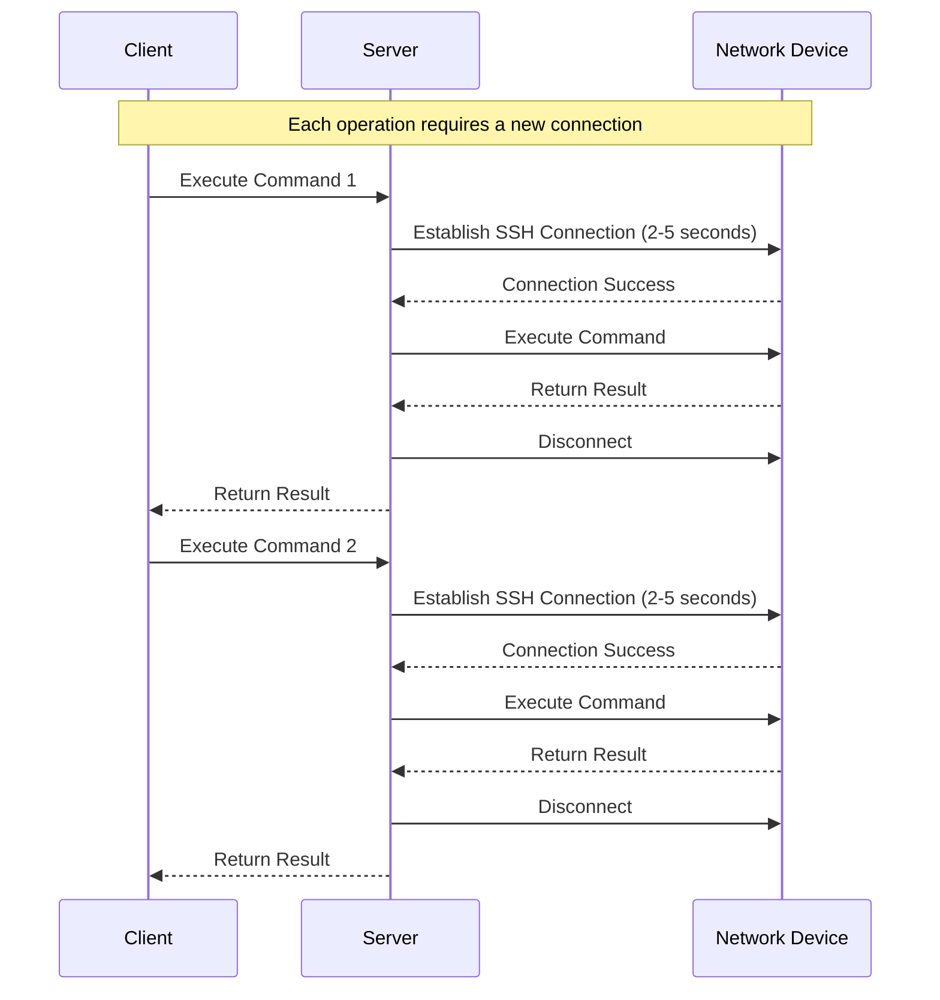
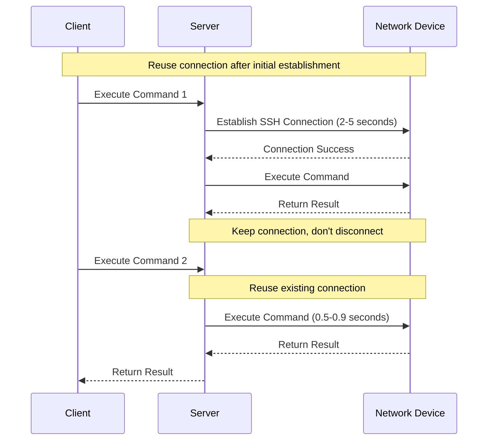
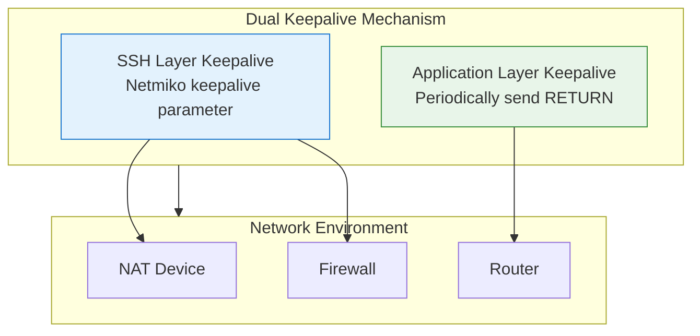
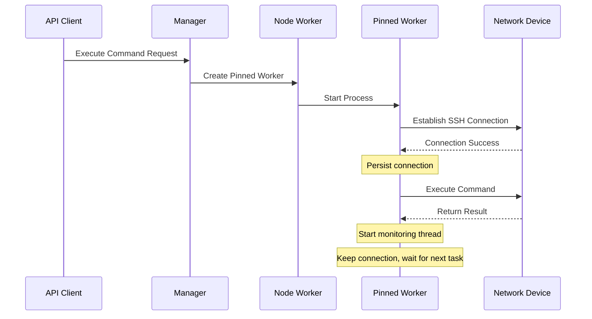
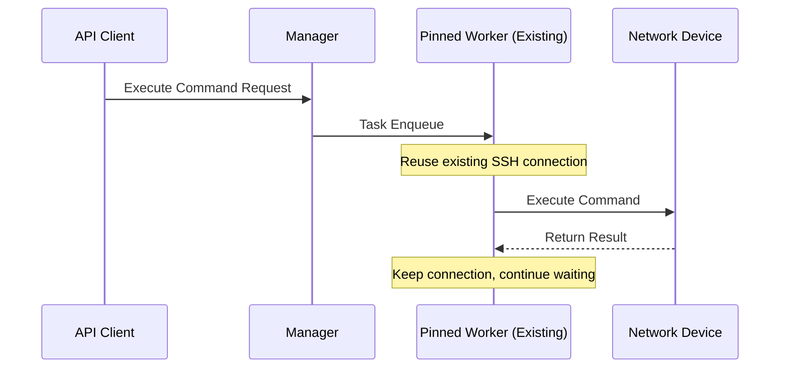
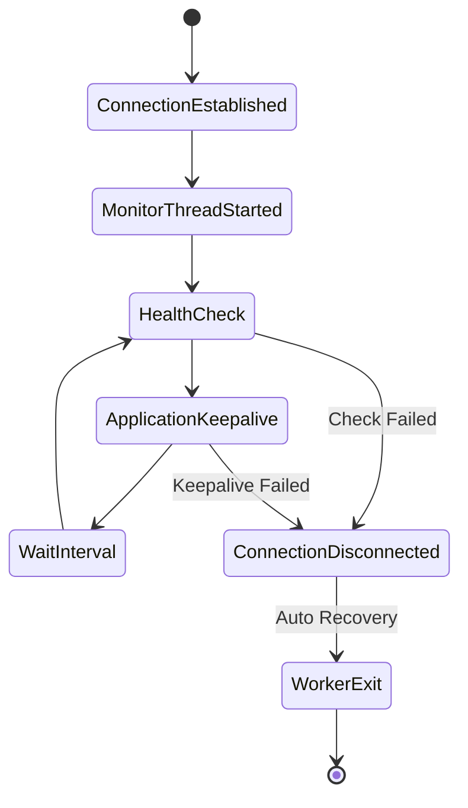

# Long Connection Technology

!!! info "About This Document"
    This document provides an in-depth introduction to the implementation principles, technical details, and best practices of long connection (persistent SSH connection) technology in NetPulse. This is one of NetPulse's core performance optimization technologies, significantly improving device operation response speed through SSH connection reuse.

---

Long connection technology is NetPulse's core performance optimization feature. By maintaining persistent SSH connections with network devices in Pinned Workers, it avoids the overhead of repeated connection establishment and significantly improves response speed in frequent operation scenarios.

## Technical Background

### Challenges of Traditional Approach

Traditional network device management uses a "connect on use" mode:



**Problems**:
- **High Connection Overhead**: Each operation requires 2-5 seconds to establish a connection
- **High Resource Consumption**: Frequent connection establishment and disconnection consume system resources
- **Connection Failure Risk**: Frequent connections may lead to connection failures
- **Slow Response**: Performance bottleneck is obvious when frequently operating the same device

### Value of Long Connection Technology

Long connection technology solves the above problems by reusing SSH connections:



**Benefits**:
- **Performance Improvement**: Response time reduced from 2-5 seconds to 0.5-0.9 seconds
- **Resource Savings**: Reduce overhead of connection establishment and disconnection
- **Stability Improvement**: Reduce failures caused by frequent connections
- **Efficiency Improvement**: Significant effect in frequent operation scenarios

## Technical Principles

### Dual Keepalive Mechanism

NetPulse's long connection technology uses a dual keepalive mechanism, maintaining connection activity at both SSH layer and application layer:



#### 1. SSH Layer Keepalive

Configure SSH keepalive option through Netmiko's `keepalive` parameter:

```python
# Configure keepalive in connection args (unit: seconds)
connection_args = {
    "host": "192.168.1.1",
    "username": "admin",
    "password": "password",
    "keepalive": 30,  # SSH keepalive interval
    # ...
}
```

**How It Works**:
- The `keepalive` parameter is passed to Netmiko's `ConnectHandler` to configure SSH keepalive
- Netmiko maintains connection activity through SSH protocol-level keepalive mechanism
- In the monitoring thread, the `keepalive` parameter value is also used as the interval for application layer keepalive
- Helps prevent intermediate devices (NAT, firewalls) from disconnecting due to timeout

#### 2. Application Layer Keepalive

Maintain SSH session activity by periodically sending carriage return (RETURN) through monitoring thread:

```python
# Monitoring thread periodically executes
session.write_channel(session.RETURN)  # Send carriage return
```

**How It Works**:
- Periodically send carriage return to device, triggering device response
- Maintain SSH session activity at application layer
- **Prevent network devices from actively disconnecting**: Many network devices (such as routers, switches) will actively disconnect SSH sessions when detecting long inactivity. Periodically sending carriage return can simulate user activity and prevent devices from actively disconnecting
- Detect if connection is truly available (if connection is disconnected, sending will fail)

### Connection State Management

Long connection state management includes three core phases:

#### 1. Connection Establishment Phase

When creating a Pinned Worker for a device for the first time:



**Key Steps**:
1. Manager detects that device has no corresponding Pinned Worker
2. Notify Node Worker to create new Pinned Worker process
3. Pinned Worker establishes SSH connection
4. After connection succeeds, start monitoring thread for keepalive
5. Connection is persisted, waiting for subsequent task reuse

#### 2. Connection Reuse Phase

Subsequent requests to the same device will reuse existing connection:



**Key Features**:
- No need to re-establish connection
- Directly use existing SSH session
- Response time significantly reduced

#### 3. Connection Maintenance Phase

Monitoring thread periodically executes health check and keepalive operations:



**Maintenance Mechanism**:
- **Health Check**: Periodically call `session.is_alive()` to check connection status
- **Application Layer Keepalive**: Periodically send carriage return to keep session active
- **Auto Recovery**: When connection is disconnected, Worker actively exits, will be automatically recreated on next request

## Implementation Details

### Code Architecture

The core implementation of long connection technology is in `NetmikoDriver`:

```python
class NetmikoDriver(BaseDriver):
    # Persistent session
    persisted_session: BaseConnection = None
    persisted_conn_args: NetmikoConnectionArgs = None
    
    # Monitoring thread related
    _monitor_stop_event = None
    _monitor_thread = None
    _monitor_lock = threading.Lock()
```

### Connection Persistence

#### Session Get and Set

```python
@classmethod
def _get_persisted_session(cls, conn_args: NetmikoConnectionArgs) -> Optional[BaseConnection]:
    """Check if persisted session is still valid"""
    if cls.persisted_session and cls.persisted_conn_args != conn_args:
        # Connection args changed, disconnect old connection
        with cls._monitor_lock:  # Use lock protection
            try:
                cls.persisted_session.disconnect()
            except Exception as e:
                log.error(f"Error in disconnecting old session: {e}")
            finally:
                cls._set_persisted_session(None, None)
    
    return cls.persisted_session

@classmethod
def _set_persisted_session(cls, session: BaseConnection, conn_args: NetmikoConnectionArgs):
    """Persist session and start monitoring thread"""
    # Clear connection
    if session is None:
        if cls.persisted_conn_args and cls.persisted_conn_args.keepalive:
            cls._stop_monitor_thread()
        cls.persisted_session = None
        cls.persisted_conn_args = None
        return None
    
    # Set connection
    cls.persisted_session = session
    cls.persisted_conn_args = conn_args
    cls._start_monitor_thread(cls.persisted_session)
```

#### Connection Reuse Logic

```python
def connect(self) -> BaseConnection:
    # Try to get existing connection
    session = self._get_persisted_session(self.conn_args)
    if session:
        log.info("Reusing existing connection")
    else:
        # Create new connection
        log.info(f"Creating new connection to {self.conn_args.host}...")
        session = ConnectHandler(**self.conn_args.model_dump())
        if self.conn_args.keepalive:
            self._set_persisted_session(session, self.conn_args)
    return session
```

### Monitoring Thread Implementation

Monitoring thread is the core of long connection technology, responsible for connection health check and keepalive:

```python
@classmethod
def _start_monitor_thread(cls, session: BaseConnection):
    """Start monitoring thread"""
    if cls._monitor_thread and cls._monitor_thread.is_alive():
        return
    
    cls._monitor_stop_event = threading.Event()
    host = cls.persisted_conn_args.host
    timeout = cls.persisted_conn_args.keepalive  # Keepalive interval
    
    def monitor():
        suicide = False
        log.info(f"Monitoring thread started ({host})")
        
        while not cls._monitor_stop_event.is_set():
            # Wait for keepalive interval
            if cls._monitor_stop_event.wait(timeout=timeout):
                break
            
            with cls._monitor_lock:  # Concurrency safety control
                # Double checking
                if cls._monitor_stop_event.is_set():
                    break
                
                # Health checking
                if not session.is_alive():
                    log.warning(f"Connection to {host} is unhealthy")
                    suicide = True
                    cls._monitor_stop_event.set()
                    break
                
                # Keepalive
                try:
                    if junk := session.clear_buffer():  # Clear buffer
                        log.debug(f"Detected junk data in keepalive: {junk}")
                    session.write_channel(session.RETURN)  # Send carriage return
                except Exception as e:
                    log.warning(f"Error in sending keepalive to {host}: {e}")
                    suicide = True
                    cls._monitor_stop_event.set()
                    break
        
        log.debug(f"Monitoring thread quitting with `suicide={suicide}`.")
        
        # When connection is disconnected, Worker actively exits
        if suicide:
            log.info(f"Pinned worker for {host} suicides.")
            os.kill(os.getpid(), signal.SIGTERM)
        
        # Only exit from current thread
        sys.exit(0)
    
    cls._monitor_thread = threading.Thread(target=monitor, daemon=True)
    cls._monitor_thread.start()
```

**Key Design Points**:

1. **Concurrency Safety**: Use `_monitor_lock` to ensure monitoring thread and task execution thread don't operate connection simultaneously
2. **Health Check**: Detect if connection is truly available through `session.is_alive()`
3. **Application Layer Keepalive**: Periodically send carriage return to keep session active, preventing network devices from actively disconnecting when detecting long inactivity
4. **Auto Recovery**: When connection fails, Worker actively exits (suicide), will be automatically recreated on next request

### Concurrency Safety Control

Since Netmiko's `BaseConnection` is not thread-safe, lock mechanism must be used to ensure concurrency safety:

```python
def send(self, session: BaseConnection = None, command: Optional[list[str]] = None):
    """Use lock protection when sending commands"""
    try:
        with self._monitor_lock:  # Acquire lock
            if self.enabled:
                session.enable()
            
            result = {}
            for cmd in command:
                response = session.send_command(cmd, **self.args.model_dump())
                result[cmd] = response
            
            if self.enabled:
                session.exit_enable_mode()
        
        return result
    except Exception as e:
        log.error(f"Error in sending command: {e}")
        raise e
```

**Lock Usage Scenarios**:
- Task execution: Acquire lock, execute command
- Monitoring thread keepalive: Acquire lock, send keepalive message
- Ensure only one thread operates connection at a time

### Auto Recovery Mechanism

When connection fails, use "suicide" mechanism instead of reconnection:

```python
# When connection fails
if suicide:
    log.info(f"Pinned worker for {host} suicides.")
    os.kill(os.getpid(), signal.SIGTERM)  # Send SIGTERM signal
    sys.exit(0)
```

**Design Reasons**:
- **Simplify Logic**: Avoid complex reconnection logic and state management
- **Fast Recovery**: New Worker will be created on next request, automatically establishing new connection
- **State Consistency**: Ensure Worker state is consistent with connection state

## Performance Optimization

### Performance Comparison

| Scenario | Traditional Approach | Long Connection Technology | Performance Improvement |
|----------|---------------------|---------------------------|------------------------|
| First Connection | 2-5 seconds | 2-5 seconds | - |
| Subsequent Operations | 2-5 seconds | 0.5-0.9 seconds | **60-80%** |
| Frequent Operations (10 times) | 20-50 seconds | 5-9 seconds | **75-82%** |

### Applicable Scenarios

Long connection technology is particularly suitable for the following scenarios:

1. **Frequent Operations on Same Device**
   - Batch configuration push
   - Real-time monitoring and collection
   - Configuration change operations

2. **Operations Requiring Order Guarantee**
   - Configuration modification tasks
   - Command sequences requiring serial execution

3. **Scenarios with High Response Speed Requirements**
   - Real-time monitoring
   - Automation scripts

### Non-Applicable Scenarios

The following scenarios are not suitable for long connections:

1. **Occasional Operations on Different Devices**
   - Low connection reuse rate, cannot leverage advantages
   - Recommend using FIFO Worker

2. **Long-Running Tasks**
   - File transfer
   - Long-running commands
   - Recommend using FIFO Worker (short connection)

## Best Practices

### Configuration Recommendations

#### 1. Keepalive Parameter Configuration

```python
connection_args = {
    "host": "192.168.1.1",
    "username": "admin",
    "password": "password",
    "keepalive": 30,  # Recommended: 30-60 seconds
    # ...
}
```

**Configuration Recommendations**:
- **Default Value**: 180 seconds (3 minutes)
- **Recommended Value**: 30-60 seconds
- **Minimum Value**: Not recommended less than 10 seconds (avoid too frequent keepalive)
- **Maximum Value**: Not recommended greater than 300 seconds (avoid connection being disconnected by intermediate devices)

**Influencing Factors**:
- Network environment: Timeout settings of NAT, firewalls
- Device type: SSH timeout settings of different devices
- Operation frequency: Frequent operations can set smaller value

#### 2. Queue Strategy Selection

```python
options = {
    "queue_strategy": "pinned",  # Use Pinned Worker to enable long connection
    "ttl": 600,  # Worker idle timeout (seconds)
}
```

**Configuration Description**:
- `queue_strategy: "pinned"`: Enable long connection technology
- `ttl`: Worker idle timeout, will be automatically cleaned up if unused beyond this time

### Monitoring and Debugging

#### 1. Log Monitoring

Monitoring thread outputs detailed log information:

```
INFO: Monitoring thread started (192.168.1.1)
DEBUG: Detected junk data in keepalive: ...
WARNING: Connection to 192.168.1.1 is unhealthy
INFO: Pinned worker for 192.168.1.1 suicides.
```

#### 2. Connection Status Check

Worker status can be queried through API to understand connection situation.

#### 3. Performance Monitoring

Monitor the following metrics:
- Connection establishment time
- Command execution response time
- Connection reuse rate
- Worker survival time

## Troubleshooting

### Common Issues

#### 1. Frequent Connection Disconnection

**Symptoms**: Worker frequently exits and rebuilds

**Possible Causes**:
- Keepalive interval set too large
- Network intermediate devices (NAT, firewalls) timeout settings too short
- Device SSH timeout settings too short

**Solutions**:
- Reduce `keepalive` parameter value (e.g., from 180 seconds to 30 seconds)
- Check timeout settings of network intermediate devices
- Check device SSH configuration

#### 2. Keepalive Failure

**Symptoms**: "Error in sending keepalive" appears in logs

**Possible Causes**:
- Unstable network
- Slow device response
- Connection disconnected but not detected

**Solutions**:
- Check network connection stability
- Increase `keepalive` interval
- Check device status

#### 3. Connection Reuse Failure

**Symptoms**: New connection established for each operation

**Possible Causes**:
- Connection parameters changed (host, username, etc.)
- Worker cleaned up (TTL timeout)
- Connection disconnected but not rebuilt in time

**Solutions**:
- Ensure connection parameters are consistent
- Adjust `ttl` parameter
- Check Worker status

### Debugging Tips

#### 1. Enable Detailed Logging

```python
import logging
logging.basicConfig(level=logging.DEBUG)
```

#### 2. Monitor Thread Status

Check if monitoring thread is running normally:

```python
# Add log in code
log.info(f"Monitor thread alive: {cls._monitor_thread.is_alive()}")
```

#### 3. Connection Status Check

Periodically check connection status:

```python
if session.is_alive():
    log.info("Connection is alive")
else:
    log.warning("Connection is dead")
```

## Technical Comparison

### Comparison with Other Solutions

| Solution | Advantages | Disadvantages | Applicable Scenarios |
|----------|-----------|---------------|---------------------|
| **Long Connection Technology** | High performance, resource saving | Need to maintain connection state | Frequent operations on same device |
| **Short Connection (Traditional)** | Simple and reliable, stateless | Low performance, high resource consumption | Occasional operations, long-running tasks |
| **Connection Pool** | Balance performance and complexity | Complex implementation, difficult state management | Medium frequency operations |

### Design Decisions

#### Why Choose "Suicide" Instead of Reconnection?

**Reasons**:
1. **Simplify Logic**: Avoid complex reconnection logic and state management
2. **Fast Recovery**: New Worker will be automatically created on next request
3. **State Consistency**: Ensure Worker state is consistent with connection state

#### Why Only Implement in Pinned Worker?

**Reasons**:
1. **Device Binding**: Pinned Worker has one-to-one binding with device, connection can be reused long-term
2. **Order Guarantee**: Serial execution ensures connection state consistency
3. **Resource Efficiency**: Avoid overhead of establishing new connection for each task

FIFO Worker doesn't implement long connection because:
- No device binding, low connection reuse rate
- Parallel execution, complex connection state management
- "Connect on use" mode is simpler and more reliable

## Summary

Long connection technology is NetPulse's core performance optimization feature, implemented through the following mechanisms:

1. **Dual Keepalive**: SSH layer and application layer dual keepalive mechanism
2. **Connection Reuse**: Persist SSH connection, avoid repeated establishment
3. **Auto Recovery**: Automatically rebuild when connection fails
4. **Concurrency Safety**: Use lock mechanism to ensure thread safety

**Performance Improvement**:
- Performance improvement of 60-80% in frequent operation scenarios (see performance comparison table for details)

**Applicable Scenarios**:
- Frequent operations on same device
- Operations requiring order guarantee
- Scenarios with high response speed requirements

Through proper configuration and usage, long connection technology can significantly improve NetPulse's performance and user experience.
