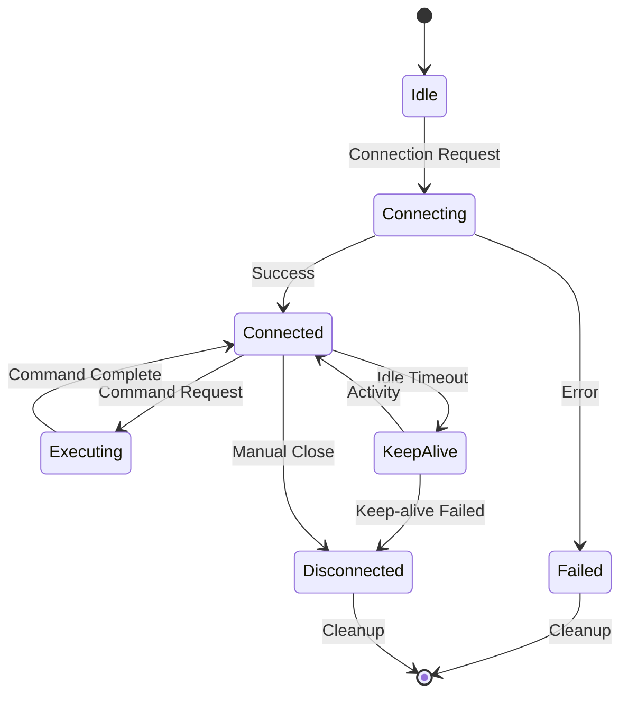

# Long Connection Technology

This document describes NetPulse's long connection technology and its implementation for persistent device connections.

## Overview

NetPulse uses long connection technology to maintain persistent SSH connections with network devices, significantly reducing command execution latency and improving system performance.

## Benefits

### Performance Improvements
- **Reduced Latency**: Eliminates connection establishment overhead
- **Faster Command Execution**: Commands execute immediately on existing connections
- **Higher Throughput**: More commands processed per second

### Resource Efficiency
- **Connection Reuse**: Single connection serves multiple commands
- **Reduced Network Overhead**: Fewer TCP handshakes and SSH negotiations
- **Lower CPU Usage**: Less cryptographic overhead

## Implementation

### Connection Pool Management
```python
class ConnectionPool:
    def __init__(self, max_connections=10):
        self.connections = {}
        self.max_connections = max_connections
    
    async def get_connection(self, device_info):
        """Get or create connection for device"""
        device_key = f"{device_info.host}:{device_info.port}"
        
        if device_key in self.connections:
            connection = self.connections[device_key]
            if connection.is_alive():
                return connection
        
        # Create new connection
        connection = await self.create_connection(device_info)
        self.connections[device_key] = connection
        return connection
```

### Keep-alive Mechanism
```python
class KeepAliveManager:
    def __init__(self, interval=60):
        self.interval = interval
        self.running = False
    
    async def start_keepalive(self, connection):
        """Start keep-alive for connection"""
        while self.running and connection.is_alive():
            try:
                # Send keep-alive command
                await connection.send_command("", expect_string="")
                await asyncio.sleep(self.interval)
            except Exception as e:
                logger.warning(f"Keep-alive failed: {e}")
                break
```

### Connection Lifecycle


## Configuration

### Connection Parameters
```yaml
long_connection:
  enabled: true
  max_idle_time: 300        # Maximum idle time (seconds)
  keepalive_interval: 60    # Keep-alive interval (seconds)
  max_connections: 10       # Maximum connections per device
  connection_timeout: 30    # Connection timeout (seconds)
```

### Per-device Configuration
```python
device_config = {
    "host": "192.168.1.1",
    "username": "admin",
    "password": "admin123",
    "connection_args": {
        "keepalive": True,
        "keepalive_interval": 60,
        "max_idle_time": 300
    }
}
```

## Best Practices

### Connection Management
- Monitor connection health regularly
- Implement proper connection cleanup
- Set appropriate timeout values
- Handle connection failures gracefully

### Security Considerations
- Use secure authentication methods
- Implement connection encryption
- Monitor for unauthorized access
- Regular credential rotation

### Performance Optimization
- Tune keep-alive intervals
- Monitor connection utilization
- Implement connection pooling
- Use batch operations when possible

---

For more details on implementation, see the [Driver System](drivers.md) documentation. 