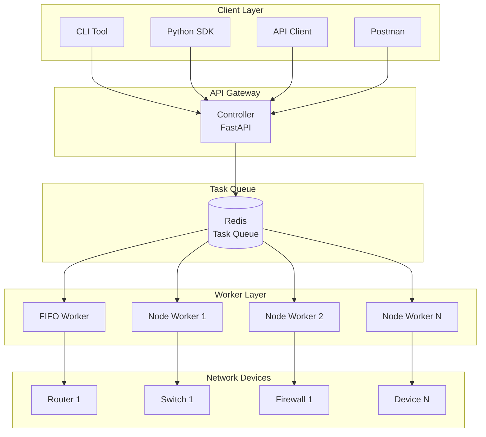
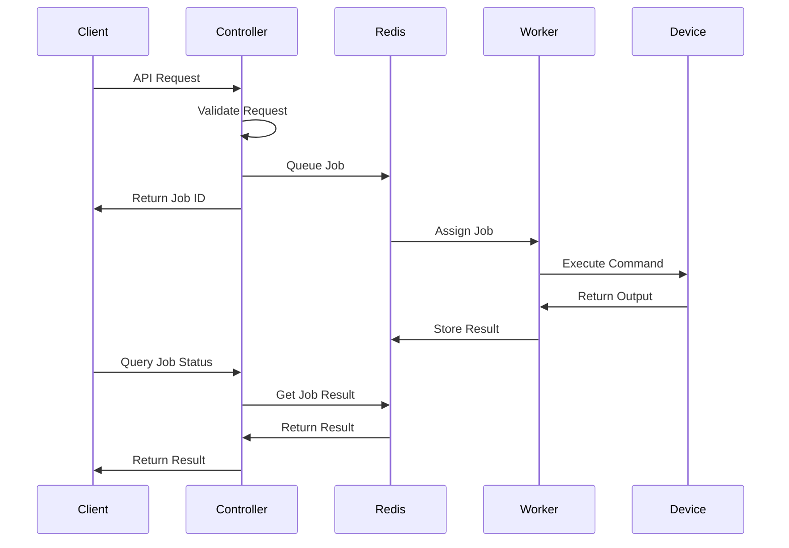
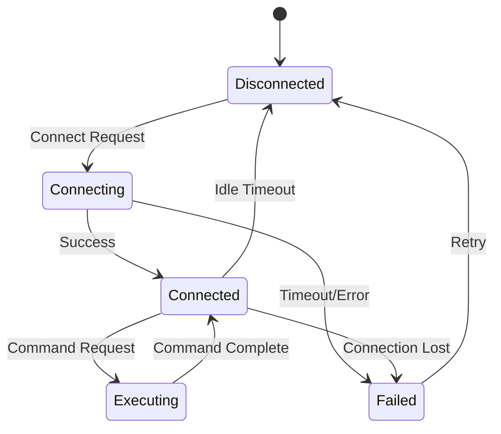
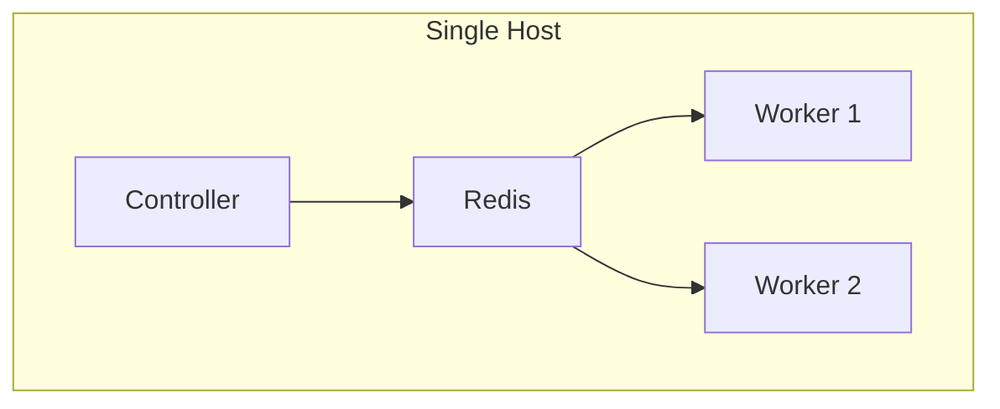
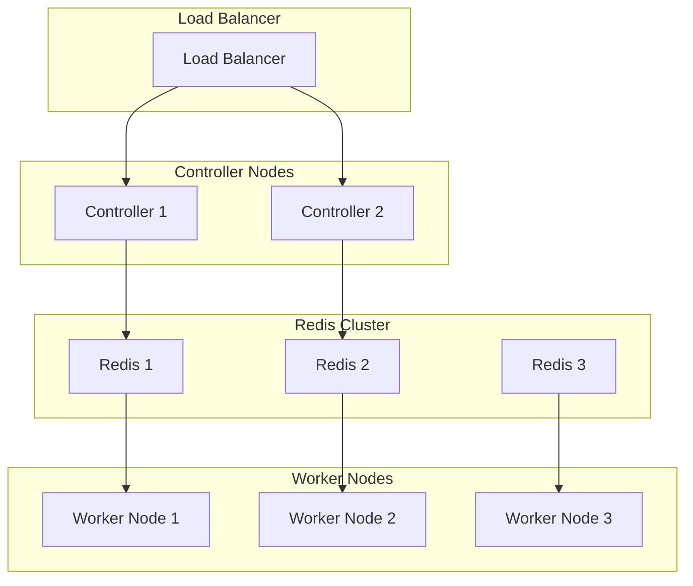

# Architecture Overview

This document provides a comprehensive overview of NetPulse's system architecture, design principles, and core components.

## System Architecture Diagram



## Design Principles

### 1. Distributed Architecture
- **Horizontal Scalability**: Add more worker nodes to handle increased load
- **Fault Tolerance**: System continues operating even if individual components fail
- **Load Distribution**: Tasks are distributed across multiple workers

### 2. Asynchronous Processing
- **Non-blocking Operations**: API returns immediately with job ID
- **Background Execution**: Tasks executed asynchronously by workers
- **Real-time Status**: Job status and results available via API

### 3. Multi-vendor Support
- **Driver Abstraction**: Unified interface for different device types
- **Extensible Drivers**: Easy to add support for new vendors
- **Protocol Agnostic**: Supports SSH, Telnet, HTTP(S), and other protocols

### 4. High Performance
- **Connection Reuse**: Persistent SSH connections reduce latency
- **Batch Operations**: Process multiple devices simultaneously
- **Caching**: Redis-based caching for improved performance

## Core Components

### API Controller
- **FastAPI Framework**: Modern, fast web framework
- **Authentication**: API key-based authentication
- **Request Validation**: Pydantic models for request/response validation
- **Rate Limiting**: Built-in rate limiting and throttling

### Task Queue (Redis)
- **Job Management**: Queue, schedule, and track job execution
- **Result Storage**: Store job results and status
- **Worker Coordination**: Coordinate work distribution among workers
- **Caching**: Cache frequently accessed data

### Worker Nodes
- **FIFO Worker**: First-in-first-out job processing
- **Node Workers**: Device-specific job processing
- **Connection Management**: Maintain persistent device connections
- **Error Handling**: Robust error handling and retry logic

### Driver System
- **Netmiko Driver**: SSH-based device communication
- **NAPALM Driver**: Multi-vendor network device abstraction
- **Custom Drivers**: Extensible driver framework
- **Protocol Support**: SSH, Telnet, HTTP(S), SNMP

## Data Flow

### 1. API Request Flow


### 2. Connection Management


## Scalability Architecture

### Horizontal Scaling
- **Multiple Controllers**: Load balancer distributes requests
- **Worker Scaling**: Add workers based on demand
- **Redis Clustering**: Scale Redis for high availability
- **Database Sharding**: Distribute data across multiple databases

### Vertical Scaling
- **Resource Optimization**: CPU, memory, and network optimization
- **Connection Pooling**: Efficient resource utilization
- **Caching Strategies**: Multi-level caching for performance

## Security Architecture

### Authentication & Authorization
- **API Key Authentication**: Secure API access
- **Role-based Access**: Different permission levels
- **Token Management**: Secure token generation and validation

### Network Security
- **TLS Encryption**: Encrypted communication
- **VPN Support**: Secure network access
- **Firewall Integration**: Network-level security

### Data Security
- **Credential Management**: Secure storage of device credentials
- **Audit Logging**: Comprehensive audit trails
- **Data Encryption**: Encryption at rest and in transit

## High Availability

### Redundancy
- **Multiple Controllers**: Active-active controller setup
- **Worker Redundancy**: Multiple workers for fault tolerance
- **Redis Sentinel**: Redis high availability
- **Database Clustering**: Database redundancy

### Monitoring & Alerting
- **Health Checks**: Continuous system health monitoring
- **Performance Metrics**: Real-time performance monitoring
- **Alerting System**: Automated alert notifications
- **Log Aggregation**: Centralized logging

## Performance Optimization

### Connection Optimization
- **Persistent Connections**: Long-lived SSH connections
- **Connection Pooling**: Efficient connection reuse
- **Keep-alive Mechanisms**: Maintain connection health

### Processing Optimization
- **Batch Processing**: Process multiple operations together
- **Parallel Execution**: Concurrent task processing
- **Queue Optimization**: Efficient job scheduling

### Caching Strategy
- **Result Caching**: Cache command outputs
- **Connection Caching**: Cache connection objects
- **Template Caching**: Cache compiled templates

## Deployment Architectures

### Single Node Deployment


### Multi-Node Deployment


### Kubernetes Deployment
```mermaid
graph TB
    subgraph "Kubernetes Cluster"
        subgraph "Ingress"
            Ingress[Nginx Ingress]
        end
        
        subgraph "Controller Pods"
            ControllerPod1[Controller Pod 1]
            ControllerPod2[Controller Pod 2]
        end
        
        subgraph "Redis Cluster"
            RedisPod1[Redis Pod 1]
            RedisPod2[Redis Pod 2]
            RedisPod3[Redis Pod 3]
        end
        
        subgraph "Worker Pods"
            WorkerPod1[Worker Pod 1]
            WorkerPod2[Worker Pod 2]
            WorkerPod3[Worker Pod 3]
        end
    end
    
    Ingress --> ControllerPod1
    Ingress --> ControllerPod2
    
    ControllerPod1 --> RedisPod1
    ControllerPod2 --> RedisPod2
    
    RedisPod1 --> WorkerPod1
    RedisPod2 --> WorkerPod2
    RedisPod3 --> WorkerPod3
```

## Technology Stack

### Backend Technologies
- **Python 3.12+**: Core programming language
- **FastAPI**: Web framework for APIs
- **Redis**: Task queue and caching
- **Pydantic**: Data validation and serialization
- **SQLAlchemy**: Database ORM

### Network Libraries
- **Netmiko**: SSH-based device communication
- **NAPALM**: Multi-vendor device abstraction
- **Paramiko**: SSH protocol implementation
- **Telnetlib**: Telnet protocol support

### Template Engines
- **Jinja2**: Configuration template rendering
- **TextFSM**: Command output parsing
- **TTP**: Template Text Parser

### Deployment Technologies
- **Docker**: Containerization
- **Docker Compose**: Multi-container orchestration
- **Kubernetes**: Container orchestration platform
- **Nginx**: Load balancing and reverse proxy

## Future Architecture Considerations

### Microservices Evolution
- **Service Decomposition**: Break down into smaller services
- **API Gateway**: Centralized API management
- **Service Mesh**: Inter-service communication
- **Event-driven Architecture**: Asynchronous service communication

### Cloud-native Features
- **Auto-scaling**: Automatic resource scaling
- **Service Discovery**: Dynamic service registration
- **Circuit Breakers**: Fault tolerance patterns
- **Distributed Tracing**: End-to-end request tracing

### Advanced Features
- **Machine Learning**: Intelligent network automation
- **AI-driven Insights**: Predictive analytics
- **Graph Database**: Network topology modeling
- **Stream Processing**: Real-time data processing

---

For detailed information about specific components, see:
- [Driver System](drivers.md)
- [Template System](templates.md)
- [Scheduler System](schedulers.md)
- [Plugin System](plugins.md)
- [Webhook System](webhooks.md) 