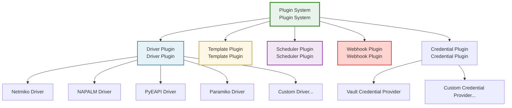
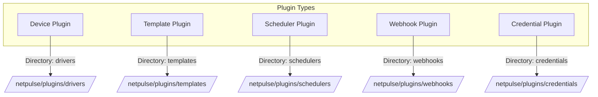
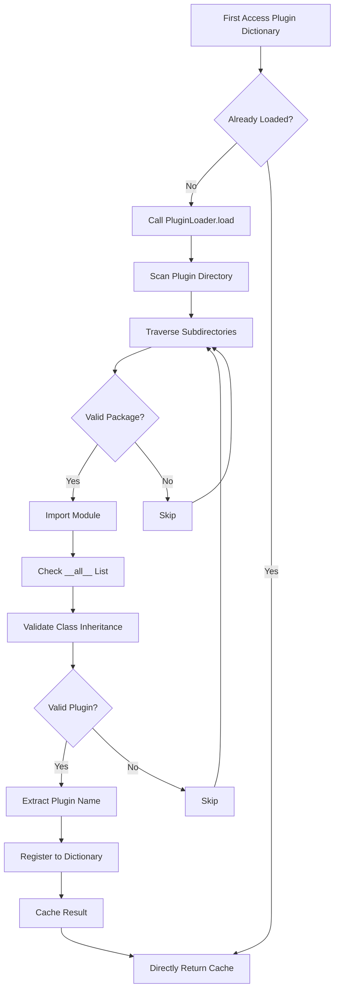

# Plugin System

NetPulse's plugin architecture provides extensibility through five core plugin types, using lazy loading mechanism to load on demand.

## Relationship Between Plugins and Drivers

!!! tip "Concept Clarification"
    **Plugin** is a broader concept, the foundation of NetPulse's extensible architecture. **Driver** is a specific type of plugin, specifically used for interacting with network devices.
    
    Simply put: **Drivers are plugins, but plugins are not necessarily drivers**.

### Relationship Description



### Difference Comparison

| Dimension | Plugin | Driver |
|-----------|--------|--------|
| **Concept Level** | Extension mechanism at architecture level | A specific type of plugin |
| **Scope** | Extensions in multiple dimensions of system | Only for device interaction |
| **Included Types** | Drivers, templates, schedulers, Webhooks, credential management | Only device drivers |
| **Base Class** | Multiple base classes (BaseDriver, BaseScheduler, etc.) | `BaseDriver` |
| **Directory Location** | Multiple subdirectories under `netpulse/plugins/` | `netpulse/plugins/drivers/` |
| **Use Cases** | General mechanism for system function extension | Connect and operate network devices |

### Why Plugin System?

Plugin system is the foundation of NetPulse's extensibility, supporting extensions in five dimensions:

1. **Driver Plugins**: Support new device types and protocols
2. **Template Plugins**: Support new template engines and parsing methods
3. **Scheduler Plugins**: Support new task scheduling algorithms
4. **Webhook Plugins**: Support new notification mechanisms
5. **Credential Management Plugins**: Support new credential storage backends

This design allows NetPulse to extend functionality through plugins without modifying core code, reducing secondary development costs.



## Plugin Type Details

### 1. Driver Plugins

**Responsibility**: Establish connection with network devices and execute operations

| Attribute | Description |
|-----------|-------------|
| **Base Class** | `BaseDriver` |
| **Name Attribute** | `driver_name` |
| **Directory** | `netpulse/plugins/drivers/` |
| **Global Variable** | `drivers` |
| **Built-in Implementation** | Netmiko, NAPALM, PyEAPI, Paramiko |

**Core Methods**:
- `connect()`: Establish device connection
- `send(session, command)`: Send command
- `config(session, config)`: Push configuration
- `disconnect(session)`: Disconnect

### 2. Template Plugins

**Responsibility**: Handle configuration rendering and command output parsing

| Attribute | Description |
|-----------|-------------|
| **Base Class** | `BaseTemplateRenderer` (rendering)<br/>`BaseTemplateParser` (parsing) |
| **Name Attribute** | `template_name` |
| **Directory** | `netpulse/plugins/templates/` |
| **Global Variable** | `renderers` (renderers)<br/>`parsers` (parsers) |
| **Built-in Implementation** | Jinja2, TextFSM, TTP |

**Core Methods**:
- `render(context)`: Render structured data into configuration text
- `parse(context)`: Parse command output into structured data

### 3. Scheduler Plugins

**Responsibility**: Select running node for Pinned Worker

| Attribute | Description |
|-----------|-------------|
| **Base Class** | `BaseScheduler` |
| **Name Attribute** | `scheduler_name` |
| **Directory** | `netpulse/plugins/schedulers/` |
| **Global Variable** | `schedulers` |
| **Built-in Implementation** | greedy, least_load, least_load_random, load_weighted_random |

**Core Methods**:
- `node_select(nodes, host)`: Select node for single device
- `batch_node_select(nodes, hosts)`: Batch select nodes for multiple devices

### 4. Webhook Plugins

**Responsibility**: Notify task execution results to external systems

| Attribute | Description |
|-----------|-------------|
| **Base Class** | `BaseWebHookCaller` |
| **Name Attribute** | `webhook_name` |
| **Directory** | `netpulse/plugins/webhooks/` |
| **Global Variable** | `webhooks` |
| **Built-in Implementation** | basic |

**Core Methods**:
- `call(req, job, result)`: Call Webhook, send task results

### 5. Credential Management Plugins

**Responsibility**: Get device authentication information from external credential storage systems

| Attribute | Description |
|-----------|-------------|
| **Base Class** | `BaseCredentialProvider` |
| **Name Attribute** | `provider_name` |
| **Directory** | `netpulse/plugins/credentials/` |
| **Global Variable** | Managed through `CredentialResolver` |
| **Built-in Implementation** | Vault (HashiCorp Vault) |

**Core Methods**:
- `get_credentials(reference)`: Get username and password based on credential reference
- `validate_connection()`: Validate connection with credential storage system

**Workflow**:
1. Client uses `credential_ref` in `connection_args` to reference credential path
2. `CredentialResolver` selects corresponding credential provider based on `provider` field
3. Credential provider reads credentials from external storage (e.g., Vault)
4. Credentials are injected into `connection_args`, replacing `credential_ref`
5. Worker uses injected credentials to establish device connection

**Supported Credential Providers**:
- **Vault**: HashiCorp Vault (supports KV v2 engine, version control, metadata management)

See: [Vault Credential Management API](../api/credential-api.md)

## Plugin System Architecture

### Core Components

Plugin system consists of two core components:

1. **PluginLoader**: Responsible for scanning plugin directories, loading plugin classes, validating plugin validity
   - Scan all subdirectories under specified directory
   - Validate if it's a valid Python package (contains `__init__.py`)
   - Dynamically import modules and check `__all__` list
   - Validate class inheritance relationships and name attributes
   - Return plugin class dictionary

2. **LazyDictProxy**: Provides lazy loading mechanism
   - Trigger loading when plugin dictionary is first accessed
   - Cache loading results, subsequent accesses directly use cache
   - Provide dictionary interface, usage same as regular dictionary

### Plugin Registration Mechanism

System exposes plugin dictionaries through global variables in `netpulse/plugins/__init__.py`:

| Global Variable | Plugin Type | Name Attribute | Base Class |
|-----------------|-------------|----------------|------------|
| `drivers` | Device Driver | `driver_name` | `BaseDriver` |
| `webhooks` | Webhook | `webhook_name` | `BaseWebHookCaller` |
| `renderers` | Template Renderer | `template_name` | `BaseTemplateRenderer` |
| `parsers` | Template Parser | `template_name` | `BaseTemplateParser` |
| `schedulers` | Scheduler | `scheduler_name` | `BaseScheduler` |
| - | Credential Management | `provider_name` | `BaseCredentialProvider` (managed through CredentialResolver) |

### Plugin Directory Structure

All plugins follow a unified directory structure, each plugin subdirectory must contain `__init__.py` file:

```
netpulse/plugins/
├── drivers/          # Device driver plugins
│   ├── netmiko/
│   │   ├── __init__.py  # Export NetmikoDriver
│   │   └── model.py
│   ├── napalm/
│   └── pyeapi/
├── templates/        # Template plugins
│   ├── jinja2/
│   ├── textfsm/
│   └── ttp/
├── schedulers/       # Scheduler plugins
│   ├── greedy/
│   ├── least_load/
│   └── ...
├── webhooks/         # Webhook plugins
│   └── basic/
└── credentials/      # Credential management plugins
    └── vault/
```

**Registration Requirements**: Plugin class must be exported through `__all__` list in `__init__.py`, for example:

```python
# netpulse/plugins/drivers/netmiko/__init__.py
from .model import NetmikoDriver

__all__ = ["NetmikoDriver"]
```

## Plugin Loading Mechanism

Plugins use `LazyDictProxy` for on-demand loading, which is a lazy loading pattern that only loads plugins when they are actually needed.

### Loading Flow



### Detailed Steps

1. **First Access**:
   - Triggered when code first accesses plugin dictionaries like `drivers["netmiko"]`
   - `LazyDictProxy` calls `PluginLoader.load()` method
   - Scan configured plugin directory (e.g., `netpulse/plugins/drivers/`)
   - Traverse all subdirectories, check if valid Python package (contains `__init__.py`)
   - Dynamically import modules, check classes exported in `__all__` list
   - Validate if class inherits from corresponding base class (e.g., `BaseDriver`)
   - Extract plugin's name attribute (e.g., `driver_name`, `scheduler_name`)
   - Register plugin class to dictionary, key is plugin name
   - Cache loading results to `_data` attribute

2. **Subsequent Access**:
   - Directly use cached `_data` dictionary
   - No additional file system scanning or module import overhead
   - Performance same as regular dictionary access

3. **Error Handling**:
   - When single plugin loading fails, log error but continue loading other plugins
   - Won't affect entire system operation due to single plugin error
   - Invalid plugin packages will be skipped, won't affect use of valid plugins


!!! warning
      If scheduler plugin is misconfigured, it will cause the system to fail to work normally. Errors in other types of plugins won't affect system operation, but may cause some functions to be unavailable.

## Plugin Usage

### System-Level Configuration

Plugin directory locations are configured in `config/config.yaml`:

```yaml
plugin:
  driver: netpulse/plugins/drivers/
  template: netpulse/plugins/templates/
  scheduler: netpulse/plugins/schedulers/
  webhook: netpulse/plugins/webhooks/
```

### Runtime Selection

Different plugin types have different usage methods:

1. **Scheduler Plugin**:
   - Set in configuration file: `worker.scheduler: "greedy"`
   - Loaded at system startup, cannot be changed at runtime
   - Affects node selection for all Pinned Workers

2. **Driver Plugin**:
   - Specified through `driver` field in API request
   - Can dynamically select different drivers for each request
   - Example: `{"driver": "netmiko", ...}`

3. **Template Plugin**:
   - Specified through `rendering.name` or `parsing.name` in API request
   - Can dynamically select different template engines for each request
   - Example: `{"rendering": {"name": "jinja2", ...}}`

4. **Webhook Plugin**:
   - Specified through `webhook.name` in API request
   - Can dynamically select different Webhook implementations for each request
   - Example: `{"webhook": {"name": "basic", ...}}`

5. **Credential Management Plugin**:
   - Specified through `credential_ref` in `connection_args`
   - System automatically selects corresponding credential provider based on `provider` field
   - Example: `{"connection_args": {"credential_ref": "sites/hq/admin"}}`
   - Defaults to Vault provider, can specify other providers through `credential_ref.provider`


## Plugin Development Guide

### Development Steps

All plugins follow a unified development pattern:

1. **Create Plugin Directory**: Create new directory under corresponding plugin type directory
2. **Implement Plugin Class**: Inherit corresponding base class, implement required methods
3. **Set Name Attribute**: Define plugin's name attribute (e.g., `driver_name`, `scheduler_name`, etc.)
4. **Register Plugin**: Export plugin class through `__all__` list in `__init__.py`

### Plugin Naming Conventions

- Use lowercase letters and underscores, e.g., `my_custom_driver`
- Name should clearly express plugin functionality
- Avoid conflicts with built-in plugins
- Name attribute must be related to directory name or functionality

### Development Notes

1. **Base Class Inheritance**: Must inherit corresponding base class, cannot directly inherit `object`
2. **Name Attribute**: Must define name attribute, system identifies plugins through this attribute
3. **Error Handling**: Should throw clear exceptions for easy debugging and problem location
4. **Performance Considerations**: Avoid time-consuming operations during initialization, consider using lazy loading
5. **Thread Safety**: Pay attention to plugin thread safety, especially use of shared resources

## Detailed Documentation

Detailed implementation and usage instructions for each plugin type:

- **[Device Driver System](./driver-system.md)** - Device driver system, including detailed explanation of long connection technology
- **[Template System](./template-system.md)** - Template rendering and parsing functionality
- **[Task Scheduler](./scheduler-system.md)** - Task scheduling algorithms and load balancing
- **[Webhook System](./webhook-system.md)** - Task result notification mechanism
- **[Vault Credential Management API](../api/credential-api.md)** - Credential management functionality and usage instructions
