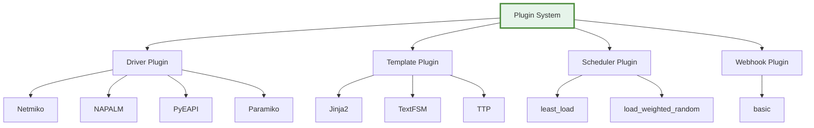

# Plugin System

NetPulse extends functionality through four plugin types, loaded lazily on demand.


```mermaid
graph TB
    Plugin[Plugin System]
    Plugin --> Driver[Driver Plugin]
    Plugin --> Template[Template Plugin]
    Plugin --> Scheduler[Scheduler Plugin]
    Plugin --> Webhook[Webhook Plugin]

    Driver --> Netmiko & NAPALM & PyEAPI & Paramiko
    Template --> Jinja2 & TextFSM & TTP
    Scheduler --> least_load & load_weighted_random
    Webhook --> basic

    style Plugin fill:#E6F4EA,stroke:#4B8B3B,stroke-width:3px
```

## Plugin Types

### 1. Driver Plugins

Connect to and operate network devices.

| Attribute | Value |
|-----------|-------|
| Base class | `BaseDriver` |
| Name attribute | `driver_name` |
| Directory | `netpulse/plugins/drivers/` |
| Core methods | `connect()`, `send()`, `config()`, `disconnect()` |
| Selection | `driver` field in API request |

### 2. Template Plugins

Render configurations and parse command output.

| Attribute | Value |
|-----------|-------|
| Base classes | `BaseTemplateRenderer`, `BaseTemplateParser` |
| Name attribute | `template_name` |
| Directory | `netpulse/plugins/templates/` |
| Core methods | `render(context)`, `parse(context)` |
| Selection | `rendering.name` or `parsing.name` in API request |

### 3. Scheduler Plugins

Select which node runs a Pinned Worker.

| Attribute | Value |
|-----------|-------|
| Base class | `BaseScheduler` |
| Name attribute | `scheduler_name` |
| Directory | `netpulse/plugins/schedulers/` |
| Core methods | `node_select()`, `batch_node_select()` |
| Selection | `worker.scheduler` in config (loaded at startup) |

!!! warning
    A misconfigured scheduler plugin will prevent the system from working. Other plugin errors only disable individual features.

### 4. Webhook Plugins

Notify external systems of task results.

| Attribute | Value |
|-----------|-------|
| Base class | `BaseWebHookCaller` |
| Name attribute | `webhook_name` |
| Directory | `netpulse/plugins/webhooks/` |
| Core methods | `call(req, job, result)` |
| Selection | `webhook.name` in API request |

## How Loading Works

Plugins use `LazyDictProxy` — they're only loaded when first accessed:

1. Code accesses `drivers["netmiko"]`
2. `PluginLoader.load()` scans the plugin directory
3. Finds subdirectories with `__init__.py`, imports modules
4. Validates classes in `__all__` inherit the correct base class
5. Registers by name attribute, caches result
6. Subsequent accesses use cache directly

If a single plugin fails to load, it's skipped — other plugins continue working.

## Plugin Directory Structure

```
netpulse/plugins/
├── drivers/
│   ├── netmiko/
│   │   ├── __init__.py    # __all__ = ["NetmikoDriver"]
│   │   └── model.py
│   ├── napalm/
│   ├── pyeapi/
│   └── paramiko/
├── templates/
│   ├── jinja2/
│   ├── textfsm/
│   └── ttp/
├── schedulers/
│   ├── least_load/
│   └── load_weighted_random/
└── webhooks/
    └── basic/
```

## Developing a Plugin

1. Create a new directory under the appropriate plugin type directory
2. Implement a class inheriting the correct base class
3. Set the name attribute (e.g., `driver_name = "my_driver"`)
4. Export via `__all__` in `__init__.py`

```python
# netpulse/plugins/drivers/my_driver/__init__.py
from .model import MyDriver
__all__ = ["MyDriver"]
```

Plugin directories are configured in `config/config.yaml`:

```yaml
plugin:
  driver: netpulse/plugins/drivers/
  template: netpulse/plugins/templates/
  scheduler: netpulse/plugins/schedulers/
  webhook: netpulse/plugins/webhooks/
```

## Detailed Documentation

- [Driver System](./driver-system.md) — Driver implementations and persistent connections
- [Template System](./template-system.md) — Rendering and parsing engines
- [Scheduler System](./scheduler-system.md) — Load balancing algorithms
- [Webhook System](./webhook-system.md) — Event notifications
