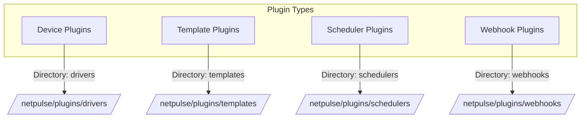

# Plugin System

NetPulse's plugin architecture provides extensibility through four core plugin types, using lazy loading mechanisms to load on demand.



## Plugin Types

1. **Drivers**
      - Interact with network devices
      - Base class: `BaseDriver`
      - Parent directory: `netpulse/plugins/drivers/`
      - Built-in implementations:
         - NAPALM
         - Netmiko
         - pyeAPI

2. **Templates**
      - Configuration and output processing
      - Base classes:
         - `BaseTemplateRenderer` for template rendering
         - `BaseTemplateParser` for output parsing
      - Parent directory: `netpulse/plugins/templates/`
      - Built-in supported engines:
         - Jinja2
         - TextFSM
         - TTP

3. **Schedulers**
      - Task distribution and load balancing for Pinned Workers
      - Base class: `BaseScheduler`
      - Location: `netpulse/plugins/schedulers/`
      - Implemented algorithms:
         - Greedy algorithm
         - Least load
         - Least load random
         - Load weighted random

4. **Webhooks**
      - Handle task result notifications
      - Base class: `BaseWebHookCaller`
      - Parent directory: `netpulse/plugins/webhooks/`
      - Provides Basic implementation for basic HTTP requests

## Plugin Implementation

All plugins follow a consistent pattern:

1. Directory structure:
```
netpulse/plugins/
└── [plugin-type]/
    ├── __init__.py
    └── [implementation].py
```

2. Implementation steps:
      - Inherit from appropriate base class
      - Implement required methods
      - Register plugin in `__init__.py`

## Plugin Loading Mechanism

Plugins use `LazyDictProxy` for on-demand loading:

1. **First Access**:
      - Scan plugin directories
      - Identify and load valid plugins
      - Cache plugin instances

2. **Subsequent Access**:
      - Use cached instances directly
      - No additional loading overhead

3. **Error Handling**:
      - Skip invalid plugins when loading fails
      - Log errors but don't affect system operation

!!! warning
      If scheduler plugin configuration is incorrect, it will cause the system to fail to operate normally. Errors in other types of plugins won't affect system operation but may cause certain features to be unavailable.

## Configuration and Usage

- Global plugin configuration, such as plugin directory locations, can be managed through `config/config.yaml`.
- Scheduler plugins are set in configuration files and cannot be changed at runtime; other types of plugins can be dynamically selected at runtime through parameters in request bodies.
- User-developed plugins can implement independent configuration management logic.

## Plugin Development Guide

### Creating a Driver Plugin

1. Create a new directory under `netpulse/plugins/drivers/`
2. Implement the driver class:
   ```python
   from netpulse.plugins.drivers.base import BaseDriver
   
   class MyCustomDriver(BaseDriver):
       driver_name = "my_custom"
       
       def connect(self):
           # Implementation for connecting to device
           pass
           
       def execute_command(self, command):
           # Implementation for executing commands
           pass
   ```

3. Register in `__init__.py`:
   ```python
   from .my_custom import MyCustomDriver
   
   __all__ = [MyCustomDriver]
   ```

### Creating a Template Plugin

1. Create a new directory under `netpulse/plugins/templates/`
2. Implement the template class:
   ```python
   from netpulse.plugins.templates.base import BaseTemplateRenderer
   
   class MyCustomTemplate(BaseTemplateRenderer):
       template_name = "my_custom"
       
       def render(self, template, context, **kwargs):
           # Implementation for rendering templates
           pass
   ```

### Creating a Scheduler Plugin

1. Create a new directory under `netpulse/plugins/schedulers/`
2. Implement the scheduler class:
   ```python
   from netpulse.plugins.schedulers.base import BaseScheduler
   
   class MyCustomScheduler(BaseScheduler):
       scheduler_name = "my_custom"
       
       def select_node(self, nodes, task):
           # Implementation for node selection
           pass
   ```

### Creating a Webhook Plugin

1. Create a new directory under `netpulse/plugins/webhooks/`
2. Implement the webhook class:
   ```python
   from netpulse.plugins.webhooks.base import BaseWebHookCaller
   
   class MyCustomWebHook(BaseWebHookCaller):
       webhook_name = "my_custom"
       
       def call(self, req, job, result, **kwargs):
           # Implementation for webhook calls
           pass
   ```

---

For more information, see:
- [Architecture Overview](overview.md)
- [Driver System](drivers.md)
- [Template System](templates.md)
- [Scheduler System](schedulers.md)
- [Webhook System](webhooks.md) 