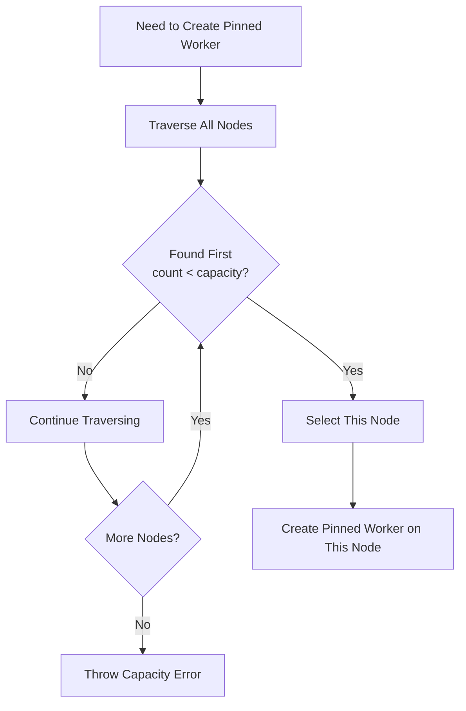
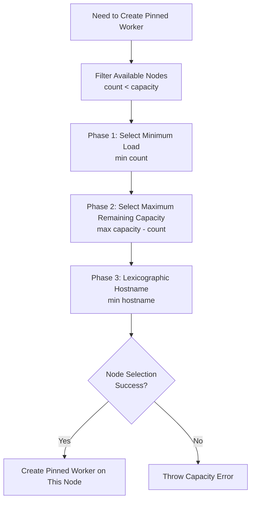
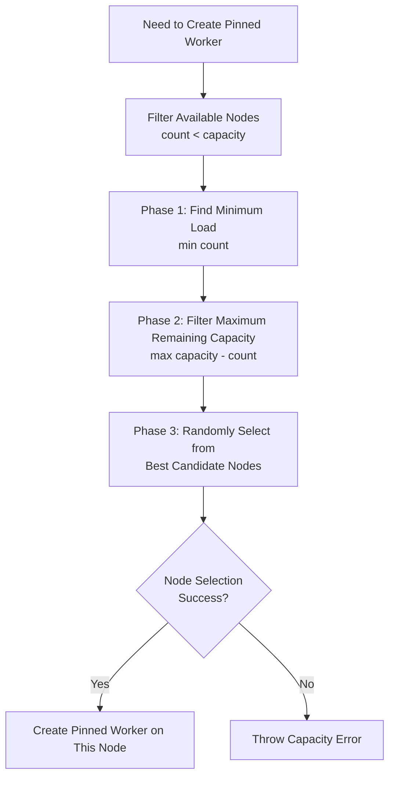
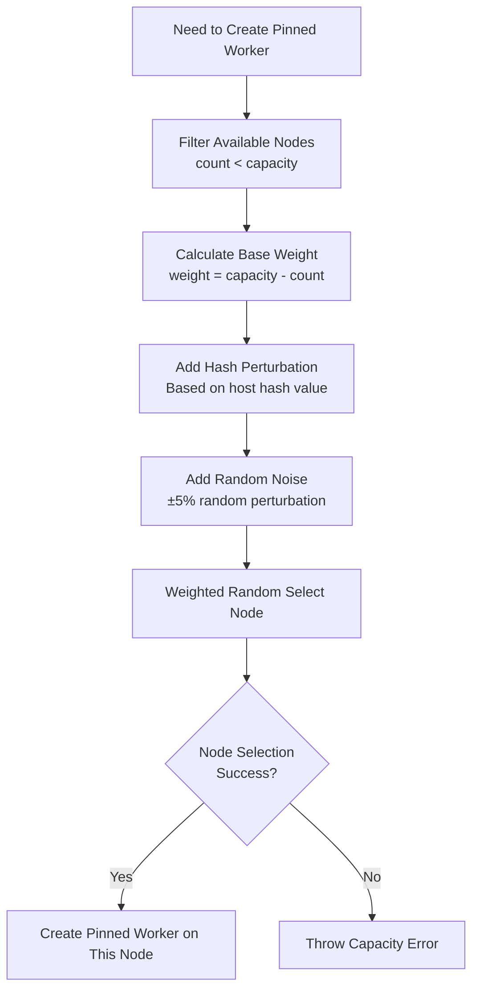

# Task Scheduler

NetPulse provides multiple scheduler plugins for selecting running nodes (Node) for Pinned Workers. Schedulers are called when tasks need to create new Pinned Workers, selecting the most suitable node to run Pinned Worker based on node load and capacity.

!!! note "Scheduler's Role"
    Schedulers don't directly assign tasks to Pinned Workers, but select running nodes for Pinned Workers. Tasks are assigned to corresponding Pinned Workers through Redis queues.

## Scheduler Algorithm Overview

NetPulse currently supports four scheduling algorithms, each optimized for different use cases. **The default algorithm is `load_weighted_random`**, suitable for most production environments.

### Algorithm Comparison Table

| Algorithm | Deterministic | Load Balancing | Scheduling Conflicts | Node Utilization | Fairness | Complexity | Recommended Scenario |
|-----------|---------------|----------------|---------------------|-------------------|----------|-------------|----------------------|
| **Greedy Scheduler** (greedy) | ✅ Yes | ⭐⭐ | High | Very High | Low | O(N) | Single-node deployment |
| **Least Load Scheduler** (least_load) | ✅ Yes | ⭐⭐⭐⭐⭐ | Medium | High | High | O(N log N) | Multi-node balancing |
| **Least Load Random Scheduler** (least_load_random) | ❌ No | ⭐⭐⭐⭐ | Low | High | Medium | O(N log N) | High concurrency scenarios |
| **Load Weighted Random Scheduler** (load_weighted_random) ⭐Default | ❌ No | ⭐⭐⭐⭐ | Very Low | High | Medium-High | O(M*N) | Large-scale concurrency |

### Quick Selection Guide

- **Single-node or small-scale deployment (1-2 nodes)** → `greedy`
- **Multi-node deployment, need load balancing (3-5 nodes)** → `least_load`
- **High concurrency scenarios (large number of tasks in short time)** → `least_load_random`
- **Large-scale high concurrency scenarios (5+ nodes, very high concurrency)** → `load_weighted_random` ⭐Default

## Scheduler Algorithm Details

### 1. Greedy Scheduler

**Algorithm Name**: `greedy`

**Core Idea**: Select the first available node, fill node capacity as much as possible.



**Algorithm Implementation**:
```python
def node_select(self, nodes: List[NodeInfo], host: str) -> NodeInfo:
    for n in nodes:
        if n.count < n.capacity:
            return n  # Return first available node
    raise WorkerUnavailableError("Insufficient capacity")
```

**Characteristics**:
- ✅ **Deterministic**: Same input always produces same output
- ⚡ **Efficient**: Simple algorithm, time complexity O(N)
- 📊 **Load Distribution**: Doesn't guarantee load balancing, may cause uneven node load
- ⚠️ **Scheduling Conflicts**: Multiple requests may select same node in high concurrency

**Use Cases**:
- Single-node or small-scale deployment (1-2 nodes)
- Scenarios with low load balancing requirements
- Need simple, predictable scheduling behavior

**Batch Scheduling**:
In batch scheduling, greedy algorithm will use as few nodes as possible to allocate all tasks, prioritizing filling existing nodes.

### 2. Least Load Scheduler

**Algorithm Name**: `least_load`

**Core Idea**: Select node with minimum load and maximum remaining capacity to achieve load balancing.



**Algorithm Implementation**:
```python
def node_select(self, nodes: List[NodeInfo], host: str) -> NodeInfo:
    available_nodes = [n for n in nodes if n.count < n.capacity]
    if not available_nodes:
        raise WorkerUnavailableError("Insufficient capacity in node selection")
    
    # Three-phase selection:
    # 1. Minimum load (count)
    # 2. Maximum remaining capacity (capacity - count)
    # 3. Lexicographic hostname (hostname)
    selected_node = None
    for node in available_nodes:
        if not selected_node:
            selected_node = node
            continue
        
        # 1. Select minimum load
        if node.count < selected_node.count:
            selected_node = node
        elif node.count == selected_node.count:
            # 2. Select maximum remaining capacity
            node_remaining = node.capacity - node.count
            selected_remaining = selected_node.capacity - selected_node.count
            if node_remaining > selected_remaining:
                selected_node = node
            elif node_remaining == selected_remaining:
                # 3. Select lexicographically smallest hostname
                if node.hostname < selected_node.hostname:
                    selected_node = node
    
    return selected_node
```

**Characteristics**:
- ✅ **Deterministic**: Same input always produces same output (guaranteed by lexicographic order)
- ⚖️ **Load Balancing**: Prioritize nodes with minimum load, ensure similar load across nodes
- 📊 **Fairness**: Consider remaining capacity, avoid node overload
- ⚠️ **Scheduling Conflicts**: May still occur in high concurrency (though better than greedy algorithm)

**Use Cases**:
- Multi-node deployment (3+ nodes)
- Scenarios requiring load balancing
- Scenarios requiring deterministic scheduling results

**Batch Scheduling**:
In batch scheduling, algorithm groups by load level, prioritizes filling nodes with lowest load, then fills nodes with higher load in sequence, ensuring overall load distribution is uniform.

### 3. Least Load Random Scheduler

**Algorithm Name**: `least_load_random`

**Core Idea**: Randomly select from candidate nodes with minimum load and maximum remaining capacity, balancing load balancing and conflict reduction.



**Algorithm Implementation**:
```python
def node_select(self, nodes: List[NodeInfo], host: str) -> NodeInfo:
    available_nodes = [n for n in nodes if n.count < n.capacity]
    
    # 1. Find minimum load
    min_count = min(n.count for n in available_nodes)
    phase1_candidates = [n for n in available_nodes if n.count == min_count]
    
    # 2. Find maximum remaining capacity
    max_remaining = max(n.capacity - n.count for n in phase1_candidates)
    phase2_candidates = [n for n in phase1_candidates 
                        if (n.capacity - n.count) == max_remaining]
    
    # 3. Random selection
    return random.choice(phase2_candidates)
```

**Characteristics**:
- ❌ **Non-deterministic**: Same input may produce different output (randomness)
- ⚖️ **Load Balancing**: Prioritize nodes with minimum load
- 🎲 **Reduce Conflicts**: Randomization reduces probability of multiple requests selecting same node
- 📊 **Fairness**: Randomly distribute among best candidate nodes

**Use Cases**:
- Multi-node deployment (3+ nodes)
- High concurrency scenarios (large number of tasks in short time)
- Need load balancing but can accept non-deterministic results

**Batch Scheduling**:
In batch scheduling, algorithm groups by load level, randomly allocates tasks from nodes with maximum remaining capacity within each load level, ensuring load balancing while reducing conflicts.

### 4. Load Weighted Random Scheduler

**Algorithm Name**: `load_weighted_random`

**Core Idea**: Calculate weights based on node remaining capacity, add random perturbation, use weighted random selection to maximize conflict reduction.



**Algorithm Implementation**:
```python
def node_select(self, nodes: List[NodeInfo], host: str) -> NodeInfo:
    available_nodes = [n for n in nodes if n.count < n.capacity]
    
    # 1. Calculate base weight (remaining capacity)
    base_weights = [n.capacity - n.count for n in available_nodes]
    
    # 2. Add perturbation based on host hash value
    host_hash = hash(host) % 1000 / 1000  # 0 <= host_hash < 1
    perturbed_weights = [
        w * (0.95 + 0.1 * ((host_hash + i / len(available_nodes)) % 1))
        for i, w in enumerate(base_weights)
    ]
    
    # 3. Weighted random selection
    return weighted_random_choice(available_nodes, perturbed_weights)
```

**Batch Scheduling Implementation**:
```python
def batch_node_select(self, nodes: List[NodeInfo], hosts: List[str]):
    remaining = {n: n.capacity - n.count for n in nodes}
    
    for host in hosts:
        candidates = [n for n in nodes if remaining[n] > 0]
        
        # Weight = (remaining capacity + 1)^2, favor empty nodes
        weights = [(remaining[n] + 1) ** 2 for n in candidates]
        
        # Add ±5% random noise
        noisy_weights = [w * random.uniform(0.95, 1.05) for w in weights]
        
        # Weighted random selection
        selected = weighted_random_choice(candidates, noisy_weights)
        remaining[selected] -= 1
```

**Characteristics**:
- ❌ **Non-deterministic**: Strongest randomness, same input almost always produces different output
- ⚖️ **Load Balancing**: Weights favor nodes with larger remaining capacity, naturally achieve load balancing
- 🎯 **Very Low Conflicts**: Randomness + weight perturbation + hash perturbation, maximize conflict reduction
- 📊 **Fairness**: Nodes with larger remaining capacity have higher probability of being selected
- ⚡ **Complexity**: Single selection O(N), batch selection O(M*N), M is number of tasks, N is number of nodes

**Use Cases**:
- Large-scale multi-node deployment (5+ nodes)
- Very high concurrency scenarios (large number of tasks in short time)
- Scenarios with severe scheduling conflicts
- Can accept non-deterministic results

**Weight Calculation Strategy**:
- **Base Weight**: `weight = capacity - count` (remaining capacity)
- **Square Weighting**: Use `(remaining + 1)^2` in batch scheduling, more favor empty nodes
- **Hash Perturbation**: Add perturbation based on host hash value, same host always selects same node (in single scheduling)
- **Random Noise**: Add ±5% random noise, break consistency, reduce conflicts

## Configuration and Usage

### Default Algorithm

NetPulse's **default scheduling algorithm is `load_weighted_random`**, which provides good performance in most scenarios, especially in multi-node, high concurrency environments where it can effectively reduce scheduling conflicts.

### How to Change Scheduling Algorithm

Scheduling algorithm is configured in `config/config.yaml` file, modify `worker.scheduler` field:

```yaml
worker:
  scheduler: "load_weighted_random"  # Change to other algorithms: greedy/least_load/least_load_random/load_weighted_random

plugin:
  scheduler: netpulse/plugins/schedulers/  # Scheduler plugin directory
```

**Modification Steps**:

1. **Edit Configuration File**:
   ```bash
   vim config/config.yaml
   ```

2. **Modify Scheduler Configuration**:
   ```yaml
   worker:
     scheduler: "least_load"  # Change to algorithm you need
   ```

3. **Restart Service**:
   ```bash
   # Docker Compose deployment
   docker compose restart controller node-worker
   
   # Or redeploy
   docker compose down
   docker compose up -d
   ```

!!! warning "Notes"
    - After modifying scheduling algorithm, need to restart Controller and Node Worker to take effect
    - Running tasks won't be affected, new tasks will use new scheduling algorithm
    - Recommend switching algorithms during low peak hours to avoid affecting executing tasks

### When to Adjust Scheduling Algorithm?

In the following scenarios or when encountering the following problems, recommend adjusting scheduling algorithm:

#### 1. Single-Node Deployment Scenario
**Problem**: Currently using default `load_weighted_random`, but only single node, algorithm complexity is high
**Recommendation**: Switch to `greedy`
**Reason**: Single node doesn't need load balancing, greedy algorithm is simple and efficient

#### 2. Severe Node Load Imbalance
**Problem**: Observe some nodes have very high load, while other nodes have very low load
**Recommendation**: Switch to `least_load` or `least_load_random`
**Reason**: These algorithms prioritize nodes with minimum load, can achieve load balancing

#### 3. Frequent Scheduling Conflicts
**Problem**: Frequently see `HostAlreadyPinnedError` or `WorkerUnavailableError` in logs
**Recommendation**: Switch to `least_load_random` or `load_weighted_random`
**Reason**: Randomized algorithms can reduce probability of multiple requests selecting same node simultaneously

#### 4. Need Deterministic Scheduling Results
**Problem**: Need predictable scheduling behavior for debugging or testing
**Recommendation**: Switch to `greedy` or `least_load`
**Reason**: These two algorithms are deterministic, same input always produces same output

#### 5. Performance Degradation in High Concurrency Scenarios
**Problem**: In high concurrency scenarios, task execution delay increases, throughput decreases
**Recommendation**: Switch to `load_weighted_random`
**Reason**: This algorithm maximizes conflict reduction through randomization and weight perturbation, improves high concurrency performance

#### 6. Low Batch Operation Efficiency
**Problem**: In batch operations, task allocation is unreasonable, execution time is too long
**Recommendation**: Choose based on node count:
- Single node: `greedy`
- Multi-node: `least_load` or `least_load_random`
**Reason**: Different algorithms have different strategies in batch scheduling, choosing appropriate algorithm can improve batch operation efficiency

### Algorithm Selection Decision Tree

```
Start
  │
  ├─ Single-node deployment?
  │   └─ Yes → Use greedy
  │
  ├─ Need deterministic results?
  │   └─ Yes → Use least_load
  │
  ├─ Frequent scheduling conflicts?
  │   └─ Yes → Use load_weighted_random (default)
  │
  ├─ Uneven node load?
  │   └─ Yes → Use least_load or least_load_random
  │
  └─ Other scenarios → Use load_weighted_random (default)
```

### Scheduling Conflict Explanation

**What is Scheduling Conflict?**

When multiple Controllers simultaneously select nodes for different devices, they may select the same node. Due to node capacity limitations, one of the requests will fail and need retry. This is scheduling conflict.

**Impact of Conflicts**:
- Cause task failures, need retry
- Increase system latency
- Reduce system throughput

**How to Reduce Conflicts?**

1. **Randomization**: `least_load_random` and `load_weighted_random` reduce conflict probability through random selection
2. **Weight Perturbation**: `load_weighted_random` uses hash and random noise to further reduce conflicts
3. **Batch Scheduling**: In batch scheduling, algorithms consider overall load distribution, avoid concentrated allocation

**Conflict Probability Comparison** (assuming 3 nodes, each capacity 10, current load all 5):
- `greedy`: High (multiple requests always select first node)
- `least_load`: Medium (multiple requests may select same node)
- `least_load_random`: Low (randomization disperses selection)
- `load_weighted_random`: Very Low (randomness + weight perturbation)

## Implementation Details

### Node Selection Flow

All schedulers implement `node_select` method, core flow as follows:

```python
def node_select(self, nodes: List[NodeInfo], host: str) -> NodeInfo:
    # 1. Filter available nodes (count < capacity)
    available_nodes = [n for n in nodes if n.count < n.capacity]
    
    # 2. Select node according to algorithm
    selected_node = self._select_from_available(available_nodes, host)
    
    # 3. Return selected node
    return selected_node
```

### Load Calculation

Node load is represented by `NodeInfo.count`, which is the number of Pinned Workers currently running on the node. Capacity is represented by `NodeInfo.capacity`, which is the maximum number of Pinned Workers the node can run.

### Batch Scheduling

All schedulers also implement `batch_node_select` method for batch node selection, improving scheduling efficiency. In batch scheduling, algorithms consider overall load distribution, avoid allocating all tasks to the same node.
