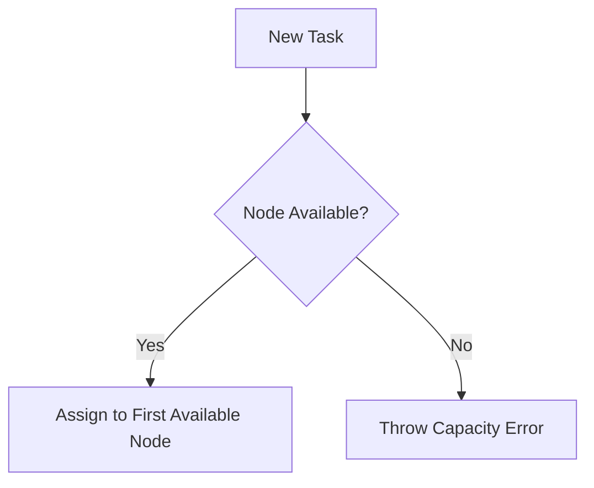
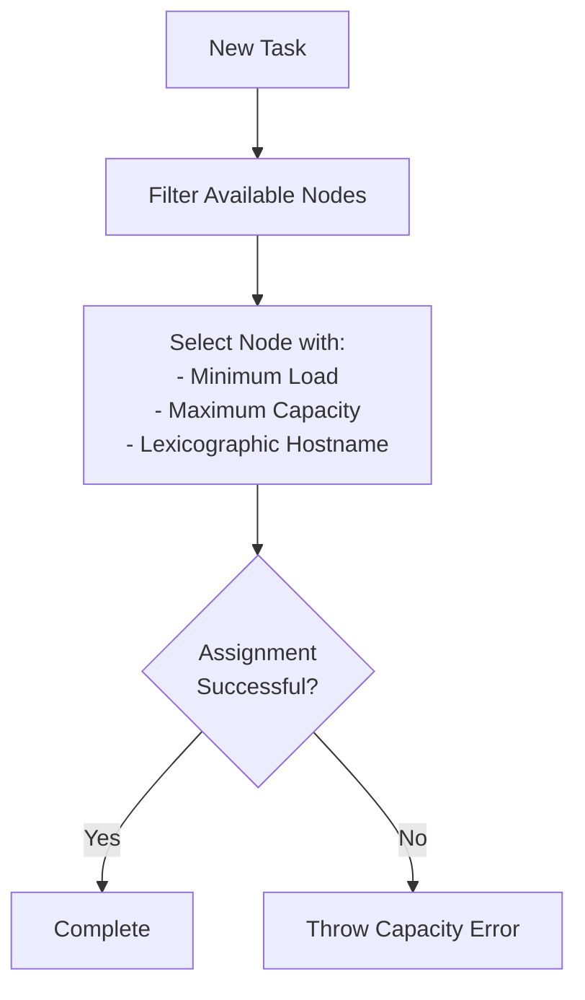
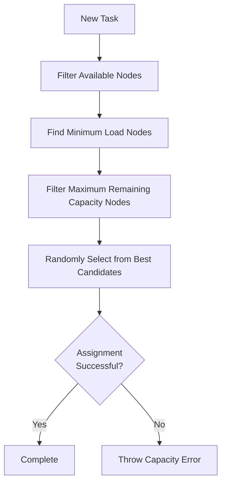
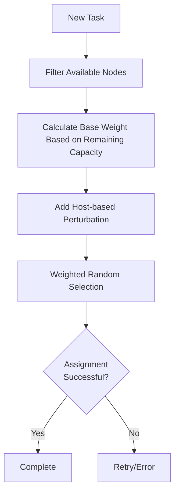

# Task Scheduler

NetPulse provides various scheduler plugins for assigning tasks to Pinned Workers. The choice of scheduler affects task allocation methods and load balancing strategies.

## Scheduling Algorithms

Currently supports the following four scheduling algorithms.

### Greedy Scheduler


- **Strategy**: Fill nodes as much as possible
- **Use Cases**:
    - Simple deployment on single physical node
    - Want node utilization as high as possible
- **Features**:
    - Simple selection algorithm with low overhead
    - Deterministic
- **Complexity**: O(N)

### Least Load Scheduler


- **Strategy**: Load balancing across nodes
- **Use Cases**:
    - Multiple physical nodes
    - Want similar load levels across nodes
- **Features**:
    - Two-stage node filtering (load, capacity)
    - Lexicographic order ensures determinism
- **Complexity**: O(N log N)

### Least Load Random Scheduler


- **Strategy**: Load balancing across nodes with randomization
- **Use Cases**:
    - Multiple physical nodes
    - Large number of tasks submitted in short time
- **Features**:
    - Two-stage node filtering (load, capacity)
    - Random assignment among best candidates, reducing scheduling conflict probability
- **Complexity**: O(N log N)

### Load Weighted Random Scheduler


- **Strategy**: Weighted random assignment based on remaining capacity
- **Use Cases**:
    - Multiple physical nodes
    - Large number of tasks submitted in short time with severe scheduling conflicts
- **Features**:
    - Uses hostname hash for weight perturbation
    - Squares remaining capacity to favor empty nodes
    - Higher randomness, significantly reducing scheduling conflict probability
- **Complexity**: O(M*N)

## Configuration
Configure scheduler in `config/config.yaml`:
```yaml
worker:
  scheduler: "load_weighted_random"  # Options: greedy/least_load/least_load_random/load_weighted_random

plugin:
  scheduler: netpulse/plugins/schedulers/
```

## Performance Comparison
| Algorithm                    | Node Utilization | Fairness | Deterministic |
|------------------------------|------------------|----------|---------------|
| Greedy Scheduler             | Very High        | Low      | Yes           |
| Least Load Scheduler         | High             | High     | Yes           |
| Least Load Random Scheduler  | High             | Medium   | No            |
| Load Weighted Random Scheduler| High             | Medium-High | No         |

## Custom Scheduler Development

To implement custom scheduling algorithms, follow these steps:

1. Create a new directory in `netpulse/plugins/schedulers/`
2. Inherit from the `BaseScheduler` class and implement required methods
   ```python
   class CustomScheduler(BaseScheduler):
       scheduler_name = "custom"

       def select_node(self, nodes, task):
           # Implementation for node selection
           pass
   ```
3. Register the scheduler in `__init__.py`

For detailed information about the plugin system, please refer to the [Plugin Development Guide](./plugins.md).

---

For more information, see:
- [Architecture Overview](overview.md)
- [Plugin System](plugins.md)
- [Performance Tuning](../advanced/performance-tuning.md) 