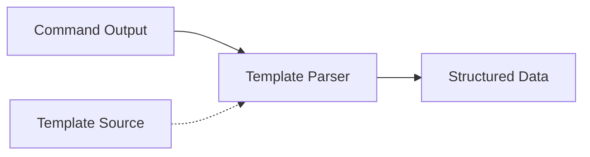
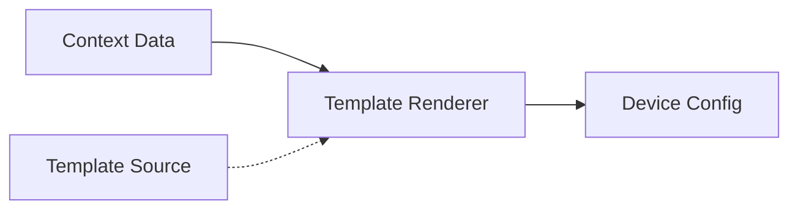

# Template System

NetPulse provides extensible template functionality through its plugin system. Template system has two main functions: command output parsing and configuration rendering. Template system also supports loading templates from multiple sources such as local files, HTTP(S), FTP, etc.

## Core Functions

The core function of template system is to parse command output into structured data, or render structured data into device configuration.

Parsing mode converts command output into structured data, generally used after device command execution.



Rendering mode generates device configuration from templates, generally used before pushing configuration.



## Template API

Template system provides both independent API interfaces and can be integrated with device operation related APIs.

!!! tip
    For detailed API usage documentation, please refer to Postman documentation.


### Independent Template Interface

#### Render Template
```http
POST /template/render/{name} HTTP/1.1
```

Request Body:
```json
{
  "name": "jinja2",
  "template": "interface {{ interface }}\n description {{ description }}",
  "context": {
    "interface": "GigabitEthernet1/0/1",
    "description": "Core Link"
  }
}
```

Response:
```json
{
  "code": 0,
  "message": "success",
  "data": "interface GigabitEthernet1/0/1\n description Core Link"
}
```

#### Parse Output
```http
POST /template/parse/{name} HTTP/1.1
```

Request Body:
```json
{
  "name": "textfsm",
  "template": "Value INTERFACE (\\S+)\nValue IP ([\\d\\.]+)\n\nStart\n  ^${INTERFACE}\\s+${IP} -> Record",
  "context": "GigabitEthernet1/0/1    192.168.1.1"
}
```

Response:
```json
{
  "code": 0,
  "message": "success",
  "data": [
    {
      "INTERFACE": "GigabitEthernet1/0/1",
      "IP": "192.168.1.1"
    }
  ]
}
```

### Device Operation Integration Interface

#### Parse After Pulling
```json
{
  "driver": "netmiko",
  "connection_args": {
    "device_type": "cisco_ios",
    "host": "192.168.1.1",
    "username": "admin",
    "password": "pwd123"
  },
  "command": "show ip interface brief",
  "parsing": {
    "name": "textfsm",
    "template": "file:///templates/show_ip_int_brief.textfsm"
  }
}
```

#### Render Before Pushing
```json
{
  "driver": "netmiko",
  "connection_args": {
    "device_type": "cisco_ios",
    "host": "192.168.1.1",
    "username": "admin",
    "password": "pwd123"
  },
  "config": {
    "interfaces": [
      {"name": "Gi1/0/1", "description": "Server Port"},
      {"name": "Gi1/0/2", "description": "Uplink Port"}
    ]
  },
  "rendering": {
    "name": "jinja2",
    "template": "file:///templates/interfaces.j2"
  }
}
```

## Template Sources

Templates can be loaded from various sources using URI format:

- **Plain Text**: Direct template content (default)
  ```json
  {
    "template": "interface {{ interface }}\n description {{ description }}"
  }
  ```

- **File System**: Local file path
  ```json
  {
    "template": "file:///templates/interfaces.j2"
  }
  ```

- **HTTP(S)**: Remote template
  ```json
  {
    "template": "https://templates.example.com/acl.j2"
  }
  ```

- **FTP**: Template on FTP server
  ```json
  {
    "template": "ftp://ftp.example.com/templates/interfaces.j2"
  }
  ```

!!! note
    When deploying in containers, local file paths must be readable paths within the container.

!!! tip "Template Source Priority"
    System identifies template source types in the following order:
    1. HTTP/HTTPS (starts with `http://` or `https://`)
    2. FTP (starts with `ftp://`)
    3. File System (starts with `file://`)
    4. Plain Text (default, directly use template content)

Developers can modify template source URI parser to support more source types.

## Template Engines

!!! tip
    For specific template syntax and engine implementation, please refer to related project documentation.

### Jinja2
Used for rendering templates, generating network device configuration.

```json
{
  "name": "jinja2",
  "template": "file:///templates/interface.j2",
  "context": {
    "interface": "GigabitEthernet1/0/1",
    "description": "Access Port"
  },
  "args": {
    "trim_blocks": true,
    "lstrip_blocks": true,
    "variable_start_string": "{{",
    "variable_end_string": "}}"
  }
}
```

### TextFSM
Used for parsing command output, supports using built-in templates from ntc_template. 

```json
{
  "name": "textfsm",
  "template": "file:///templates/show_ip_int_brief.textfsm",
  "context": "GigabitEthernet1/0/1    172.16.1.1    YES manual up    up"
}
```

### TTP
Template Text Parser, supports using built-in templates from ttp_template.

```json
{
  "name": "ttp",
  "use_ttp_template": true,
  "ttp_template_args": {
    "platform": "cisco_ios",
    "command": "show ip interface brief"
  },
  "context": "GigabitEthernet1/0/1    172.16.1.1    YES manual up    up"
}
```

## Design Considerations

### Why Template System?

**Question**: Network device configurations and output formats are diverse, how to handle uniformly?

**Answer**: Achieve through template system:
1. **Configuration Generation**: Use Jinja2 to render structured data into device configuration
2. **Output Parsing**: Use TextFSM/TTP to parse command output into structured data

This can unify device operations from different vendors and formats into structured data processing flow.

### Template Source Design

Reasons for supporting multiple template sources (file, HTTP, FTP):
- **Flexibility**: Templates can be centrally managed or distributed
- **Version Control**: Template version management can be achieved through HTTP source
- **Dynamic Updates**: Update templates without restarting service

### Template Engine Selection

- **Jinja2**: Mature template engine, suitable for configuration generation
- **TextFSM**: Specifically for parsing network device output, rich community templates
- **TTP**: More flexible parsing engine, supports complex data extraction

Multiple engines are chosen to meet different scenario needs, users can choose appropriate engine based on specific situation.
