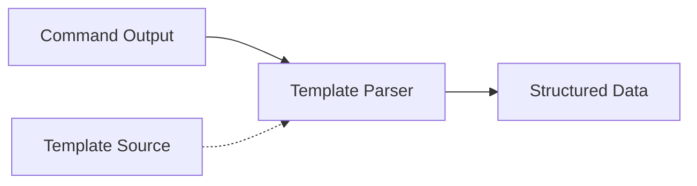
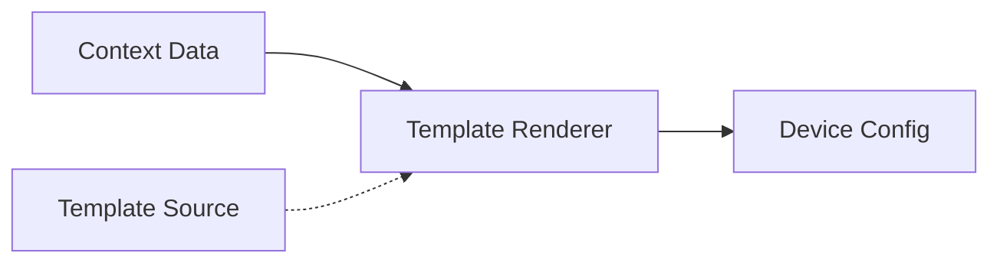

# Template Module

NetPulse provides extensible template functionality through its plugin system. The template module has two main functions: command output parsing and configuration rendering. The template module also supports loading templates from various sources including local files, HTTP(S), FTP, and more.

## Core Functions

The core functions of the template module are parsing command output into structured data, or rendering structured data into device configurations.

Parsing mode converts command output to structured data, generally used after device command execution.



Rendering mode generates device configurations from templates, generally used before pushing configurations.



## Template API

The template module provides both independent API interfaces and can be integrated with device operation-related APIs.

!!! tip
    For detailed API usage documentation, please refer to the Postman documentation.

### Independent Template Interface

#### Render Template
```http
POST /template/render/{name} HTTP/1.1
```

Request body:
```json
{
  "name": "jinja2",
  "template": "interface {{ interface }}\n description {{ description }}",
  "context": {
    "interface": "GigabitEthernet1/0/1",
    "description": "Core Link"
  }
}
```

Response:
```json
{
  "code": 0,
  "message": "success",
  "data": "interface GigabitEthernet1/0/1\n description Core Link"
}
```

#### Parse Output
```http
POST /template/parse/{name} HTTP/1.1
```

Request body:
```json
{
  "name": "textfsm",
  "template": "Value INTERFACE (\\S+)\nValue IP ([\\d\\.]+)\n\nStart\n  ^${INTERFACE}\\s+${IP} -> Record",
  "context": "GigabitEthernet1/0/1    192.168.1.1"
}
```

Response:
```json
{
  "code": 0,
  "message": "success",
  "data": [
    {
      "INTERFACE": "GigabitEthernet1/0/1",
      "IP": "192.168.1.1"
    }
  ]
}
```

### Device Operation Integration Interface

#### Parse After Pulling
```json
{
  "driver": "netmiko",
  "connection_args": {
    "device_type": "cisco_ios",
    "host": "192.168.1.1",
    "username": "admin",
    "password": "pwd123"
  },
  "command": "show ip interface brief",
  "parsing": {
    "name": "textfsm",
    "template": "file:///templates/show_ip_int_brief.textfsm"
  }
}
```

#### Render Before Pushing
```json
{
  "driver": "netmiko",
  "connection_args": {
    "device_type": "cisco_ios",
    "host": "192.168.1.1",
    "username": "admin",
    "password": "pwd123"
  },
  "config": {
    "interfaces": [
      {"name": "Gi1/0/1", "description": "Server Port"},
      {"name": "Gi1/0/2", "description": "Uplink Port"}
    ]
  },
  "rendering": {
    "name": "jinja2",
    "template": "file:///templates/interfaces.j2"
  }
}
```

## Template Sources

Templates can be loaded from various sources using URI format:

- **Plain Text**: Direct template content (default)
  ```json
  {
    "template": "interface {{ interface }}\n description {{ description }}"
  }
  ```

- **File System**: Local file path
  ```json
  {
    "template": "file:///templates/interfaces.j2"
  }
  ```

- **HTTP(S)**: Remote templates
  ```json
  {
    "template": "https://templates.example.com/acl.j2"
  }
  ```

!!! note
    When deploying in containers, local file paths must be readable paths within the container.

Developers can modify the template source URI parser to support more source types.

## Template Engines

!!! tip
    For specific template syntax and engine implementation, please refer to the documentation of related projects.

### Jinja2
Used for rendering templates to generate network device configurations.

```json
{
  "name": "jinja2",
  "template": "file:///templates/interface.j2",
  "context": {
    "interface": "GigabitEthernet1/0/1",
    "description": "Access Port"
  },
  "args": {
    "trim_blocks": true,
    "lstrip_blocks": true,
    "variable_start_string": "{{",
    "variable_end_string": "}}"
  }
}
```

### TextFSM
Used for parsing command output, supports using built-in templates from ntc_template.

```json
{
  "name": "textfsm",
  "template": "file:///templates/show_ip_int_brief.textfsm",
  "context": "GigabitEthernet1/0/1    172.16.1.1    YES manual up    up"
}
```

### TTP
Template Text Parser for parsing and converting semi-structured text into structured data.

```json
{
  "name": "ttp",
  "template": "file:///templates/interface_config.ttp",
  "context": "interface GigabitEthernet1/0/1\n description Access Port\n switchport mode access"
}
```

## Custom Template Engine Development

To add support for new template engines, implement a custom template engine through the following steps:

1. Create a new directory in `netpulse/plugins/templates/`
2. Inherit from the `BaseTemplate` class and implement required methods
   ```python
   class CustomTemplate(BaseTemplate):
       template_name = "custom"

       def render(self, template, context, **kwargs):
           # Implementation for rendering
           pass

       def parse(self, template, context, **kwargs):
           # Implementation for parsing
           pass
   ```
3. Register the template engine in `__init__.py`

For detailed information about the plugin system, please refer to the [Plugin Development Guide](./plugins.md).

---

For more information, see:
- [Architecture Overview](overview.md)
- [Plugin System](plugins.md)
- [API Reference](../guides/api.md) 