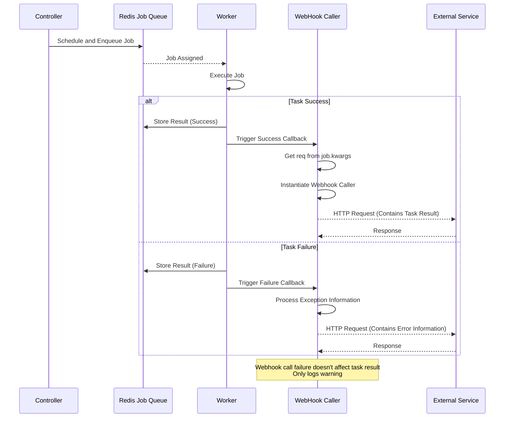

# Webhook System

NetPulse supports notifying task execution results to external systems through webhooks, facilitating integration with monitoring systems, automated workflows, or HTTP-enabled services.

## Call Flow

Task execution and Webhook call flow is as follows:



### Call Timing

Webhook is called at the following times:

1. **Task Successfully Completed**: After Worker completes task execution, triggered through RQ's `on_success` callback
2. **Task Execution Failed**: After Worker catches exception, triggered through RQ's `on_failure` callback

### Implementation Mechanism

Webhook calls are implemented through RQ's callback mechanism:

```python
# Set callback when task is enqueued
job = queue.enqueue(
    func,
    on_success=rpc_webhook_callback,  # Success callback
    on_failure=rpc_webhook_callback,  # Failure callback
    **kwargs
)

# Callback function gets request information from job.kwargs
def rpc_webhook_callback(*args):
    job = args[0]
    req = job.kwargs.get("req")  # Get original request
    webhook = req.webhook
    
    # Instantiate and call Webhook
    caller = webhooks[webhook.name](webhook)
    caller.call(req=req, job=job, result=result)
```

## Webhook Configuration

### Basic Configuration

```json
{
  "name": "basic",
  "url": "http://monitor.example.com/callback",
  "method": "POST",
  "headers": {
    "Content-Type": "application/json",
    "Authorization": "Bearer your-token"
  }
}
```

### Configuration Options

| Field    | Type   | Description                         | Default |
|----------|--------|-------------------------------------|---------|
| name     | string | WebHook call type ("basic")       | "basic" |
| url      | string | Webhook endpoint URL                | Required |
| method   | string | HTTP method (GET/POST/PUT/DELETE)   | "POST"  |
| headers  | object | Custom HTTP headers                 | null    |
| cookies  | object | Custom cookies                      | null    |
| auth     | array  | Basic authentication [username, password] | null    |
| timeout  | number | Request timeout (seconds)          | 5.0     |

## Examples

1. Set Webhook in Request
   
    Use `webhook` field to attach Webhook configuration in task request:

    ```json
    {
      "driver": "netmiko",
      "connection_args": {
        "device_type": "cisco_ios",
        "host": "192.168.1.1",
        "username": "admin",
        "password": "pwd123"
      },
      "command": "show version",
      "webhook": {
        "name": "basic",
        "url": "http://monitor.example.com/callback",
        "method": "POST",
        "headers": {
          "Content-Type": "application/json"
        },
        "timeout": 5.0
      }
    }
    ```

2. Handle Webhook Messages in External Service

    Default Basic Webhook will send task execution results to specified URL. Webhook request body contains the following information:

    **Success Task Callback Example**:
    ```json
    {
      "id": "job-uuid-here",
      "result": "Interface GigabitEthernet1/0/1\n description Core Link"
    }
    ```

    **Failure Task Callback Example**:
    ```json
    {
      "id": "job-uuid-here",
      "result": "Connection timeout: Unable to connect to device"
    }
    ```

    !!! note "Result Format"
        The `result` field in Webhook is in string format, containing original task execution result or error information.

## Notes

1. **Timeout Limits**
    - Minimum: 0.5 seconds
    - Maximum: 120.0 seconds
    - Default: 5.0 seconds

2. **HTTP Methods**
    - Supported: GET, POST, PUT, DELETE, PATCH
    - Default: POST

3. **Error Handling**
    - Warning logs will be output when request fails, but won't affect task execution result
    - Requests won't retry on failure (avoid blocking Worker)
    - Webhook exceptions won't cause task failure
    - Recommend implementing idempotency and retry mechanism on external service side

!!! warning "Webhook Reliability"
    Webhook calls are "best effort" and don't guarantee success. If reliable notification mechanism is needed, recommend:
    - Implement idempotency handling on external service side
    - Use message queue (such as RabbitMQ, Kafka) as intermediate layer
    - Regular polling of task status as backup solution

## Custom Webhook Development

NetPulse's built-in Basic Webhook can meet most needs, but if more complex logic is needed, custom Webhook can be created by implementing `BaseWebHookCaller` class.

1. Create new directory in `netpulse/plugins/webhooks/`
2. Inherit `BaseWebHookCaller` class and implement required methods
  ```python
  class CustomWebHookCaller:
    webhook_name: str = "custom"

    def call(self, req: Any, job: rq.job.Job, result: Any, **kwargs):
    # ...

    # For specific methods, please refer to BaseWebHookCaller class
  ```
3. Register Webhook in `__init__.py`
  ```python
  __all__ = [CustomWebHookCaller]
  ```

For detailed introduction to plugin system, please refer to [Plugin System](./plugin-system.md).
