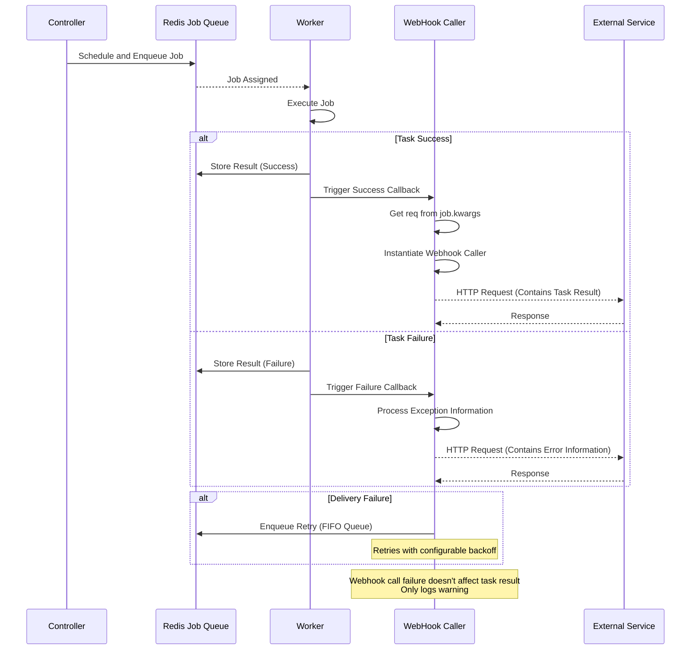

# Webhook System

NetPulse supports notifying task execution results to external systems through webhooks, facilitating integration with monitoring systems, automated workflows, or HTTP-enabled services.

## Call Flow

Task execution and Webhook call flow is as follows:


```mermaid
sequenceDiagram
    participant Controller as Controller
    participant Redis as Redis Job Queue
    participant Worker as Worker
    participant Hook as WebHook Caller
    participant External as External Service

    Controller->>Redis: Schedule and Enqueue Job
    Redis-->>Worker: Job Assigned
    Worker->>Worker: Execute Job

    alt Task Success
        Worker->>Redis: Store Result (Success)
        Worker->>Hook: Trigger Success Callback
        Hook->>Hook: Get req from job.kwargs
        Hook->>Hook: Instantiate Webhook Caller
        Hook-->>External: HTTP Request (Contains Task Result)
        External-->>Hook: Response
    else Task Failure
        Worker->>Redis: Store Result (Failure)
        Worker->>Hook: Trigger Failure Callback
        Hook->>Hook: Process Exception Information
        Hook-->>External: HTTP Request (Contains Error Information)
        External-->>Hook: Response
    end

    alt Delivery Failure
        Hook->>Redis: Enqueue Retry (FIFO Queue)
        Note over Hook: Retries with configurable backoff
    end

    Note over Hook: Webhook call failure doesn't affect task result<br/>Only logs warning
```

### Call Timing

Webhook is called at the following times:

1. **Task Successfully Completed**: After Worker completes task execution, triggered through RQ's `on_success` callback
2. **Task Execution Failed**: After Worker catches exception, triggered through RQ's `on_failure` callback

### Implementation Mechanism

Webhook calls are implemented through RQ's callback mechanism:

```python
# Set callback when task is enqueued
job = queue.enqueue(
    func,
    on_success=rpc_webhook_callback,  # Success callback
    on_failure=rpc_webhook_callback,  # Failure callback
    **kwargs
)

# Callback function gets request information from job.kwargs
def rpc_webhook_callback(*args):
    job = args[0]
    req = job.kwargs.get("req")  # Get original request
    webhook = req.webhook

    # Instantiate and call Webhook
    caller = webhooks[webhook.name](webhook)
    caller.call(req=req, job=job, result=result)
```

## Webhook Configuration

### Basic Configuration

```json
{
  "name": "basic",
  "url": "http://monitor.example.com/callback",
  "method": "POST",
  "headers": {
    "Content-Type": "application/json",
    "Authorization": "Bearer your-token"
  },
  "max_retries": 3,
  "retry_intervals": [10, 30, 120]
}
```

### Configuration Options

| Field           | Type     | Description                                                                 | Default      |
|-----------------|----------|-----------------------------------------------------------------------------|--------------|
| name            | string   | WebHook call type ("basic")                                                | "basic"      |
| url             | string   | Webhook endpoint URL                                                        | Required     |
| method          | string   | HTTP method (GET/POST/PUT/DELETE/PATCH)                                     | "POST"       |
| headers         | object   | Custom HTTP headers                                                         | null         |
| cookies         | object   | Custom cookies                                                              | null         |
| auth            | array    | Basic authentication [username, password]                                   | null         |
| timeout         | number   | Request timeout in seconds (0.5 - 120.0)                                   | 5.0          |
| max_retries     | integer  | Maximum delivery retries on failure (0 disables retry, max 10)              | 3            |
| retry_intervals | array    | Delay in seconds between retries. Last value reused if list is shorter.     | [10, 30, 120]|

## Webhook Payload

The webhook payload is aligned with the `JobInResponse` API model, so you can use the same data model to parse both API responses and webhook payloads.

### Payload Fields

| Field       | Type          | Description                                                      |
|-------------|---------------|------------------------------------------------------------------|
| id          | string        | Job ID (or Task ID for detached tasks)                           |
| status      | string        | Job status: `"finished"`, `"failed"`, etc.                       |
| event_type  | string        | Event type (see Event Types below)                               |
| timestamp   | string        | ISO 8601 timestamp of when the webhook was generated             |
| started_at  | string\|null  | ISO 8601 timestamp of job execution start                        |
| ended_at    | string\|null  | ISO 8601 timestamp of job execution end                          |
| duration    | number\|null  | Execution duration in seconds                                    |
| result      | object\|null  | Structured result (see Result Format below)                      |
| device      | object\|null  | Device connection info: `{"host": "...", "device_type": "..."}`  |
| task_id     | string\|null  | Task ID (for detached tasks)                                     |
| device_name | string\|null  | Human-readable device name (from job metadata)                   |
| command     | array\|null   | List of executed commands                                        |

### Event Types

| Value               | Description                          |
|---------------------|--------------------------------------|
| `job.completed`     | Regular job completed successfully   |
| `job.failed`        | Regular job execution failed         |
| `detached.completed`| Detached task completed              |
| `detached.failed`   | Detached task failed                 |
| `detached.log_push` | Detached task incremental log push   |

### Result Format

The `result` field uses the same structure as the API's `JobResult`, but with self-describing string types instead of integers:

| result.type    | Description       |
|----------------|-------------------|
| `"successful"` | Execution success |
| `"failed"`     | Execution failed  |
| `"stopped"`    | Execution stopped |
| `"retried"`    | Execution retried |

## Examples

1. Set Webhook in Request

    Use `webhook` field to attach Webhook configuration in task request:

    ```json
    {
      "driver": "netmiko",
      "connection_args": {
        "device_type": "cisco_ios",
        "host": "192.168.1.1",
        "username": "admin",
        "password": "pwd123"
      },
      "command": "show version",
      "webhook": {
        "name": "basic",
        "url": "http://monitor.example.com/callback",
        "method": "POST",
        "headers": {
          "Content-Type": "application/json"
        },
        "timeout": 5.0,
        "max_retries": 3,
        "retry_intervals": [10, 30, 120]
      }
    }
    ```

2. Handle Webhook Messages in External Service

    Default Basic Webhook will send task execution results to specified URL:

    **Success Task Callback Example**:
    ```json
    {
      "id": "job-uuid-here",
      "status": "finished",
      "event_type": "job.completed",
      "timestamp": "2024-02-23T10:00:01+00:00",
      "started_at": "2024-02-23T10:00:00+00:00",
      "ended_at": "2024-02-23T10:00:01+00:00",
      "duration": 0.5,
      "result": {
        "type": "successful",
        "retval": [
          {
            "command": "show version",
            "stdout": "Cisco IOS Software, Version 15.1",
            "stderr": "",
            "exit_status": 0,
            "metadata": {"host": "192.168.1.1", "duration_seconds": 0.123}
          }
        ],
        "error": null
      },
      "device": {"host": "192.168.1.1", "device_type": "cisco_ios"},
      "task_id": null,
      "device_name": "switch-01",
      "command": ["show version"]
    }
    ```

    **Failure Task Callback Example**:
    ```json
    {
      "id": "job-uuid-here",
      "status": "failed",
      "event_type": "job.failed",
      "timestamp": "2024-02-23T10:00:01+00:00",
      "started_at": "2024-02-23T10:00:00+00:00",
      "ended_at": "2024-02-23T10:00:01+00:00",
      "duration": 0.5,
      "result": {
        "type": "failed",
        "retval": null,
        "error": {"type": "ConnectionError", "message": "Unable to connect to device"}
      },
      "device": {"host": "192.168.1.1", "device_type": "cisco_ios"},
      "task_id": null,
      "device_name": null,
      "command": ["show version"]
    }
    ```

    !!! note "Result Format"
        The `result` field is a structured object aligned with the API's `JobResult` model. The `result.type` uses self-describing strings (`"successful"`, `"failed"`) instead of integer enums.

## Notes

1. **Timeout Limits**
    - Minimum: 0.5 seconds
    - Maximum: 120.0 seconds
    - Default: 5.0 seconds

2. **HTTP Methods**
    - Supported: GET, POST, PUT, DELETE, PATCH
    - Default: POST

3. **Retry Mechanism**
    - On delivery failure, retries are automatically scheduled via the FIFO queue
    - Retry delays are configurable through `retry_intervals` (default: 10s, 30s, 120s)
    - Maximum retries configurable through `max_retries` (default: 3, set to 0 to disable)
    - Retries use the last interval value when the list is shorter than `max_retries`
    - Retry jobs are non-blocking — they run asynchronously in the FIFO queue

4. **Error Handling**
    - Webhook delivery failures are logged as warnings but never affect task execution results
    - Webhook exceptions won't cause task failure
    - External services should implement idempotency to handle potential duplicate deliveries

!!! warning "Webhook Reliability"
    While webhooks include automatic retry with configurable backoff, delivery is still "best effort". For mission-critical notification, recommend:
    - Implement idempotency handling on external service side
    - Use message queue (such as RabbitMQ, Kafka) as intermediate layer
    - Regular polling of task status as backup solution

## Custom Webhook Development

NetPulse's built-in Basic Webhook can meet most needs, but if more complex logic is needed, custom Webhook can be created by inheriting `BaseWebHookCaller` class.

1. Create new directory in `netpulse/plugins/webhooks/`
2. Inherit `BaseWebHookCaller` class and implement required methods
  ```python
  class CustomWebHookCaller(BaseWebHookCaller):
    webhook_name: str = "custom"

    def call(self, req: Any, job: rq.job.Job, result: Any, **kwargs):
    # ...

    # For specific methods, please refer to BaseWebHookCaller class
  ```
3. Register Webhook in `__init__.py`
  ```python
  __all__ = [CustomWebHookCaller]
  ```

For detailed introduction to plugin system, please refer to [Plugin System](./plugin-system.md).
