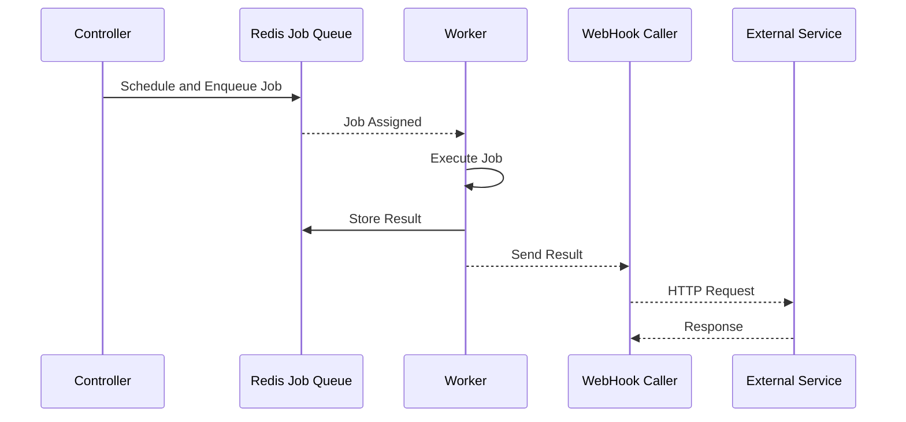

# Webhooks

NetPulse supports notifying external systems about task execution results through webhooks, enabling seamless integration with monitoring systems, automated workflows, or any HTTP-enabled service.

## Execution Flow

The flow of task execution and webhook calls is as follows:



## Webhook Configuration

### Basic Configuration

```json
{
  "name": "basic",
  "url": "http://monitor.example.com/callback",
  "method": "POST",
  "headers": {
    "Content-Type": "application/json",
    "Authorization": "Bearer your-token"
  }
}
```

### Configuration Options

| Field    | Type    | Description                      | Default |
|----------|---------|----------------------------------|---------|
| name     | string  | WebHook caller type ("basic")    | "basic" |
| url      | string  | Webhook endpoint URL             | Required |
| method   | string  | HTTP method (GET/POST/PUT/DELETE) | "POST"  |
| headers  | object  | Custom HTTP headers              | null    |
| cookies  | object  | Custom cookies                   | null    |
| auth     | array   | Basic authentication [username, password] | null    |
| timeout  | number  | Request timeout (seconds)        | 5.0     |

## Examples

1. Set Webhook in Request
   
    Use the `webhook` field to attach webhook configuration in task requests:

    ```json
    {
      "driver": "netmiko",
      "connection_args": {
        "device_type": "cisco_ios",
        "host": "192.168.1.1",
        "username": "admin",
        "password": "pwd123"
      },
      "command": "show version",
      "webhook": {
        "name": "basic",
        "url": "http://monitor.example.com/callback",
        "method": "POST",
        "headers": {
          "Content-Type": "application/json"
        },
        "timeout": 5.0
      }
    }
    ```

2. Handle Webhook Messages in External Services

    The default Basic Webhook sends task execution results to the specified URL. Here's an example callback:

    ```json
    {
      "id": "job-uuid-here",
      "result": {
        "type": 1,
        "retval": "Interface GigabitEthernet1/0/1",
        "error": null
      }
    }
    ```

## Important Notes

1. **Timeout Limits**
    - Minimum: 0.5 seconds
    - Maximum: 120.0 seconds
    - Default: 5.0 seconds

2. **HTTP Methods**
    - Supported: GET, POST, PUT, DELETE, PATCH
    - Default: POST

3. **Error Handling**
    - Request failures will output logs but won't affect task execution results
    - No retry mechanism for failed requests

## Custom Webhook Development

NetPulse's built-in Basic Webhook can meet most needs, but if more complex logic is required, you can create custom webhooks by implementing the `BaseWebHookCaller` class.

1. Create a new directory in `netpulse/plugins/webhooks/`
2. Inherit from the `BaseWebHookCaller` class and implement required methods
  ```python
  class CustomWebHookCaller:
    webhook_name: str = "custom"

    def call(self, req: Any, job: rq.job.Job, result: Any, **kwargs):
    # ...

    # For specific methods, please refer to the BaseWebHookCaller class
  ```
3. Register the webhook in `__init__.py`
  ```python
  __all__ = [CustomWebHookCaller]
  ```

For detailed information about the plugin system, please refer to the [Plugin Development Guide](./plugins.md). 