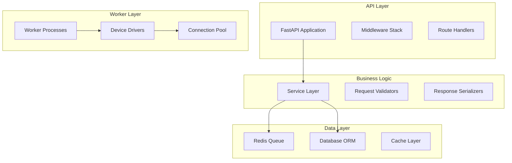

# Development Guide

Welcome to the NetPulse Development Guide! This section will help you understand how to contribute to the NetPulse project.

## Development Environment Setup

### System Requirements

- Python 3.12+
- Redis 6.0+
- Git

### Local Development Environment

1. **Clone the project**
```bash
git clone https://github.com/your-org/netpulse.git
cd netpulse
```

2. **Create a virtual environment**
```bash
python -m venv .venv
source .venv/bin/activate  # Linux/macOS
# or
.venv\Scripts\activate  # Windows
```

3. **Install dependencies**
```bash
pip install -e .[dev]
```

4. **Start Redis**
```bash
docker run -d -p 6379:6379 redis:7-alpine
```

5. **Run tests**
```bash
pytest tests/
```

## Project Structure

```
netpulse/
├── netpulse/                 # Core code
│   ├── cli/                 # CLI tools
│   ├── models/              # Data models
│   ├── plugins/             # Plugin system
│   │   ├── drivers/         # Device drivers
│   │   ├── parsers/         # Parsers
│   │   └── renderers/       # Renderers
│   ├── routes/              # API routes
│   ├── services/            # Business logic
│   └── utils/               # Utility functions
├── tests/                   # Test code
├── docs/                    # Documentation
├── scripts/                 # Script tools
└── config/                  # Configuration files
```

## Development Workflow

### 1. Create a feature branch
```bash
git checkout -b feature/your-feature-name
```

### 2. Write code
- Follow PEP 8 code style
- Add appropriate comments and docstrings
- Write unit tests

### 3. Run tests
```bash
pytest tests/ -v
```

### 4. Code formatting
```bash
black netpulse/
ruff check netpulse/
```

### 5. Commit code
```bash
git add .
git commit -m "feat: add new feature"
```

### 6. Create a Pull Request

## Contribution Guide

### Code Style

- Use Python type annotations
- Follow PEP 8 code style
- Use Black for code formatting
- Use Ruff for code linting

### Commit Message Convention

Use the [Conventional Commits](https://www.conventionalcommits.org/) format:

```
<type>[optional scope]: <description>

[optional body]

[optional footer(s)]
```

Types include:
- `feat`: New feature
- `fix`: Bug fix
- `docs`: Documentation update
- `style`: Code style adjustment
- `refactor`: Code refactoring
- `test`: Test related
- `chore`: Build process or auxiliary tool changes

### Test Requirements

- New features must include unit tests
- Test coverage should not be less than 80%
- All tests must pass

## Plugin Development

NetPulse uses a plugin architecture and supports custom drivers, parsers, and renderers.

### Driver Plugins

Driver plugins are used to connect to different types of network devices.

### Parser Plugins

Parser plugins are used to parse command outputs.

### Renderer Plugins

Renderer plugins are used to render configuration templates.

## Debugging Tips

### Logging Configuration

```python
import logging
logging.basicConfig(level=logging.DEBUG)
```

### Using the Debugger

```python
import pdb; pdb.set_trace()
```

### Performance Profiling

```bash
python -m cProfile -o profile.stats your_script.py
python -c "import pstats; pstats.Stats('profile.stats').sort_stats('cumulative').print_stats(10)"
```

## FAQ

### Q: How to add a new device driver?

A: Refer to existing driver implementations and create a new driver module under `netpulse/plugins/drivers/`.

### Q: How to debug API requests?

A: Use FastAPI's automatic documentation at `http://localhost:9000/docs`.

### Q: How to test batch operations?

A: Use the provided test device files or create your own test environment.

## Getting Help

- Check [GitHub Issues](https://github.com/your-org/netpulse/issues)
- Read the [API Documentation](../guides/api.md)
- Refer to [Best Practices](../reference/best-practices.md)

## Development Topics

### Core Development
- Contributing Guidelines - How to contribute to NetPulse
- Development Setup - Setting up development environment
- Testing Guide - Writing and running tests
- Code Style Guide - Coding standards and conventions

### Extension Development
- Plugin System - Creating custom plugins
- Driver System - Implementing new device drivers
- Template System - Creating custom templates
- Webhook System - Building webhook integrations

### Advanced Topics
- API Guide - Extending the REST API
- Worker System - Custom worker implementations
- Database Guide - Database structure and migrations
- Performance Guide - Performance analysis and optimization

## Architecture for Developers

### Core Components


### Development Principles
1. **Modularity**: Keep components loosely coupled
2. **Testability**: Write testable code with good coverage
3. **Documentation**: Document all public APIs
4. **Performance**: Consider performance implications
5. **Security**: Follow security best practices

## Development Resources
- [API Documentation](../guides/api.md)
- [Architecture Overview](../architecture/overview.md)
- [Best Practices](../reference/best-practices.md)
- [Log Analysis](../troubleshooting/log-analysis.md)

## Community

### Getting Help
- **GitHub Issues**: Report bugs and request features
- **Discussions**: Ask questions and share ideas
- **Discord/Slack**: Real-time community chat
- **Documentation**: Comprehensive guides and references

### Contributing
We welcome contributions from the community! Whether you're fixing bugs, adding features, improving documentation, or helping with testing, your contributions are valuable.

---

Choose a topic from the menu to dive deeper into NetPulse development! 