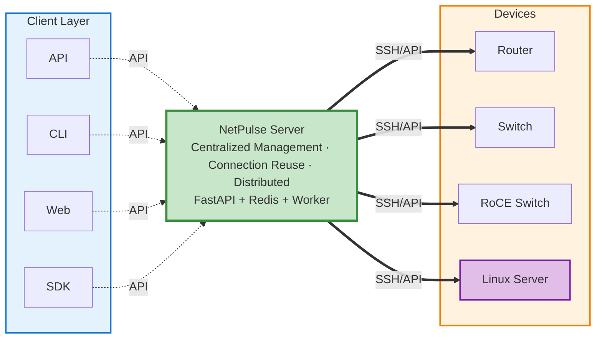

# NetPulse Documentation

NetPulse is a RESTful API server for network device management, providing a unified multi-vendor network device management interface.


## What is NetPulse?

NetPulse acts as an intermediate layer proxy between clients and network devices, providing unified network device management services:



NetPulse is a **server-side network automation controller** that provides a unified network device management interface through RESTful APIs. Unlike traditional client-side tools (such as Netmiko, NAPALM), NetPulse adopts a server-side architecture, centrally deployed on servers, and clients only need to make HTTP requests to complete device operations.

### Why Server-Side Mode?

Traditional client-side tools need to be installed on every machine, and each program must handle complex issues such as concurrent scheduling, connection management, and task queues. Server-side mode centralizes these complexities on the server:

- **Simplified Client**: Clients don't need to handle concurrent scheduling, connection reuse, task queues, etc., just call APIs
- **Centralized Management**: Unified management of all network devices, resource sharing, no need to install tools on each client
- **High Availability**: High availability through distributed architecture, single point of failure does not affect service
- **Easy Integration**: Easy integration into existing systems through standard RESTful APIs

!!! info "About Similar Frameworks"
    During the design process, we learned from the framework design ideas of [NetPalm](https://github.com/tbotnz/netpalm), reflecting the sharing and learning spirit of open source. Both use the same open source components at the **product level** (such as Netmiko, NAPALM, Redis + RQ), but there are significant differences in **code implementation logic**, especially in core components such as long connection management, scheduling algorithms, and Worker architecture, which have been independently designed and developed.

## Key Features

- **RESTful API** - Unified asynchronous API interface supporting multi-vendor network devices
- **Persistent Connections** - Improved operation efficiency through SSH long connection technology
- **Distributed Architecture** - Supports multi-node deployment and horizontal scaling
- **Multi-Driver Support** - Multiple drivers including Netmiko, NAPALM, PyEAPI, Paramiko
- **Vault Credential Management** - Integrated HashiCorp Vault for secure storage and management of device credentials
- **Template Support** - Supports Jinja2, TextFSM, TTP template engines
- **Batch Operations** - Supports large-scale device management and configuration

## Quick Start

```bash
git clone https://github.com/scitix/netpulse.git
cd netpulse
bash ./scripts/docker_auto_deploy.sh
```

!!! tip "Prerequisites"
    - Docker 20.10+ and Docker Compose 2.0+
    - At least 2GB available memory
    - Port 9000 is not occupied

For detailed deployment instructions, see [Quick Start](getting-started/quick-start.md).

## Learning Path for Beginners

If you are using NetPulse for the first time, we recommend reading the documentation in the following order:

1. **[Quick Start](getting-started/quick-start.md)** - Get started in 5 minutes and experience basic features
2. **[Basic Concepts](getting-started/basic-concepts.md)** - Understand core concepts (drivers, queues, tasks, etc.)
3. **[Driver Selection](drivers/index.md)** - Learn how to choose the right driver
4. **[API Overview](api/api-overview.md)** - Learn about all API interfaces
5. **Advanced Usage** - Read architecture documentation and reference manuals as needed

## Documentation Navigation

### Quick Start
- [Quick Start](getting-started/quick-start.md) - Get started quickly
- [Basic Concepts](getting-started/basic-concepts.md) - Core concepts
- [Deployment Guide](getting-started/deployment-guide.md) - Deployment instructions

### API Reference
- [API Overview](api/api-overview.md) - API interface documentation
- [Device Operation API](api/device-api.md) - Device operation interfaces
- [Vault Credential Management API](api/credential-api.md) - Vault credential management interface
- [API Examples](api/api-examples.md) - Usage examples
- [Driver Selection](drivers/index.md) - Driver selection

### Technical Architecture
- [Architecture Overview](architecture/architecture-overview.md) - System architecture
- [Task Scheduler](architecture/scheduler-system.md) - Scheduling algorithms
- [Plugin System](architecture/plugin-system.md) - Plugin mechanism

### Reference Manual
- [Configuration Guide](reference/configuration-guide.md) - Configuration documentation
- [Environment Variables](reference/environment-variables.md) - Environment variables
- [Error Codes](reference/error-codes.md) - Error documentation
- [Performance Tuning](reference/performance-tuning.md) - Performance recommendations
- [Glossary](reference/glossary.md) - Terminology definitions
- [Troubleshooting](reference/troubleshooting.md) - Problem troubleshooting
- [Development Guide](reference/development-guide.md) - Development environment

## Quick FAQ

**Q: Are device operations synchronous or asynchronous?**  
A: Device operations (`/device/execute`, `/device/bulk`) are asynchronous and require querying task status to get results. Only `/device/test-connection` is synchronous.

**Q: How to choose the right driver?**  
A: Use Paramiko for Linux servers, PyEAPI for Arista devices, NAPALM if you need configuration rollback, and Netmiko for other scenarios (recommended).

**Q: When to use FIFO queue, when to use Pinned queue?**  
A: The system will automatically select based on the driver. Netmiko/NAPALM default to Pinned (connection reuse), PyEAPI/Paramiko default to FIFO. Usually no manual specification is needed.

**Q: How to get command execution results?**  
A: After submitting a task, you get a task ID, then query results through the `/job?id=xxx` interface.

**Q: How to securely manage device credentials?**  
A: Use the Vault credential management feature to store credentials in HashiCorp Vault, and reference them via `credential_ref` in device operations to avoid directly passing passwords in requests. See [Vault Credential Management API](api/credential-api.md) for details.

## Get Help

- **Documentation Issues**: See [Troubleshooting](reference/troubleshooting.md)
- **Technical Issues**: Submit [GitHub Issue](https://github.com/scitix/netpulse/issues)
- **Contribute Documentation**: Welcome to submit Pull Request

---