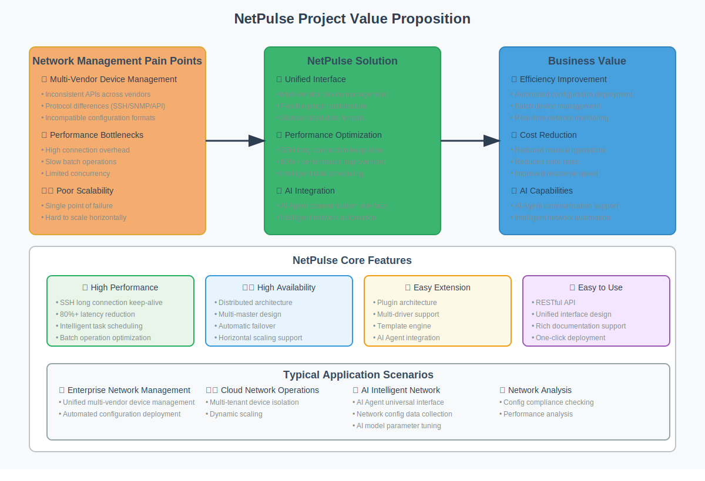
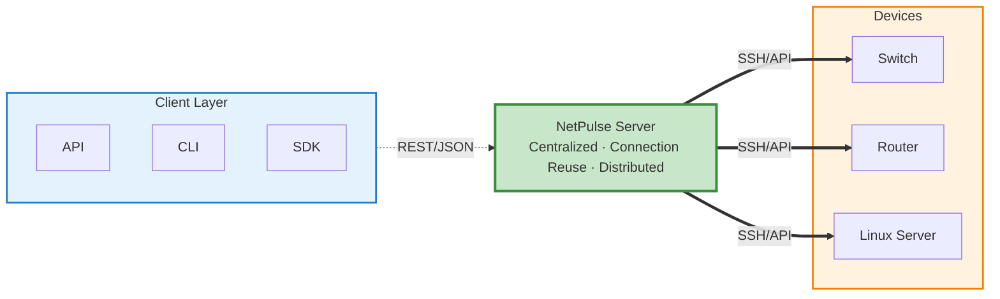

# NetPulse Documentation

NetPulse is a distributed RESTful API server that turns network switches and Linux servers into programmable assets via persistent SSH connections.




```mermaid
flowchart LR
    subgraph Clients[Client Layer]
        direction TB
        API[API]
        CLI[CLI]
        SDK[SDK]
    end

    NetPulse[NetPulse Server<br/>Centralized · Connection Reuse · Distributed]

    subgraph Devices[Devices]
        direction TB
        Switch[Switch]
        Router[Router]
        Linux[Linux Server]
    end

    Clients -.->|REST/JSON| NetPulse
    NetPulse ==>|SSH/API| Switch
    NetPulse ==>|SSH/API| Router
    NetPulse ==>|SSH/API| Linux

    style Clients fill:#E3F2FD,stroke:#1976D2,stroke-width:2px
    style NetPulse fill:#C8E6C9,stroke:#388E3C,stroke-width:3px
    style Devices fill:#FFF3E0,stroke:#F57C00,stroke-width:2px
```

## Key Features

- **RESTful API** — Unified async interface for multi-vendor network devices
- **Persistent SSH Connections** — Reuse connections for 2-5x faster response
- **Distributed Architecture** — Multi-node deployment with horizontal scaling
- **Multi-Driver Support** — Netmiko, NAPALM, PyEAPI, Paramiko
- **Template Engines** — Jinja2, TextFSM, TTP for rendering and parsing
- **Batch Operations** — Large-scale device management

## Quick Start

```bash
git clone https://github.com/scitix/netpulse.git
cd netpulse
bash ./scripts/docker_auto_deploy.sh
```

!!! tip "Prerequisites"
    - Docker 20.10+ and Docker Compose 2.0+
    - At least 2GB available memory
    - Port 9000 available

See [Quick Start](getting-started/quick-start.md) for detailed instructions.

## Learning Path

1. **[Quick Start](getting-started/quick-start.md)** — Deploy and make your first API call
2. **[Basic Concepts](getting-started/basic-concepts.md)** — Understand drivers, queues, and jobs
3. **[Driver Selection](drivers/index.md)** — Choose the right driver for your devices
4. **[API Overview](api/api-overview.md)** — Explore all API endpoints

---
