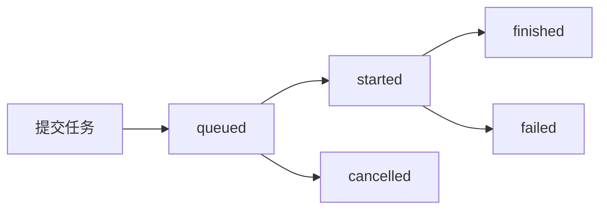

# 任务管理 API

## 概述

任务管理 API 提供任务状态查询、任务取消和Worker管理功能，是NetPulse异步处理系统的核心组件。

## API 端点

### GET /job

查询任务状态和结果。

**功能说明**:
- 支持按任务ID、队列、状态、节点、主机等条件查询
- 返回任务详细信息，包括执行时间、结果、错误信息
- 支持分页和过滤
- **按ID查询优先级最高**：如果提供了 `id` 参数，其他过滤条件将被忽略

**查询参数**:

| 参数 | 类型 | 描述 |
|------|------|------|
| id | string | 按任务ID查询 (优先级最高) |
| queue | string | 按队列名称查询 |
| status | string | 按状态查询 (queued, started, finished, failed) |
| node | string | 按节点名称查询 |
| host | string | 按主机名称查询 |

**请求示例**:

```bash
# 按任务ID查询
curl -X GET "http://localhost:9000/job?id=job_123456" \
  -H "X-API-KEY: your_key"

# 按队列查询
curl -X GET "http://localhost:9000/job?queue=pinned_192.168.1.1" \
  -H "X-API-KEY: your_key"

# 按状态查询
curl -X GET "http://localhost:9000/job?status=finished" \
  -H "X-API-KEY: your_key"

# 按主机查询
curl -X GET "http://localhost:9000/job?host=192.168.1.1" \
  -H "X-API-KEY: your_key"
```

**响应示例**:

```json
{
  "code": 200,
  "message": "success",
  "data": [
    {
      "id": "job_123456",
      "status": "finished",
      "queue": "pinned_192.168.1.1",
      "created_at": "2024-01-01T12:00:00+08:00",
      "enqueued_at": "2024-01-01T12:00:01+08:00",
      "started_at": "2024-01-01T12:00:02+08:00",
      "ended_at": "2024-01-01T12:00:05+08:00",
      "worker": "worker_001",
      "result": {
        "type": "success",           // 结果类型: "success" 或 "failure"
        "retval": "Cisco IOS Software, Version 15.2...",  // 成功时的返回值（命令输出）
        "error": null                // 失败时的错误信息对象: {"type": "错误类型", "message": "错误消息"}
      },
      "duration": 3.0,
      "queue_time": 1.0
    }
  ]
}
```

### DELETE /job

取消任务。

**功能说明**:
- 只能取消尚未开始执行的任务
- 支持按任务ID、队列、主机等条件批量取消
- 已开始执行的任务无法取消

**查询参数**:

| 参数 | 类型 | 描述 |
|------|------|------|
| id | string | 按任务ID取消 |
| queue | string | 按队列名称取消 |
| host | string | 按主机名称取消 |

**请求示例**:

```bash
# 取消指定任务
curl -X DELETE "http://localhost:9000/job?id=job_123456" \
  -H "X-API-KEY: your_key"

# 取消队列中的所有任务
curl -X DELETE "http://localhost:9000/job?queue=pinned_192.168.1.1" \
  -H "X-API-KEY: your_key"

# 取消主机的所有任务
curl -X DELETE "http://localhost:9000/job?host=192.168.1.1" \
  -H "X-API-KEY: your_key"
```

**响应示例**:

```json
{
  "code": 200,
  "message": "success",
  "data": {
    "cancelled_count": 5,
    "cancelled_jobs": [
      "job_123456",
      "job_123457",
      "job_123458"
    ]
  }
}
```

### GET /worker

查询Worker状态。

**功能说明**:
- 返回所有活跃的Worker节点信息
- 包括Worker状态、处理的任务数量、性能指标等
- 用于系统监控和性能调优

**查询参数**:

| 参数 | 类型 | 描述 |
|------|------|------|
| queue | string | 按队列名称过滤（优先级最高） |
| node | string | 按节点名称过滤 |
| host | string | 按主机名称过滤 |

**请求示例**:

```bash
curl -X GET "http://localhost:9000/worker" \
  -H "X-API-KEY: your_key"
```

**响应示例**:

```json
{
  "code": 200,
  "message": "success",
  "data": [
    {
      "name": "worker_001",
      "status": "busy",
      "pid": 12345,
      "hostname": "worker-node-1",
      "queues": ["FifoQ"],
      "last_heartbeat": "2024-01-01T12:00:00+08:00",
      "birth_at": "2024-01-01T10:00:00+08:00",
      "successful_job_count": 150,
      "failed_job_count": 2
    },
    {
      "name": "worker_002",
      "status": "idle",
      "pid": 12346,
      "hostname": "worker-node-2",
      "queues": ["pinned_192.168.1.1"],
      "last_heartbeat": "2024-01-01T12:00:00+08:00",
      "birth_at": "2024-01-01T11:00:00+08:00",
      "successful_job_count": 75,
      "failed_job_count": 1
    }
  ]
}
```

### DELETE /worker

删除Worker。

**功能说明**:
- 强制停止指定的Worker节点
- 正在执行的任务会被中断
- 谨慎使用，可能导致任务丢失

**查询参数**:

| 参数 | 类型 | 描述 |
|------|------|------|
| name | string | Worker名称（优先级最高） |
| queue | string | 按队列名称过滤 |
| node | string | 按节点名称过滤 |
| host | string | 按主机名称过滤 |

**请求示例**:

```bash
curl -X DELETE "http://localhost:9000/worker?name=worker_001" \
  -H "X-API-KEY: your_key"
```

**响应示例**:

```json
{
  "code": 200,
  "message": "success",
  "data": ["worker_001"]
}
```

> **注意**: 返回的是被终止的Worker名称列表。

## 任务状态说明

### 任务状态

| 状态 | 描述 | 说明 |
|------|------|------|
| queued | 已排队 | 任务已提交到队列，等待执行 |
| started | 执行中 | 任务正在被Worker执行 |
| finished | 已完成 | 任务执行成功，有结果 |
| failed | 执行失败 | 任务执行失败，有错误信息 |

### 任务生命周期



## 响应模型详解

### GetJobResponse

任务查询响应。

```json
{
  "code": 200,
  "message": "success",
  "data": [
    {
      "id": "job_123456",
      "status": "finished",
      "queue": "pinned_192.168.1.1",
      "created_at": "2024-01-01T12:00:00+08:00",
      "enqueued_at": "2024-01-01T12:00:01+08:00",
      "started_at": "2024-01-01T12:00:02+08:00",
      "ended_at": "2024-01-01T12:00:05+08:00",
      "worker": "worker_001",
      "result": {
        "type": "success",
        "retval": "命令输出内容",
        "error": null
      },
      "duration": 3.0,
      "queue_time": 1.0
    }
  ]
}
```

### DeleteJobResponse

任务取消响应。

```json
{
  "code": 200,
  "message": "success",
  "data": {
    "cancelled_count": 5,
    "cancelled_jobs": [
      "job_123456",
      "job_123457"
    ]
  }
}
```

### GetWorkerResponse

Worker查询响应。

```json
{
  "code": 200,
  "message": "success",
  "data": [
    {
      "name": "worker_001",
      "status": "busy",
      "pid": 12345,
      "hostname": "worker-node-1",
      "queues": ["FifoQ", "pinned_192.168.1.1"],
      "last_heartbeat": "2024-01-01T12:00:00+08:00",
      "birth_at": "2024-01-01T10:00:00+08:00",
      "successful_job_count": 150,
      "failed_job_count": 2
    }
  ]
}
```

### DeleteWorkerResponse

Worker删除响应。

```json
{
  "code": 200,
  "message": "success",
  "data": {
    "worker": "worker_001",
    "status": "stopped",
    "interrupted_jobs": 1
  }
}
```

## 使用示例

### 1. 查询任务状态

```python
import requests
import time

def check_job_status(job_id, api_key):
    """查询任务状态"""
    response = requests.get(
        f"http://localhost:9000/job?id={job_id}",
        headers={"X-API-KEY": api_key}
    )
    
    if response.status_code == 200:
        job_data = response.json()["data"][0]
        return job_data["status"], job_data.get("result")
    else:
        print(f"查询失败: {response.status_code}")
        return None, None

# 使用示例
job_id = "job_123456"
api_key = "your_key"

while True:
    status, result = check_job_status(job_id, api_key)
    
    if status == "finished":
        print(f"任务完成: {result['retval']}")
        break
    elif status == "failed":
        print(f"任务失败: {result['error']}")
        break
    elif status in ["queued", "started"]:
        print(f"任务状态: {status}")
        time.sleep(2)
    else:
        print(f"未知状态: {status}")
        break
```

### 2. 批量查询任务

```python
# 查询所有已完成的任务
response = requests.get(
    "http://localhost:9000/job?status=finished",
    headers={"X-API-KEY": "your_key"}
)

if response.status_code == 200:
    jobs = response.json()["data"]
    for job in jobs:
        print(f"任务ID: {job['id']}, 执行时间: {job['duration']}秒")
```

### 3. 取消任务

```python
# 取消指定任务
response = requests.delete(
    "http://localhost:9000/job?id=job_123456",
    headers={"X-API-KEY": "your_key"}
)

if response.status_code == 200:
    result = response.json()["data"]
    print(f"取消任务数量: {result['cancelled_count']}")
```

### 4. 监控Worker状态

```python
# 查询Worker状态
response = requests.get(
    "http://localhost:9000/worker",
    headers={"X-API-KEY": "your_key"}
)

if response.status_code == 200:
    workers = response.json()["data"]
    for worker in workers:
        print(f"Worker: {worker['name']}, 状态: {worker['status']}, "
              f"完成任务: {worker['successful_job_count']}, 失败任务: {worker['failed_job_count']}")
```

### 5. 任务结果处理

```python
def process_job_result(job_id, api_key):
    """处理任务结果"""
    response = requests.get(
        f"http://localhost:9000/job?id={job_id}",
        headers={"X-API-KEY": api_key}
    )
    
    if response.status_code == 200:
        job_data = response.json()["data"][0]
        
        if job_data["status"] == "finished":
            result = job_data["result"]
            if result["type"] == "success":
                return result["retval"]
            else:
                return f"执行失败: {result['error']}"
        else:
            return f"任务状态: {job_data['status']}"
    else:
        return "查询失败"

# 使用示例
result = process_job_result("job_123456", "your_key")
print(result)
```

## 最佳实践

### 1. 任务状态轮询

```python
def wait_for_job_completion(job_id, api_key, timeout=300, interval=2):
    """等待任务完成"""
    import time
    
    start_time = time.time()
    while time.time() - start_time < timeout:
        status, result = check_job_status(job_id, api_key)
        
        if status == "finished":
            return result["retval"]
        elif status == "failed":
            raise Exception(f"任务执行失败: {result['error']}")
        elif status in ["queued", "started"]:
            time.sleep(interval)
        else:
            raise Exception(f"未知任务状态: {status}")
    
    raise Exception("任务超时")

# 使用示例
try:
    result = wait_for_job_completion("job_123456", "your_key")
    print(f"任务结果: {result}")
except Exception as e:
    print(f"任务异常: {e}")
```

### 2. 批量任务管理

```python
def monitor_batch_jobs(job_ids, api_key):
    """监控批量任务"""
    import time
    
    completed_jobs = []
    failed_jobs = []
    
    while len(completed_jobs) + len(failed_jobs) < len(job_ids):
        for job_id in job_ids:
            if job_id not in completed_jobs and job_id not in failed_jobs:
                status, result = check_job_status(job_id, api_key)
                
                if status == "finished":
                    completed_jobs.append(job_id)
                    print(f"任务 {job_id} 完成")
                elif status == "failed":
                    failed_jobs.append(job_id)
                    print(f"任务 {job_id} 失败: {result['error']}")
        
        time.sleep(2)
    
    return completed_jobs, failed_jobs
```

### 3. Worker监控

```python
def monitor_workers(api_key):
    """监控Worker状态"""
    response = requests.get(
        "http://localhost:9000/worker",
        headers={"X-API-KEY": api_key}
    )
    
    if response.status_code == 200:
        workers = response.json()["data"]
        
        busy_workers = [w for w in workers if w["status"] == "busy"]
        idle_workers = [w for w in workers if w["status"] == "idle"]
        
        print(f"忙碌Worker: {len(busy_workers)}")
        print(f"空闲Worker: {len(idle_workers)}")
        
        for worker in workers:
            print(f"Worker {worker['name']}: {worker['successful_job_count']} 完成, "
                  f"{worker['failed_job_count']} 失败")
```

## 注意事项

1. **任务超时**: 长时间运行的任务可能超时，需要合理设置TTL
2. **任务取消**: 只能取消未开始的任务，已开始的任务无法取消
3. **Worker管理**: 谨慎删除Worker，可能导致任务丢失
4. **状态轮询**: 避免过于频繁的轮询，建议间隔2-5秒
5. **错误处理**: 正确处理任务失败和系统错误

## 性能优化

### 1. 批量查询

```python
# 批量查询多个任务
job_ids = ["job_123456", "job_123457", "job_123458"]
for job_id in job_ids:
    status, result = check_job_status(job_id, api_key)
    # 处理结果
```

### 2. 条件过滤

```python
# 只查询特定状态的任务
response = requests.get(
    "http://localhost:9000/job?status=finished",
    headers={"X-API-KEY": "your_key"}
)
```

### 3. 异步处理

```python
import asyncio
import aiohttp

async def check_job_status_async(session, job_id, api_key):
    """异步查询任务状态"""
    async with session.get(
        f"http://localhost:9000/job?id={job_id}",
        headers={"X-API-KEY": api_key}
    ) as response:
        if response.status == 200:
            data = await response.json()
            return data["data"][0]
        return None

async def monitor_jobs_async(job_ids, api_key):
    """异步监控任务"""
    async with aiohttp.ClientSession() as session:
        tasks = [check_job_status_async(session, job_id, api_key) 
                for job_id in job_ids]
        results = await asyncio.gather(*tasks)
        return results
```

## Worker管理示例

### 1. 查询Worker状态

```python
import requests

def get_all_workers():
    url = "http://localhost:9000/worker"
    headers = {"X-API-Key": "your-api-key-here"}
    response = requests.get(url, headers=headers)
    if response.status_code == 200:
        return response.json()['data']
    return []

def get_workers_by_queue(queue):
    url = f"http://localhost:9000/worker?queue={queue}"
    headers = {"X-API-Key": "your-api-key-here"}
    response = requests.get(url, headers=headers)
    if response.status_code == 200:
        return response.json()['data']
    return []

def get_workers_by_host(host):
    url = f"http://localhost:9000/worker?host={host}"
    headers = {"X-API-Key": "your-api-key-here"}
    response = requests.get(url, headers=headers)
    if response.status_code == 200:
        return response.json()['data']
    return []

# 使用示例
workers = get_all_workers()
fifo_workers = get_workers_by_queue('FifoQ')
```

### 2. 终止Worker

```python
def terminate_worker(worker_name):
    url = f"http://localhost:9000/worker?name={worker_name}"
    headers = {"X-API-Key": "your-api-key-here"}
    response = requests.delete(url, headers=headers)
    return response.status_code == 200

def terminate_workers_by_queue(queue):
    url = f"http://localhost:9000/worker?queue={queue}"
    headers = {"X-API-Key": "your-api-key-here"}
    response = requests.delete(url, headers=headers)
    return response.status_code == 200

def terminate_workers_by_host(host):
    url = f"http://localhost:9000/worker?host={host}"
    headers = {"X-API-Key": "your-api-key-here"}
    response = requests.delete(url, headers=headers)
    return response.status_code == 200

# 使用示例
if workers:
    worker_name = workers[0]['name']
    terminate_worker(worker_name)
```

### 3. Worker监控脚本

```bash
#!/bin/bash
# Worker监控脚本

API_KEY="your-api-key-here"
API_URL="http://localhost:9000/worker"
LOG_FILE="/var/log/netpulse-workers.log"

# 获取所有Worker
response=$(curl -s -H "X-API-KEY: $API_KEY" "$API_URL")

if [ $? -eq 0 ]; then
    total_workers=$(echo "$response" | jq '.data | length')
    busy_workers=$(echo "$response" | jq '.data[] | select(.status == "busy") | .name' | wc -l)
    dead_workers=$(echo "$response" | jq '.data[] | select(.status == "dead") | .name' | wc -l)
    
    timestamp=$(date '+%Y-%m-%d %H:%M:%S')
    echo "[$timestamp] 总Worker: $total_workers, 忙碌: $busy_workers, 已停止: $dead_workers" >> "$LOG_FILE"
    
    # 如果有已停止的Worker，发送告警
    if [ "$dead_workers" -gt 0 ]; then
        echo "[$timestamp] 警告: 发现已停止Worker ($dead_workers)" >> "$LOG_FILE"
    fi
    
    # 如果忙碌Worker太少，发送告警
    if [ "$busy_workers" -lt 2 ]; then
        echo "[$timestamp] 警告: 忙碌Worker过少 ($busy_workers)" >> "$LOG_FILE"
    fi
else
    echo "[$timestamp] Worker监控失败" >> "$LOG_FILE"
fi
```

## Worker状态说明

### Worker状态
- `busy`: 正在处理任务
- `idle`: 空闲，等待任务
- `suspended`: 已暂停
- `dead`: 已停止

### 队列类型
- `FifoQ`: FIFO队列Worker
- `pinned_{device_host}`: 设备绑定队列Worker

## Worker管理最佳实践

### 1. Worker监控
- 定期检查Worker状态
- 监控运行中Worker数量
- 设置告警阈值

### 2. Worker管理
- 及时终止错误Worker
- 合理分配Worker资源
- 避免Worker过载

### 3. 性能优化
- 根据任务量调整Worker数量
- 监控Worker负载
- 合理使用队列策略

## 系统健康检查

### GET /health

检查系统整体健康状态，用于监控NetPulse服务的运行状态和各个组件的健康状况。

**请求示例**:

```bash
curl -H "X-API-KEY: your-api-key-here" \
  http://localhost:9000/health
```

**响应示例**:

```json
{
  "code": 200,
  "message": "success",
  "data": "ok"
}
```

### 健康检查项目

#### 1. API服务状态
- 服务是否正常运行
- 响应时间是否正常
- 错误率是否在可接受范围内

#### 2. Redis连接状态
- Redis服务是否可达
- 连接池是否正常
- 内存使用情况

#### 3. Worker进程状态
- 活跃Worker数量
- Worker心跳状态
- 任务队列状态

### 使用示例

#### Python 示例

```python
import requests
import json

def check_system_health():
    url = "http://localhost:9000/health"
    headers = {"X-API-Key": "your-api-key-here"}
    
    try:
        response = requests.get(url, headers=headers, timeout=10)
        if response.status_code == 200:
            data = response.json()
            return data['data']
        else:
            return {"status": "error", "message": f"HTTP {response.status_code}"}
    except Exception as e:
        return {"status": "error", "message": str(e)}

def monitor_health():
    """持续监控系统健康状态"""
    import time
    
    while True:
        health = check_system_health()
        print(f"Health Status: {health}")
        print("-" * 50)
        time.sleep(60)  # 每分钟检查一次

# 使用示例
if __name__ == "__main__":
    health_status = check_system_health()
    print(json.dumps(health_status, indent=2))
```

### 监控集成

#### Prometheus 集成

```yaml
# prometheus.yml
scrape_configs:
  - job_name: 'netpulse'
    static_configs:
      - targets: ['localhost:9000']
    metrics_path: '/health'
    scrape_interval: 30s
```

### 故障排除

#### 常见问题

1. **API服务无响应**
   - 检查服务是否启动
   - 检查端口是否被占用
   - 查看服务日志

2. **Redis连接失败**
   - 检查Redis服务状态
   - 验证连接配置
   - 检查网络连通性

#### 调试命令

```bash
# 检查服务状态
docker compose ps

# 查看服务日志
docker compose logs api

# 检查端口占用
netstat -tlnp | grep 9000

# 测试Redis连接
redis-cli ping
```

### 健康检查最佳实践

1. **监控策略**
   - 设置合理的检查间隔（建议30秒）
   - 配置告警阈值
   - 建立故障升级流程

2. **日志管理**
   - 记录健康检查结果
   - 设置日志轮转
   - 配置日志级别

3. **性能优化**
   - 缓存健康检查结果
   - 异步执行检查
   - 设置超时时间

4. **安全考虑**
   - 限制健康检查访问
   - 使用HTTPS
   - 配置访问控制

---

## 相关文档

- [API概览](./api-overview.md) - 了解所有API接口
- [设备操作 API](./device-api.md) - 设备操作核心接口 