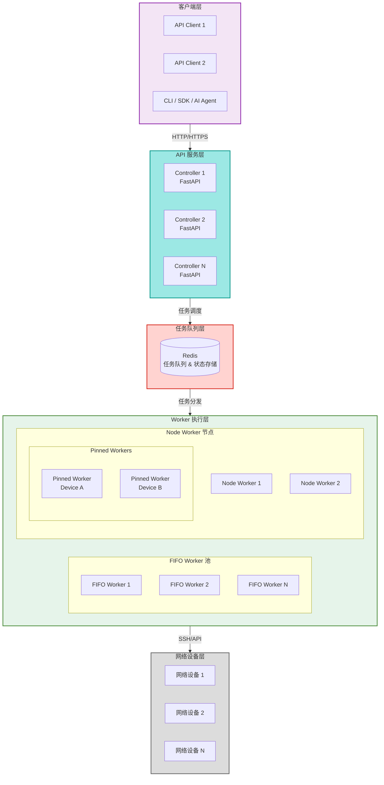
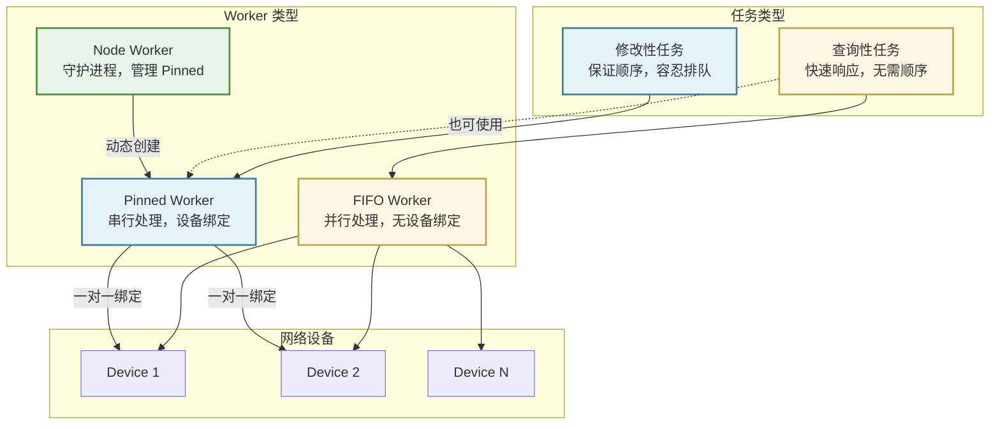
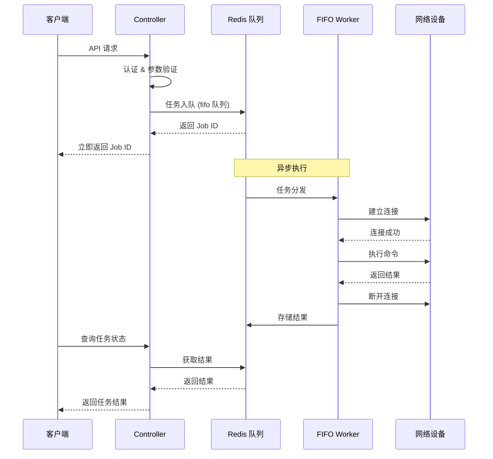
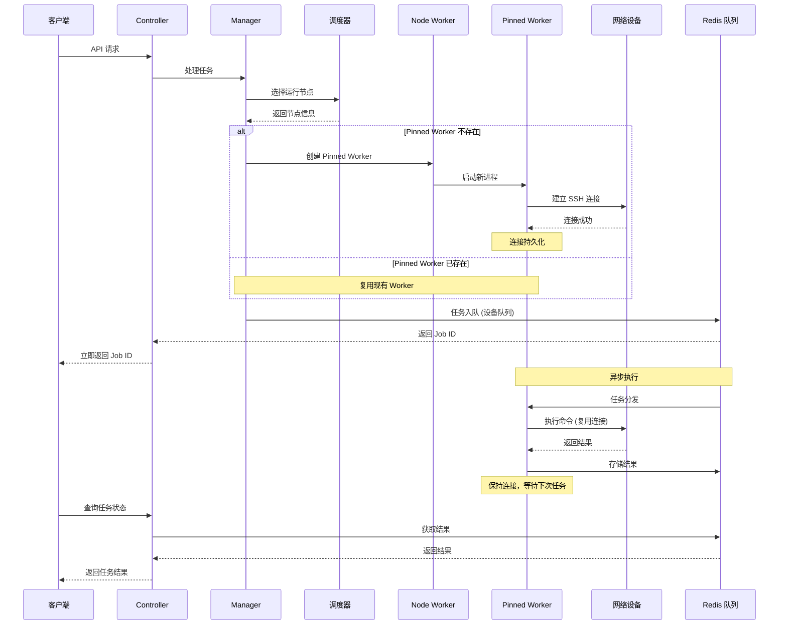

# 技术架构

!!! info "关于本文档"
    本文档介绍 NetPulse 的技术架构、设计理念和实现细节。如果你只是想**使用** NetPulse 进行网络设备管理，可以跳过这部分内容，直接查看 [快速开始](../getting-started/quick-start.md)、[API 参考](../api/api-overview.md) 和 [驱动选择](../drivers/index.md) 等章节，这不会影响你的正常使用。
    
    但如果你是一位**技术极客**，对分布式系统设计、高性能网络编程、插件架构等话题感兴趣，或者想要深入了解 NetPulse 的技术实现逻辑，那么欢迎阅读本文档。我们非常开放地分享我们的设计理念、技术选型和架构思考，希望能与同样热爱技术的你产生共鸣，也欢迎提出宝贵的意见和建议。

---

NetPulse 采用分布式架构设计，旨在提供高可用、高性能的网络设备管理服务。本文档介绍系统的技术架构、设计理念、核心组件以及关键技术实现。

## 架构概览

NetPulse 采用分层架构设计，从客户端到网络设备，包含 API 层、任务队列层、Worker 层和设备层：

### 架构分层

NetPulse 技术架构分为四个主要层次：

## 设计理念

### 任务类型与 Worker 分工

NetPulse 的设计理念基于对网络运维任务特性的分析。网络运维任务通常分为两类：

| 任务类型 | 特点 | 执行要求 | 典型场景 |
|---------|------|---------|---------|
| **查询性任务** | 只读操作，不改变设备状态 | 无需保证顺序，追求快速响应 | 拉取设备状态、检查配置信息 |
| **修改性任务** | 写入操作，改变设备状态 | 必须保证单设备上的执行顺序 | 推送配置、应用变更 |

基于这两种任务的不同特性，NetPulse 设计了三种 Worker：

### Worker 特性说明

**FIFO Worker**
- **特点**：无设备绑定，每个节点只能运行一个（使用文件锁保证）
- **优势**：并行处理，缩短排队时间
- **限制**：任务顺序无严格保证；每个节点单实例限制
- **适用**：查询性任务，追求快速响应
- **扩展**：通过部署多个节点实现水平扩展

**Pinned Worker**
- **特点**：与设备一对一绑定，串行执行
- **优势**：保证任务顺序，支持连接持久化
- **适用**：修改性任务，需要顺序保证的场景

**Node Worker**
- **作用**：守护进程，动态创建和管理 Pinned Worker
- **原因**：无法预知用户操作哪些设备，Pinned Worker 必须按需创建

!!! tip "连接持久化"
    利用 Pinned Worker 与设备一对一的特点，实现了 SSH Session 的持久化，有助于提升性能（参考 [长连接技术](./driver-system.md)）。

## 核心组件

1. **RESTful API**
    - 基于 FastAPI 构建
    - 处理传入请求、验证并排队任务

2. **消息队列**
    - 基于 Redis 的任务队列（基于 RQ）
    - 用于多主多从架构中的状态同步
    - 暂存任务状态、任务执行结果

3. **工作节点**
    - 设计了三种 Worker，处理不同类型的任务
    - FIFO 工作节点：按顺序处理任务
    - Node 工作节点：作为守护进程管理 Pinned Worker 和节点状态
    - Pinned 工作节点：维护和单个设备的连接，串行执行某设备的任务

4. **插件系统**
    - 可扩展的插件系统包含设备驱动、调度器、模板引擎和 Webhooks
    - 接口定义明确，便于二次开发和集成
    - 采用延迟加载机制，按需加载插件，不影响系统启动性能
    - 支持运行时动态选择插件，无需重启服务

## 数据流

### 1. FIFO Worker 任务流程

FIFO Worker 处理查询性任务，采用"即用即连"模式：

### 2. Pinned Worker 任务流程

Pinned Worker 处理修改性任务，采用"连接持久化"模式：

## 技术特点

NetPulse 通过以下三个核心设计来提升系统性能、可用性和扩展性：

| 特点维度 | 核心特性 | 实际效果 |
|---------|---------|---------|
| **性能优化** | 持久化 SSH 连接 | 在频繁操作场景下，可减少连接建立时间，提升响应速度 |
| **可用性** | 分布式多节点架构 | 支持多节点部署，单点故障时可通过其他节点继续服务 |
| **扩展性** | 插件化架构 | 通过插件机制扩展功能，无需修改核心代码 |

### 性能优化：持久化连接技术

**背景**：传统方式每次操作都需要建立新连接，连接建立过程通常需要 2-5 秒。

**实现方式**：Pinned Worker 维护与设备的持久 SSH 连接，复用连接执行任务。

**效果**：
- 在频繁操作同一设备的场景下，可以避免重复建立连接的开销
- 实际性能提升取决于网络环境、设备响应速度等因素
- 有助于提升连接成功率（减少频繁建连可能导致的失败）
- 减少资源消耗（减少连接建立的开销）

### 可用性：分布式架构设计

**核心能力**：
- **多节点部署**：支持多 Controller、多 Worker 节点部署
- **故障处理**：Worker 故障时会进行清理和重新分配
- **状态同步**：基于 Redis 实现多节点状态同步

**部署方式**：支持 Docker Compose 和 Kubernetes 部署。

### 扩展性：插件化架构

**设计理念**：通过插件机制实现功能扩展，驱动是插件的一种类型。

**支持的扩展**：
- **设备驱动**：可添加新的设备驱动（当前支持 Netmiko、NAPALM、PyEAPI、Paramiko 等）
- **模板引擎**：可添加新的模板格式（当前支持 Jinja2、TextFSM、TTP 等）
- **调度算法**：可添加新的调度策略（当前支持贪婪、最小负载等）
- **通知机制**：可添加新的 Webhook 实现

**扩展方式**：继承对应基类，在插件目录创建类，系统会自动发现和加载。

!!! tip "了解更多"
    详细的插件系统介绍和开发指南请参考 [插件系统](./plugin-system.md)。

## 设计决策说明

### 为什么需要三种 Worker？

**问题**：为什么不能只用一种 Worker 处理所有任务？

**答案**：网络运维任务有两种不同的特性需求：
- **查询性任务**：需要快速响应，可以并行处理，不需要严格顺序
- **修改性任务**：需要保证顺序，可以容忍排队，但必须串行执行

如果只用一种 Worker，要么牺牲查询性能（串行执行），要么牺牲配置安全性（并行执行可能导致配置冲突）。

### 为什么 FIFO Worker 每个节点只能有一个？

**原因**：FIFO Worker 使用 RQ 的 `Worker` 类，该类会 fork 子进程。为了避免资源竞争和状态混乱，使用文件锁确保每个节点只有一个 FIFO Worker 实例。如果需要更多并发处理能力，可以通过部署多个节点来实现水平扩展。

### 为什么 Pinned Worker 需要动态创建？

**原因**：无法预知用户会对哪些设备进行操作。如果预先创建所有可能的 Pinned Worker，会浪费大量资源（大部分 Worker 可能永远不会被使用）。动态创建可以按需分配资源，提高资源利用率。

### 为什么选择 Redis + RQ 而不是其他消息队列？

**原因**：
- **简单高效**：RQ 基于 Redis，无需额外的消息队列中间件
- **状态管理**：Redis 可以同时存储任务状态和结果，简化架构
- **成熟稳定**：RQ 是 Python 生态中成熟的任务队列解决方案
- **易于调试**：可以直接通过 Redis 查看任务状态，便于问题排查
