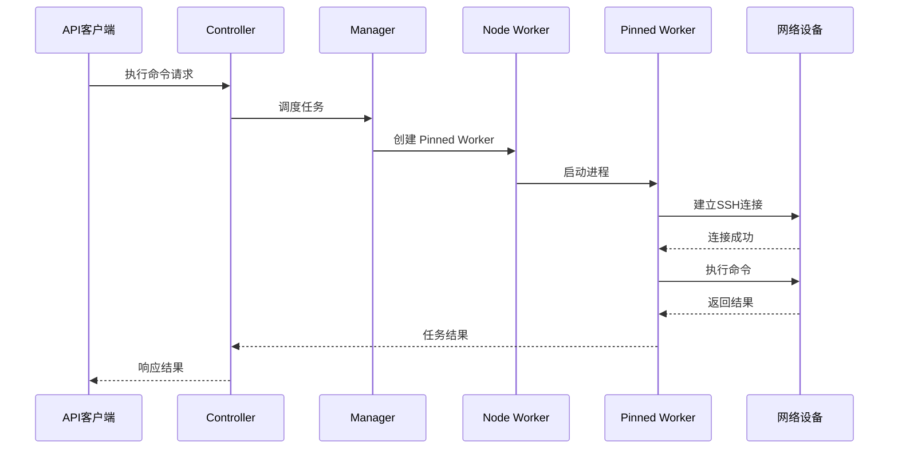
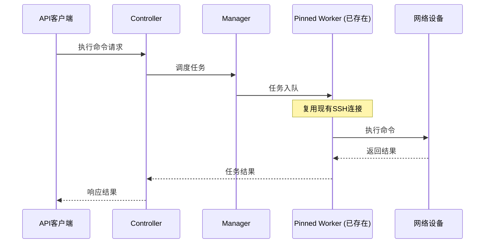

# 设备驱动系统

NetPulse 通过其插件系统提供可扩展的驱动支持。用户可以使用内置支持的三种驱动，也可以根据需要开发自定义驱动。

## 核心驱动

| 驱动      | 协议          | 厂商支持                 | 关键特性                              | 依赖项             |
|-----------|----------------|--------------------------|---------------------------------------|--------------------|
| Netmiko   | SSH/Telnet     | 30+ 厂商                 | CLI 命令执行、**SSH 保活** | netmiko~=4.5.0     |
| NAPALM    | API/SSH        | 多厂商（Cisco/Juniper/Arista） | 配置管理、状态收集 | napalm~=5.0.0      |
| pyeAPI    | HTTP/HTTPS     | 仅 Arista EOS            | 原生 EOS API 访问，基于 HTTP 的 eAPI | pyeapi~=1.0.4      |

## 指定设备驱动

在 /device/execute 和 /device/bulk API 中，使用 `driver` 字段指定本次任务需要使用的驱动：

```json
{
  "driver": "netmiko",
  "connection_args": {
    "device_type": "cisco_ios",
    "host": "192.168.1.1",
    "username": "admin",
    "password": "password123"
  },
  ...
}
```

注意，选择不同的驱动时，`connection_args` 中的字段可能会变化。请参考驱动的文档查看详情。


## 自定义驱动开发

要添加对新协议/厂商的支持，请通过以下步骤实现自定义驱动：

1. 在 `netpulse/plugins/drivers/` 中创建新目录
2. 继承 `BaseDriver` 类并实现所需方法
   ```python
   class CustomDriver(BaseDriver):
       driver_name = "custom"

       def connect(self):
       # ...

       # 具体方法请参考 BaseDriver 类
   ```
4. 在 `__init__.py` 中注册驱动
   ```python
    __all__ = [CustomDriver]
   ```

关于插件系统的详细介绍，请参考[插件系统](./plugin-system.md)。

## Netmiko

Netmiko 驱动是 NetPulse 中较为成熟和稳定的驱动，支持 30 多种网络设备。Netmiko 驱动使用 SSH 和 Telnet 协议与设备进行通信，支持 CLI 命令执行。

在使用 [Pinned Worker](./architecture-overview.md) 时选择 Netmiko 驱动，Worker 会新建一个 SSH 连接并定期发送保活命令和 KeepAlive 报文。从 TCP 连接和应用层协议两个层面保持连接的活跃性，从而避免 SSH 连接的断开和重连带来的延迟。

用户可以通过 `keepalive` 参数配置 SSH 的保活时间。当 SSH 保活失败时，Pinned Worker 会自动退出。再次发送任务时，会新建一个 Pinned Worker 来连接设备。

## 长连接技术

### 技术概述

长连接技术是指在与网络设备建立 SSH 连接后，保持连接状态而不是每次命令执行后断开连接。这种技术可以：

- **减少连接开销**: 避免重复建立连接的开销，在频繁操作场景下可提升响应速度
- **提升操作效率**: 在频繁操作同一设备时，可减少连接建立时间
- **减少资源消耗**: 减少连接建立相关的资源消耗
- **提升连接稳定性**: 减少频繁建连可能导致的连接失败

### 连接生命周期

#### 1. 连接建立阶段

当首次为某个设备创建 Pinned Worker 时，Worker 会建立 SSH 连接并持久化该连接：



#### 2. 连接复用阶段

后续对同一设备的请求会复用已存在的 Pinned Worker 及其 SSH 连接：



#### 3. 连接维护阶段

Pinned Worker 通过监控线程定期执行以下操作来维持连接活跃性：

- **健康检查**：调用 `session.is_alive()` 检查连接状态
- **应用层保活**：定期发送回车符（RETURN）保持会话活跃
- **自动恢复**：连接断开时，Pinned Worker 自动退出，下次请求时会重新创建

当连接健康检查失败或保活失败时，Pinned Worker 会主动退出（suicide），确保下次请求时能够重新建立连接。

## 设计思考

### 为什么只在 Pinned Worker 中实现长连接？

**原因**：
1. **设备绑定**：Pinned Worker 与设备一对一绑定，连接可以长期复用
2. **顺序保证**：串行执行保证了连接状态的一致性
3. **资源效率**：避免为每个任务都建立新连接的开销

FIFO Worker 不实现长连接是因为：
- 无设备绑定，连接复用率低
- 并行执行，连接状态管理复杂
- "即用即连"模式更简单可靠

### 保活机制的设计

保活机制从两个层面工作：
1. **TCP 层**：通过 SSH 的 KeepAlive 选项保持 TCP 连接活跃
2. **应用层**：定期发送回车符（RETURN）保持 SSH 会话活跃

这种双重保活机制可以应对网络中间设备（如 NAT、防火墙）的超时设置，确保连接不会因空闲而断开。

### 自动恢复机制

当连接失败时，Pinned Worker 会主动退出（suicide），而不是尝试重连。这样设计的原因：
- **简化逻辑**：避免复杂的重连逻辑和状态管理
- **快速恢复**：下次请求时会创建新的 Worker，自动建立新连接
- **状态一致**：确保 Worker 状态与连接状态一致
