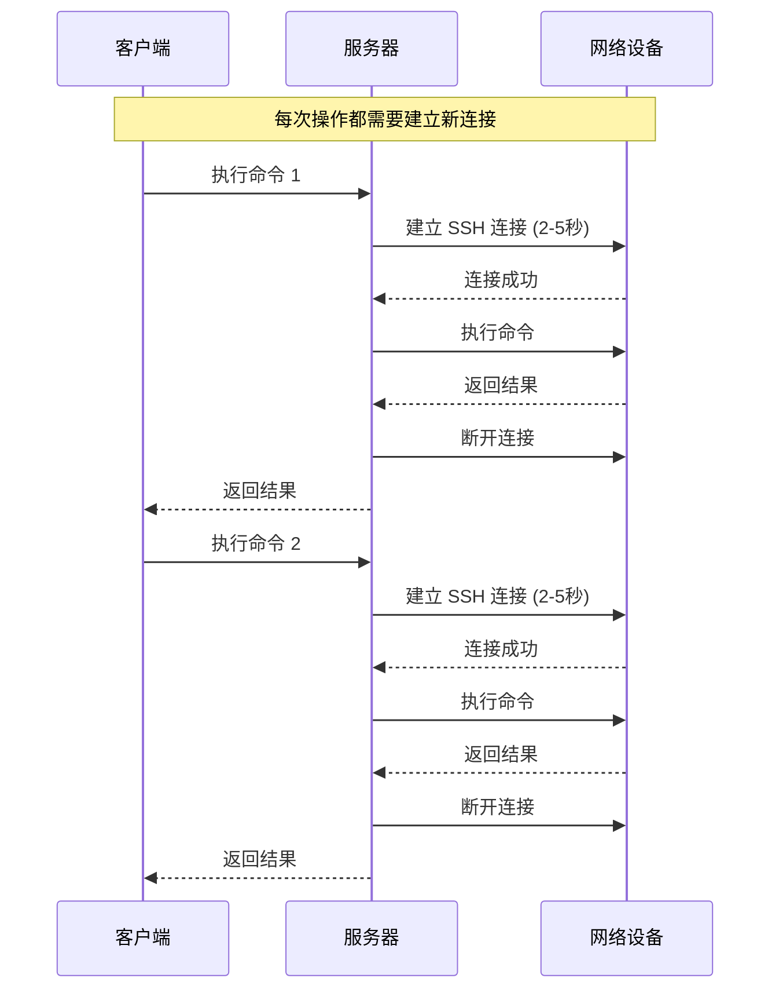
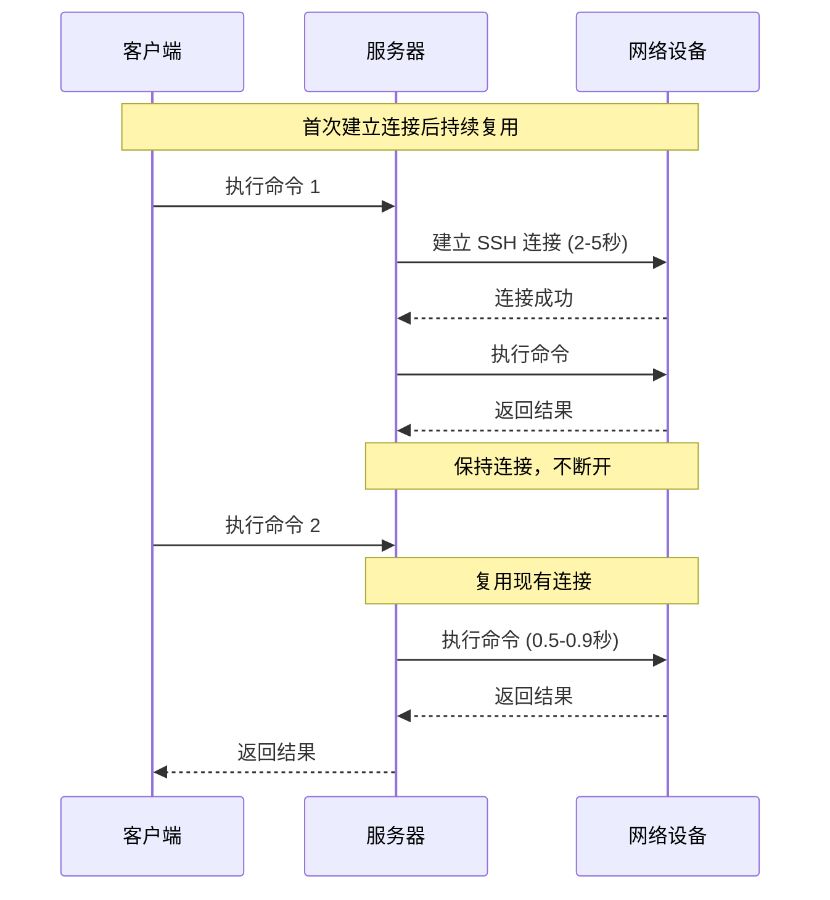
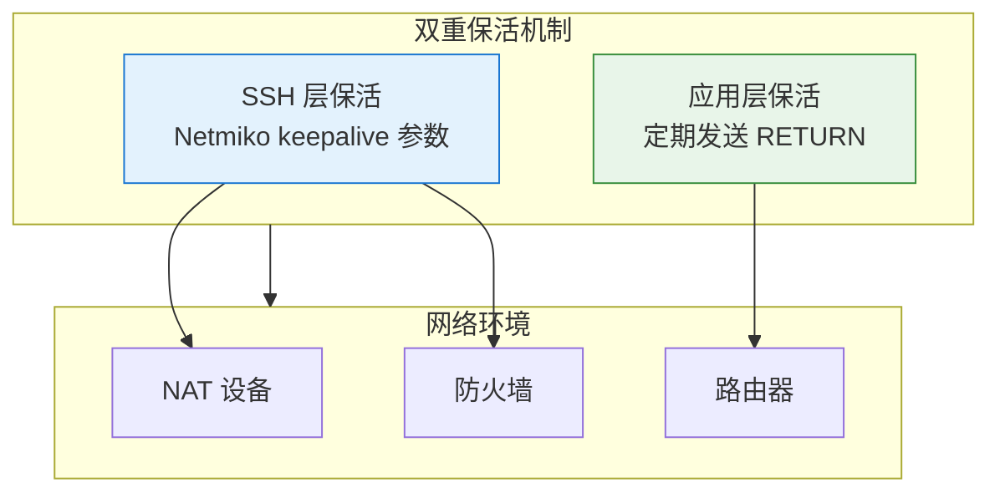
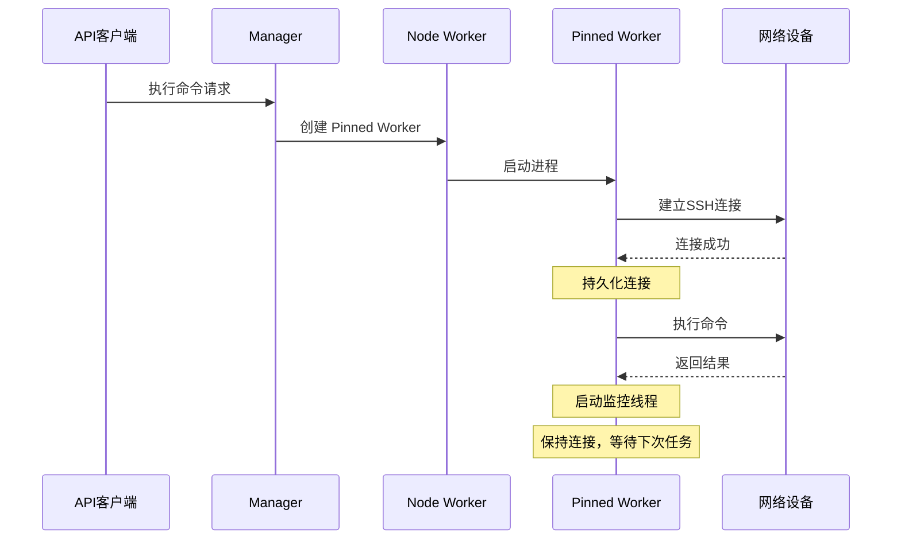
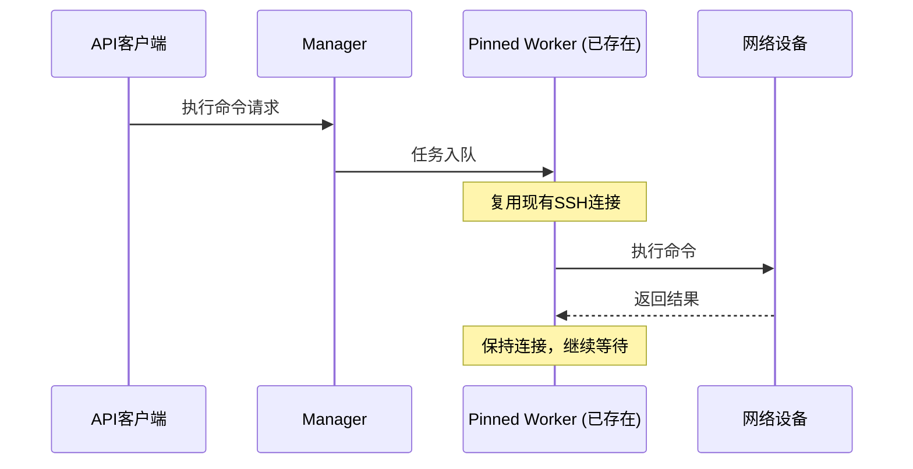
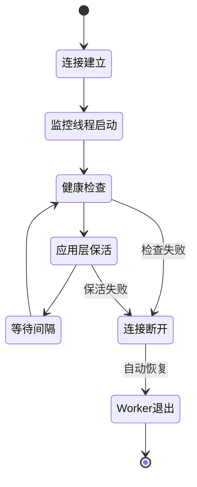

# 长连接技术

!!! info "关于本文档"
    本文档深入介绍 NetPulse 中长连接（持久化 SSH 连接）技术的实现原理、技术细节和最佳实践。这是 NetPulse 的核心性能优化技术之一，通过复用 SSH 连接显著提升设备操作的响应速度。

---

长连接技术是 NetPulse 的核心性能优化特性，通过在 Pinned Worker 中维护与网络设备的持久化 SSH 连接，避免重复建立连接的开销，在频繁操作场景下可显著提升响应速度。

## 技术背景

### 传统方式的挑战

传统的网络设备管理方式采用"即用即连"模式：



**存在的问题**：
- **连接建立开销大**：每次操作都需要 2-5 秒建立连接
- **资源消耗高**：频繁建立和断开连接消耗系统资源
- **连接失败风险**：频繁建连可能导致连接失败
- **响应速度慢**：在频繁操作同一设备时，性能瓶颈明显

### 长连接技术的价值

长连接技术通过复用 SSH 连接解决上述问题：



**带来的优势**：
- **性能提升**：响应时间从 2-5 秒降低到 0.5-0.9 秒
- **资源节约**：减少连接建立和断开的开销
- **稳定性提升**：减少频繁建连导致的失败
- **效率提升**：在频繁操作场景下效果显著

## 技术原理

### 双重保活机制

NetPulse 的长连接技术采用双重保活机制，从 SSH 层和应用层两个层面保持连接活跃：



#### 1. SSH 层保活

通过 Netmiko 的 `keepalive` 参数配置 SSH keepalive 选项：

```python
# 在连接参数中配置 keepalive（单位：秒）
connection_args = {
    "host": "192.168.1.1",
    "username": "admin",
    "password": "password",
    "keepalive": 30,  # SSH keepalive 间隔
    # ...
}
```

**工作原理**：
- `keepalive` 参数被传递给 Netmiko 的 `ConnectHandler`，用于配置 SSH keepalive
- Netmiko 会通过 SSH 协议层面的保活机制保持连接活跃
- 在监控线程中，`keepalive` 参数的值也被用作应用层保活的间隔时间
- 有助于防止 NAT、防火墙等中间设备因超时断开连接

#### 2. 应用层保活

通过监控线程定期发送回车符（RETURN）保持 SSH 会话活跃：

```python
# 监控线程定期执行
session.write_channel(session.RETURN)  # 发送回车符
```

**工作原理**：
- 定期向设备发送回车符，触发设备响应
- 保持 SSH 会话在应用层的活跃状态
- **防止网络设备主动断开连接**：许多网络设备（如路由器、交换机）在检测到 SSH 会话长时间无活动时会主动断开连接，定期发送回车符可以模拟用户活动，防止设备主动断开
- 检测连接是否真正可用（如果连接断开，发送会失败）

### 连接状态管理

长连接的状态管理包括三个核心阶段：

#### 1. 连接建立阶段

当首次为某个设备创建 Pinned Worker 时：



**关键步骤**：
1. Manager 检测到设备没有对应的 Pinned Worker
2. 通知 Node Worker 创建新的 Pinned Worker 进程
3. Pinned Worker 建立 SSH 连接
4. 连接成功后，启动监控线程进行保活
5. 连接持久化，等待后续任务复用

#### 2. 连接复用阶段

后续对同一设备的请求会复用已存在的连接：



**关键特点**：
- 无需重新建立连接
- 直接使用已存在的 SSH 会话
- 响应时间显著降低

#### 3. 连接维护阶段

监控线程定期执行健康检查和保活操作：



**维护机制**：
- **健康检查**：定期调用 `session.is_alive()` 检查连接状态
- **应用层保活**：定期发送回车符保持会话活跃
- **自动恢复**：连接断开时，Worker 主动退出，下次请求时自动重建

## 实现细节

### 代码架构

长连接技术的核心实现在 `NetmikoDriver` 中：

```python
class NetmikoDriver(BaseDriver):
    # 持久化会话
    persisted_session: BaseConnection = None
    persisted_conn_args: NetmikoConnectionArgs = None
    
    # 监控线程相关
    _monitor_stop_event = None
    _monitor_thread = None
    _monitor_lock = threading.Lock()
```

### 连接持久化

#### 会话获取与设置

```python
@classmethod
def _get_persisted_session(cls, conn_args: NetmikoConnectionArgs) -> Optional[BaseConnection]:
    """检查持久化会话是否仍然有效"""
    if cls.persisted_session and cls.persisted_conn_args != conn_args:
        # 连接参数变化，断开旧连接
        with cls._monitor_lock:  # 使用锁保护
            try:
                cls.persisted_session.disconnect()
            except Exception as e:
                log.error(f"Error in disconnecting old session: {e}")
            finally:
                cls._set_persisted_session(None, None)
    
    return cls.persisted_session

@classmethod
def _set_persisted_session(cls, session: BaseConnection, conn_args: NetmikoConnectionArgs):
    """持久化会话并启动监控线程"""
    # 清除连接
    if session is None:
        if cls.persisted_conn_args and cls.persisted_conn_args.keepalive:
            cls._stop_monitor_thread()
        cls.persisted_session = None
        cls.persisted_conn_args = None
        return None
    
    # 设置连接
    cls.persisted_session = session
    cls.persisted_conn_args = conn_args
    cls._start_monitor_thread(cls.persisted_session)
```

#### 连接复用逻辑

```python
def connect(self) -> BaseConnection:
    # 尝试获取已存在的连接
    session = self._get_persisted_session(self.conn_args)
    if session:
        log.info("Reusing existing connection")
    else:
        # 创建新连接
        log.info(f"Creating new connection to {self.conn_args.host}...")
        session = ConnectHandler(**self.conn_args.model_dump())
        if self.conn_args.keepalive:
            self._set_persisted_session(session, self.conn_args)
    return session
```

### 监控线程实现

监控线程是长连接技术的核心，负责连接的健康检查和保活：

```python
@classmethod
def _start_monitor_thread(cls, session: BaseConnection):
    """启动监控线程"""
    if cls._monitor_thread and cls._monitor_thread.is_alive():
        return
    
    cls._monitor_stop_event = threading.Event()
    host = cls.persisted_conn_args.host
    timeout = cls.persisted_conn_args.keepalive  # 保活间隔
    
    def monitor():
        suicide = False
        log.info(f"Monitoring thread started ({host})")
        
        while not cls._monitor_stop_event.is_set():
            # 等待保活间隔
            if cls._monitor_stop_event.wait(timeout=timeout):
                break
            
            with cls._monitor_lock:  # 并发安全控制
                # 双重检查
                if cls._monitor_stop_event.is_set():
                    break
                
                # 健康检查
                if not session.is_alive():
                    log.warning(f"Connection to {host} is unhealthy")
                    suicide = True
                    cls._monitor_stop_event.set()
                    break
                
                # 应用层保活
                try:
                    if junk := session.clear_buffer():  # 清理缓冲区
                        log.debug(f"Detected junk data in keepalive: {junk}")
                    session.write_channel(session.RETURN)  # 发送回车符
                except Exception as e:
                    log.warning(f"Error in sending keepalive to {host}: {e}")
                    suicide = True
                    cls._monitor_stop_event.set()
                    break
        
        log.debug(f"Monitoring thread quitting with `suicide={suicide}`.")
        
        # 连接断开时，Worker 主动退出
        if suicide:
            log.info(f"Pinned worker for {host} suicides.")
            os.kill(os.getpid(), signal.SIGTERM)
        
        # 只退出当前线程
        sys.exit(0)
    
    cls._monitor_thread = threading.Thread(target=monitor, daemon=True)
    cls._monitor_thread.start()
```

**关键设计点**：

1. **并发安全**：使用 `_monitor_lock` 确保监控线程和任务执行线程不会同时操作连接
2. **健康检查**：通过 `session.is_alive()` 检测连接是否真正可用
3. **应用层保活**：定期发送回车符保持会话活跃，防止网络设备因检测到长时间无活动而主动断开连接
4. **自动恢复**：连接失败时，Worker 主动退出（suicide），下次请求时自动重建

### 并发安全控制

由于 Netmiko 的 `BaseConnection` 不是线程安全的，必须使用锁机制保证并发安全：

```python
def send(self, session: BaseConnection = None, command: Optional[list[str]] = None):
    """发送命令时使用锁保护"""
    try:
        with self._monitor_lock:  # 获取锁
            if self.enabled:
                session.enable()
            
            result = {}
            for cmd in command:
                response = session.send_command(cmd, **self.args.model_dump())
                result[cmd] = response
            
            if self.enabled:
                session.exit_enable_mode()
        
        return result
    except Exception as e:
        log.error(f"Error in sending command: {e}")
        raise e
```

**锁的使用场景**：
- 任务执行时：获取锁，执行命令
- 监控线程保活时：获取锁，发送保活消息
- 确保同一时间只有一个线程操作连接

### 自动恢复机制

当连接失败时，采用"自杀"（suicide）机制而非重连：

```python
# 连接失败时
if suicide:
    log.info(f"Pinned worker for {host} suicides.")
    os.kill(os.getpid(), signal.SIGTERM)  # 发送 SIGTERM 信号
    sys.exit(0)
```

**设计原因**：
- **简化逻辑**：避免复杂的重连逻辑和状态管理
- **快速恢复**：下次请求时会创建新的 Worker，自动建立新连接
- **状态一致**：确保 Worker 状态与连接状态一致

## 性能优化

### 性能对比

| 场景 | 传统方式 | 长连接技术 | 性能提升 |
|------|---------|-----------|---------|
| 首次连接 | 2-5 秒 | 2-5 秒 | - |
| 后续操作 | 2-5 秒 | 0.5-0.9 秒 | **60-80%** |
| 频繁操作（10次） | 20-50 秒 | 5-9 秒 | **75-82%** |

### 适用场景

长连接技术特别适合以下场景：

1. **频繁操作同一设备**
   - 批量配置推送
   - 实时监控和采集
   - 配置变更操作

2. **需要保证顺序的操作**
   - 配置修改任务
   - 需要串行执行的命令序列

3. **对响应速度要求高的场景**
   - 实时监控
   - 自动化运维脚本

### 不适用场景

以下场景不适合使用长连接：

1. **偶尔操作不同设备**
   - 连接复用率低，无法发挥优势
   - 建议使用 FIFO Worker

2. **长时间运行的任务**
   - 文件传输
   - 长时间执行的命令
   - 建议使用 FIFO Worker（短连接）

## 最佳实践

### 配置建议

#### 1. Keepalive 参数配置

```python
connection_args = {
    "host": "192.168.1.1",
    "username": "admin",
    "password": "password",
    "keepalive": 30,  # 推荐值：30-60 秒
    # ...
}
```

**配置建议**：
- **默认值**：180 秒（3 分钟）
- **推荐值**：30-60 秒
- **最小值**：不建议小于 10 秒（避免过于频繁的保活）
- **最大值**：不建议大于 300 秒（避免连接被中间设备断开）

**影响因素**：
- 网络环境：NAT、防火墙的超时设置
- 设备类型：不同设备的 SSH 超时设置
- 操作频率：频繁操作可以设置较小的值

#### 2. 队列策略选择

```python
options = {
    "queue_strategy": "pinned",  # 使用 Pinned Worker 启用长连接
    "ttl": 600,  # Worker 空闲超时时间（秒）
}
```

**配置说明**：
- `queue_strategy: "pinned"`：启用长连接技术
- `ttl`：Worker 空闲超时时间，超过该时间未使用会自动清理

### 监控与调试

#### 1. 日志监控

监控线程会输出详细的日志信息：

```
INFO: Monitoring thread started (192.168.1.1)
DEBUG: Detected junk data in keepalive: ...
WARNING: Connection to 192.168.1.1 is unhealthy
INFO: Pinned worker for 192.168.1.1 suicides.
```

#### 2. 连接状态检查

可以通过 API 查询 Worker 状态，了解连接情况。

#### 3. 性能监控

监控以下指标：
- 连接建立时间
- 命令执行响应时间
- 连接复用率
- Worker 存活时间

## 故障排查

### 常见问题

#### 1. 连接频繁断开

**症状**：Worker 频繁退出和重建

**可能原因**：
- Keepalive 间隔设置过大
- 网络中间设备（NAT、防火墙）超时设置过短
- 设备 SSH 超时设置过短

**解决方案**：
- 减小 `keepalive` 参数值（如从 180 秒改为 30 秒）
- 检查网络中间设备的超时设置
- 检查设备的 SSH 配置

#### 2. 保活失败

**症状**：日志中出现 "Error in sending keepalive"

**可能原因**：
- 网络不稳定
- 设备响应慢
- 连接已断开但未检测到

**解决方案**：
- 检查网络连接稳定性
- 增加 `keepalive` 间隔
- 检查设备状态

#### 3. 连接复用失败

**症状**：每次操作都建立新连接

**可能原因**：
- 连接参数变化（host、username 等）
- Worker 被清理（TTL 超时）
- 连接断开后未及时重建

**解决方案**：
- 确保连接参数一致
- 调整 `ttl` 参数
- 检查 Worker 状态

### 调试技巧

#### 1. 启用详细日志

```python
import logging
logging.basicConfig(level=logging.DEBUG)
```

#### 2. 监控线程状态

检查监控线程是否正常运行：

```python
# 在代码中添加日志
log.info(f"Monitor thread alive: {cls._monitor_thread.is_alive()}")
```

#### 3. 连接状态检查

定期检查连接状态：

```python
if session.is_alive():
    log.info("Connection is alive")
else:
    log.warning("Connection is dead")
```

## 技术对比

### 与其他方案对比

| 方案 | 优点 | 缺点 | 适用场景 |
|------|------|------|---------|
| **长连接技术** | 性能高、资源节约 | 需要维护连接状态 | 频繁操作同一设备 |
| **短连接（传统）** | 简单可靠、无状态 | 性能低、资源消耗大 | 偶尔操作、长时间任务 |
| **连接池** | 平衡性能和复杂度 | 实现复杂、状态管理难 | 中等频率操作 |

### 设计决策

#### 为什么选择"自杀"而非重连？

**原因**：
1. **简化逻辑**：避免复杂的重连逻辑和状态管理
2. **快速恢复**：下次请求时会自动创建新 Worker
3. **状态一致**：确保 Worker 状态与连接状态一致

#### 为什么只在 Pinned Worker 中实现？

**原因**：
1. **设备绑定**：Pinned Worker 与设备一对一绑定，连接可以长期复用
2. **顺序保证**：串行执行保证了连接状态的一致性
3. **资源效率**：避免为每个任务都建立新连接的开销

FIFO Worker 不实现长连接是因为：
- 无设备绑定，连接复用率低
- 并行执行，连接状态管理复杂
- "即用即连"模式更简单可靠

## 总结

长连接技术是 NetPulse 的核心性能优化特性，通过以下机制实现：

1. **双重保活**：SSH 层和应用层双重保活机制
2. **连接复用**：持久化 SSH 连接，避免重复建立
3. **自动恢复**：连接失败时自动重建
4. **并发安全**：使用锁机制保证线程安全

**性能提升**：
- 在频繁操作场景下性能提升 60-80%（详见性能对比表格）

**适用场景**：
- 频繁操作同一设备
- 需要保证任务顺序
- 对响应速度要求高

通过合理配置和使用，长连接技术可以显著提升 NetPulse 的性能和用户体验。

