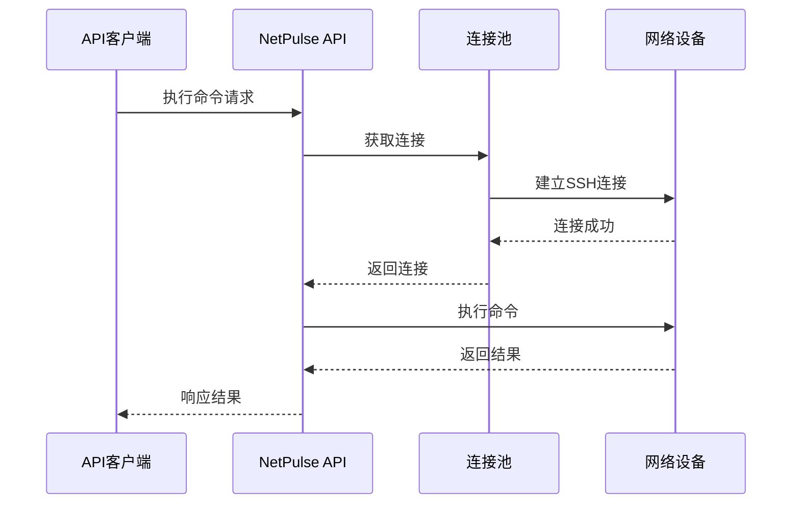
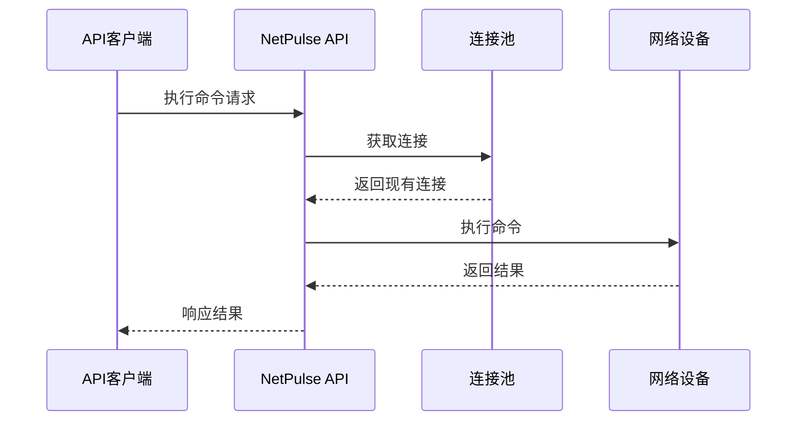

# 长连接技术详解

NetPulse 的核心技术优势在于其创新的长连接管理机制，通过持久化SSH连接显著提升网络设备管理效率。本文档详细介绍长连接技术的原理、实现和最佳实践。

## 技术概述

### 什么是长连接技术？

长连接技术是指在与网络设备建立SSH连接后，保持连接状态而不是每次命令执行后断开连接。这种技术可以：

- **提升响应速度**: 避免重复建立连接的开销
- **提高并发能力**: 支持更多并发操作
- **节省资源**: 减少CPU和内存消耗
- **增强稳定性**: 减少连接失败的概率

### 与传统方式的对比

| 特性 | 传统方式 | NetPulse长连接 |
|------|----------|----------------|
| **连接方式** | 每次命令建立新连接 | 持久化连接池 |
| **响应时间** | 2-5秒 | 0.3-0.9秒 |
| **并发能力** | 低 | 高 |
| **资源消耗** | 高 | 低 |
| **稳定性** | 中等 | 高 |

## 架构设计

### 系统架构图

### 核心组件

## 连接生命周期

### 1. 连接建立阶段

### 2. 连接复用阶段

### 3. 连接维护阶段

通过定期keeplive进行长连接
