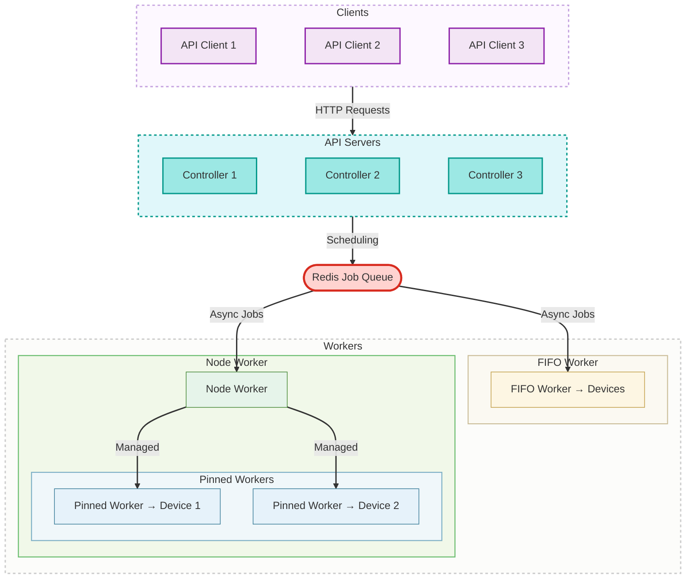
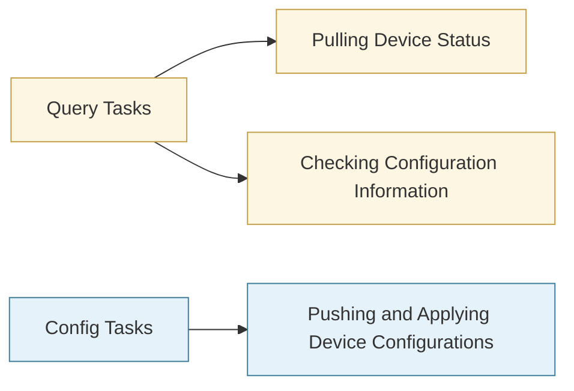
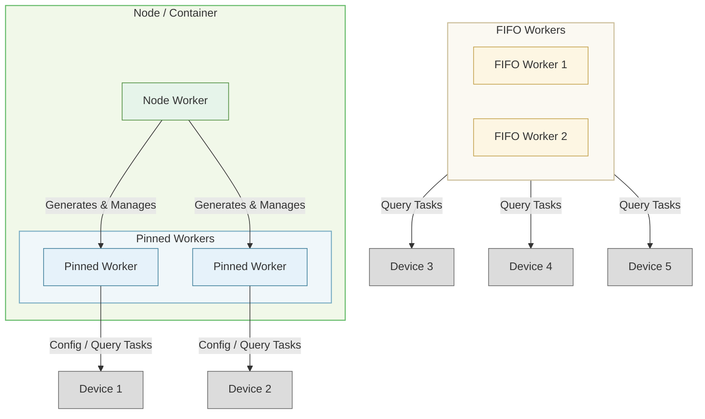
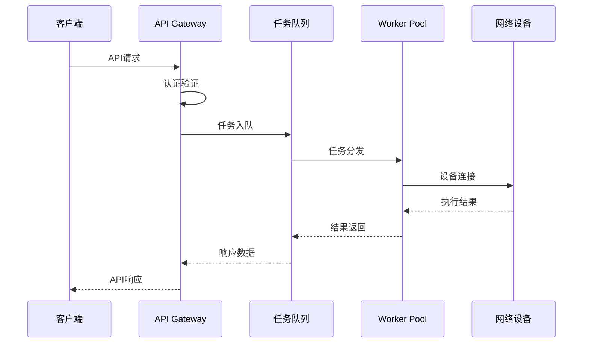
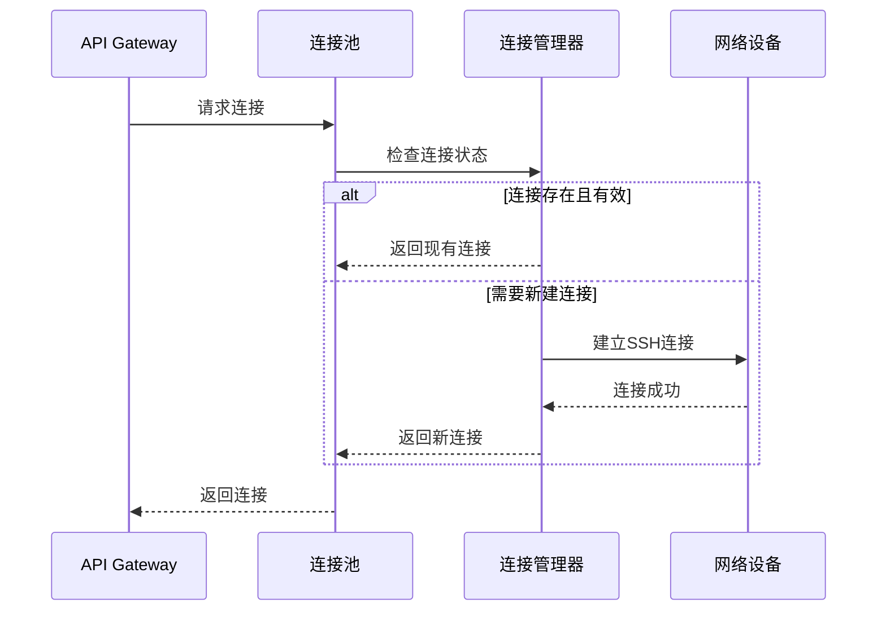

# 系统架构概览

NetPulse 采用现代化的分布式架构设计，提供高可用、高性能的网络设备管理服务。

## 整体架构

## 设计理念

NetPulse 的核心设计理念在于三种 Worker 的分工。

在网络运维工作中，通常具备两种任务：

- **查询性任务：** 拉取设备状态、检查配置信息等
- **修改性任务：** 推送和应用设备配置

这两种类型的任务，对操作者提出了不同的需求。简单而言，检查性任务往往不具备先后顺序，而修改性任务则必须保证在单台设备上的先后顺序。而且，用户往往期望查询性任务尽快执行，而修改性任务则容忍排队。这就导致我们必须设计两种 Worker：Pinned Worker 和 FIFO Worker。

Pinned Worker 专门负责连接一台设备，与设备保持一对一的关系。因此，当客户端向 Pinned Worker 发送任务时，可以保证任务在设备上严格按照先后顺序执行。这就使得 Pinned Worker 十分适合处理修改性的任务。

FIFO Worker 则没有与设备的绑定关系。一个系统中可以部署多个 FIFO Worker。多个 FIFO Worker 同时从 Redis 中取出任务，尽快执行。这种并行缩短了任务的排队时间，但也导致任务之间的顺序没有严格的保证。因此，FIFO Worker 很适合完成查询性的任务。

在部署时，我们可以预先启动指定数量的 FIFO Worker，但不可能预先启动 Pinned Worker，因为无法预知用户会对哪些设备进行操作。因此 Pinned Worker 必须动态生成，Node Worker 就是一种“守护进程”，用于在容器内、节点上动态生成 Pinned Worker。

除了上述基本的设计考量之外，我们进一步利用单个 Pinned Worker 只关联一台设备的特点，在 Pinned Worker 中实现了 SSH Session 的持久化，进一步提升了任务执行的稳定性、降低了延迟（参考 [SSH 保活](./drivers.md)）。

## 核心组件

1. **RESTful API**
    - 基于 FastAPI 构建
    - 处理传入请求、验证并排队任务

2. **消息队列**
    - 基于 Redis 的任务队列（基于 RQ）
    - 用于多主多从架构中的状态同步
    - 暂存任务状态、任务执行结果

3. **工作节点**
    - 设计了三种 Worker，处理不同类型的任务
    - FIFO 工作节点：按顺序处理任务
    - Node 工作节点：作为守护进程管理 Pinned Worker 和节点状态
    - Pinned 工作节点：维护和单个设备的连接，串行执行某设备的任务

4. **插件系统**
    - 可扩展的插件系统包含设备驱动、调度器、模板引擎和 Webhooks
    - 接口定义明确，便于二次开发和集成

## 数据流

### 1. 请求处理流程

### 2. 连接管理流程

## 功能对比

相较于 NetPalm 等现有项目，NetPulse 具有以下显著优势：

### 功能精简

NetPulse 在设计之初就深入分析了业务需求，并充分考虑了功能的通用性。与 NetPalm 相比，NetPulse 专注于命令下发的核心功能，将模板管理、定时任务触发等辅助功能交由上层业务系统实现。这种精简化的设计理念使得 NetPulse 更易于维护，同时能够更好地融入现有的基础设施环境。

### 性能卓越

NetPulse 通过以下三个关键技术实现了显著的性能提升：

- **连接保活机制**：通过维持长连接，大幅减少了重复建立连接所带来的执行延迟，实现命令的快速下发。
- **多样化调度算法**：提供负载均衡和资源集中利用等多种调度策略，相比 NetPalm 单一的贪心算法，性能表现更加出色。
- **批量命令接口**：支持批次化命令下发，有效降低了大规模设备操作时的重复请求开销，结合分批调度算法，性能优势更加明显。

### 高可用性

NetPulse 提供基于 Kubernetes 和 Redis Sentinel 哨兵模式的企业级高可用部署方案，开箱即用，确保系统稳定运行。

### 可扩展性

NetPulse 设计了完善的插件架构，支持在驱动层、模板层、调度算法和 WebHook 四个维度进行灵活的自定义开发，满足不同场景的扩展需求。
