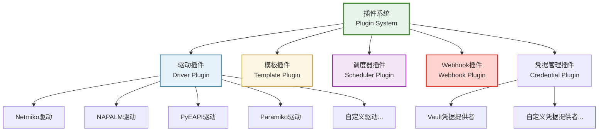
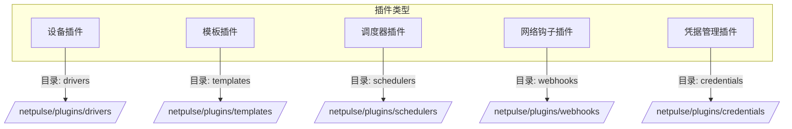
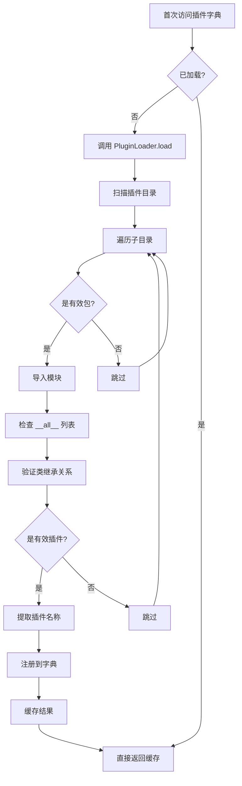

# 插件系统

NetPulse 的插件架构通过五种核心插件类型提供扩展能力，使用延迟加载机制按需加载。

## 插件与驱动的关系

!!! tip "概念澄清"
    **插件（Plugin）** 是一个更广泛的概念，是 NetPulse 可扩展架构的基础。**驱动（Driver）** 是插件的一种具体类型，专门用于与网络设备交互。
    
    简单来说：**驱动是插件，但插件不一定是驱动**。

### 关系说明



### 区别对比

| 维度 | 插件（Plugin） | 驱动（Driver） |
|------|---------------|----------------|
| **概念层级** | 架构层面的扩展机制 | 插件的一种具体类型 |
| **作用范围** | 系统多个维度的扩展 | 仅用于设备交互 |
| **包含类型** | 驱动、模板、调度器、Webhook、凭据管理 | 仅设备驱动 |
| **基类** | 多种基类（BaseDriver、BaseScheduler 等） | `BaseDriver` |
| **目录位置** | `netpulse/plugins/` 下的多个子目录 | `netpulse/plugins/drivers/` |
| **使用场景** | 系统功能扩展的通用机制 | 连接和操作网络设备 |

### 为什么需要插件系统？

插件系统是 NetPulse 扩展能力的基础，支持在五个维度进行扩展：

1. **驱动插件**：支持新的设备类型和协议
2. **模板插件**：支持新的模板引擎和解析方式
3. **调度器插件**：支持新的任务调度算法
4. **Webhook 插件**：支持新的通知机制
5. **凭据管理插件**：支持新的凭据存储后端

这种设计使得 NetPulse 可以在不修改核心代码的情况下，通过插件扩展功能，降低二次开发成本。



## 插件类型详解

### 1. 驱动插件（Driver Plugins）

**职责**：与网络设备建立连接并执行操作

| 属性 | 说明 |
|------|------|
| **基类** | `BaseDriver` |
| **名称属性** | `driver_name` |
| **目录** | `netpulse/plugins/drivers/` |
| **全局变量** | `drivers` |
| **内置实现** | Netmiko、NAPALM、PyEAPI、Paramiko |

**核心方法**：
- `connect()`：建立设备连接
- `send(session, command)`：发送命令
- `config(session, config)`：推送配置
- `disconnect(session)`：断开连接

### 2. 模板插件（Template Plugins）

**职责**：处理配置渲染和命令输出解析

| 属性 | 说明 |
|------|------|
| **基类** | `BaseTemplateRenderer`（渲染）<br/>`BaseTemplateParser`（解析） |
| **名称属性** | `template_name` |
| **目录** | `netpulse/plugins/templates/` |
| **全局变量** | `renderers`（渲染器）<br/>`parsers`（解析器） |
| **内置实现** | Jinja2、TextFSM、TTP |

**核心方法**：
- `render(context)`：将结构化数据渲染为配置文本
- `parse(context)`：将命令输出解析为结构化数据

### 3. 调度器插件（Scheduler Plugins）

**职责**：为 Pinned Worker 选择运行节点

| 属性 | 说明 |
|------|------|
| **基类** | `BaseScheduler` |
| **名称属性** | `scheduler_name` |
| **目录** | `netpulse/plugins/schedulers/` |
| **全局变量** | `schedulers` |
| **内置实现** | greedy、least_load、least_load_random、load_weighted_random |

**核心方法**：
- `node_select(nodes, host)`：为单个设备选择节点
- `batch_node_select(nodes, hosts)`：为多个设备批量选择节点

### 4. Webhook 插件（Webhook Plugins）

**职责**：将任务执行结果通知到外部系统

| 属性 | 说明 |
|------|------|
| **基类** | `BaseWebHookCaller` |
| **名称属性** | `webhook_name` |
| **目录** | `netpulse/plugins/webhooks/` |
| **全局变量** | `webhooks` |
| **内置实现** | basic |

**核心方法**：
- `call(req, job, result)`：调用 Webhook，发送任务结果

### 5. 凭据管理插件（Credential Plugins）

**职责**：从外部凭据存储系统获取设备认证信息

| 属性 | 说明 |
|------|------|
| **基类** | `BaseCredentialProvider` |
| **名称属性** | `provider_name` |
| **目录** | `netpulse/plugins/credentials/` |
| **全局变量** | 通过 `CredentialResolver` 管理 |
| **内置实现** | Vault（HashiCorp Vault） |

**核心方法**：
- `get_credentials(reference)`：根据凭据引用获取用户名和密码
- `validate_connection()`：验证与凭据存储系统的连接

**工作流程**：
1. 客户端在 `connection_args` 中使用 `credential_ref` 引用凭据路径
2. `CredentialResolver` 根据 `provider` 字段选择对应的凭据提供者
3. 凭据提供者从外部存储（如 Vault）读取凭据
4. 凭据被注入到 `connection_args` 中，替换 `credential_ref`
5. Worker 使用注入后的凭据建立设备连接

**支持的凭据提供者**：
- **Vault**：HashiCorp Vault（支持 KV v2 引擎，版本控制，元数据管理）

参考：[Vault 凭据管理 API](../api/credential-api.md)

## 插件系统架构

### 核心组件

插件系统由两个核心组件构成：

1. **PluginLoader**：负责扫描插件目录、加载插件类、验证插件有效性
   - 扫描指定目录下的所有子目录
   - 验证是否为有效的 Python 包（包含 `__init__.py`）
   - 动态导入模块并检查 `__all__` 列表
   - 验证类继承关系和名称属性
   - 返回插件类字典

2. **LazyDictProxy**：提供延迟加载机制
   - 首次访问插件字典时触发加载
   - 缓存加载结果，后续访问直接使用缓存
   - 提供字典接口，使用方式与普通字典相同

### 插件注册机制

系统在 `netpulse/plugins/__init__.py` 中通过全局变量暴露插件字典：

| 全局变量 | 插件类型 | 名称属性 | 基类 |
|---------|---------|---------|------|
| `drivers` | 设备驱动 | `driver_name` | `BaseDriver` |
| `webhooks` | Webhook | `webhook_name` | `BaseWebHookCaller` |
| `renderers` | 模板渲染器 | `template_name` | `BaseTemplateRenderer` |
| `parsers` | 模板解析器 | `template_name` | `BaseTemplateParser` |
| `schedulers` | 调度器 | `scheduler_name` | `BaseScheduler` |
| - | 凭据管理 | `provider_name` | `BaseCredentialProvider`（通过 CredentialResolver 管理） |

### 插件目录结构

所有插件遵循统一的目录结构，每个插件子目录必须包含 `__init__.py` 文件：

```
netpulse/plugins/
├── drivers/          # 设备驱动插件
│   ├── netmiko/
│   │   ├── __init__.py  # 导出 NetmikoDriver
│   │   └── model.py
│   ├── napalm/
│   └── pyeapi/
├── templates/        # 模板插件
│   ├── jinja2/
│   ├── textfsm/
│   └── ttp/
├── schedulers/       # 调度器插件
│   ├── greedy/
│   ├── least_load/
│   └── ...
├── webhooks/         # Webhook 插件
│   └── basic/
└── credentials/      # 凭据管理插件
    └── vault/
```

**注册要求**：插件类必须在 `__init__.py` 中通过 `__all__` 列表导出，例如：

```python
# netpulse/plugins/drivers/netmiko/__init__.py
from .model import NetmikoDriver

__all__ = ["NetmikoDriver"]
```

## 插件加载机制

插件使用 `LazyDictProxy` 按需加载，这是一种延迟加载模式，只有在真正需要使用时才会加载插件。

### 加载流程



### 详细步骤

1. **首次访问**：
   - 当代码首次访问 `drivers["netmiko"]` 等插件字典时触发
   - `LazyDictProxy` 调用 `PluginLoader.load()` 方法
   - 扫描配置的插件目录（如 `netpulse/plugins/drivers/`）
   - 遍历所有子目录，检查是否为有效 Python 包（包含 `__init__.py`）
   - 动态导入模块，检查 `__all__` 列表中导出的类
   - 验证类是否继承自对应的基类（如 `BaseDriver`）
   - 提取插件的名称属性（如 `driver_name`、`scheduler_name`）
   - 将插件类注册到字典中，键为插件名称
   - 缓存加载结果到 `_data` 属性

2. **后续访问**：
   - 直接使用缓存的 `_data` 字典
   - 无额外文件系统扫描或模块导入开销
   - 性能与普通字典访问相同

3. **错误处理**：
   - 单个插件加载失败时，记录错误日志但继续加载其他插件
   - 不会因为某个插件错误而影响整个系统运行
   - 无效的插件包会被跳过，不影响有效插件的使用


!!! warning
      如果调度器插件配置错误，将会导致系统无法正常工作。其他类型的插件错误不会影响系统运行，但可能导致某些功能不可用。

## 插件使用方式

### 系统级配置

插件目录位置在 `config/config.yaml` 中配置：

```yaml
plugin:
  driver: netpulse/plugins/drivers/
  template: netpulse/plugins/templates/
  scheduler: netpulse/plugins/schedulers/
  webhook: netpulse/plugins/webhooks/
```

### 运行时选择

不同插件类型的使用方式不同：

1. **调度器插件**：
   - 在配置文件中设置：`worker.scheduler: "greedy"`
   - 系统启动时加载，运行时不可更改
   - 影响所有 Pinned Worker 的节点选择

2. **驱动插件**：
   - 在 API 请求中通过 `driver` 字段指定
   - 每次请求可以动态选择不同的驱动
   - 示例：`{"driver": "netmiko", ...}`

3. **模板插件**：
   - 在 API 请求中通过 `rendering.name` 或 `parsing.name` 指定
   - 每次请求可以动态选择不同的模板引擎
   - 示例：`{"rendering": {"name": "jinja2", ...}}`

4. **Webhook 插件**：
   - 在 API 请求中通过 `webhook.name` 指定
   - 每次请求可以动态选择不同的 Webhook 实现
   - 示例：`{"webhook": {"name": "basic", ...}}`

5. **凭据管理插件**：
   - 在 `connection_args` 中通过 `credential_ref` 指定
   - 系统自动根据 `provider` 字段选择对应的凭据提供者
   - 示例：`{"connection_args": {"credential_ref": "sites/hq/admin"}}`
   - 默认使用 Vault 提供者，可通过 `credential_ref.provider` 指定其他提供者


## 插件开发指南

### 开发步骤

所有插件都遵循统一的开发模式：

1. **创建插件目录**：在对应的插件类型目录下创建新目录
2. **实现插件类**：继承对应的基类，实现必需的方法
3. **设置名称属性**：定义插件的名称属性（如 `driver_name`、`scheduler_name` 等）
4. **注册插件**：在 `__init__.py` 中通过 `__all__` 列表导出插件类

### 插件命名规范

- 使用小写字母和下划线，如 `my_custom_driver`
- 名称应该清晰表达插件功能
- 避免与内置插件重名
- 名称属性必须与目录名或功能相关

### 开发注意事项

1. **基类继承**：必须继承对应的基类，不能直接继承 `object`
2. **名称属性**：必须定义名称属性，系统通过此属性识别插件
3. **错误处理**：应该抛出明确的异常，便于调试和问题定位
4. **性能考虑**：避免在初始化时执行耗时操作，考虑使用延迟加载
5. **线程安全**：注意插件的线程安全性，特别是共享资源的使用

## 详细文档

各个插件类型的详细实现和使用说明：

- **[设备驱动系统](./driver-system.md)** - 设备驱动系统，包括长连接技术详解
- **[模板系统](./template-system.md)** - 模板渲染和解析功能
- **[任务调度器](./scheduler-system.md)** - 任务调度算法和负载均衡
- **[Webhook系统](./webhook-system.md)** - 任务结果通知机制
- **[Vault 凭据管理 API](../api/credential-api.md)** - 凭据管理功能和使用说明
