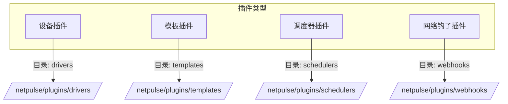

# 插件系统

NetPulse 的插件架构通过四种核心插件类型提供可扩展性，使用延迟加载机制按需加载。



## 插件类型

1. **驱动**
      - 与网络设备交互
      - 基类：`BaseDriver`
      - 父目录：`netpulse/plugins/drivers/`
      - 内置实现：
         - NAPALM
         - Netmiko
         - pyeAPI

2. **模板**
      - 配置和输出处理
      - 基类：
         - `BaseTemplateRenderer` 用于模板渲染
         - `BaseTemplateParser` 用于输出解析
      - 父目录：`netpulse/plugins/templates/`
      - 内置支持的引擎：
         - Jinja2
         - TextFSM
         - TTP

3. **调度器**
      - 针对 Pinned Worker 的任务分发和负载均衡
      - 基类：`BaseScheduler`
      - 位置：`netpulse/plugins/schedulers/`
      - 实现的算法：
         - 贪婪算法
         - 最小负载
         - 最小负载随机
         - 负载加权随机

4. **网络钩子**
      - 处理任务结果通知
      - 基类：`BaseWebHookCaller`
      - 父目录：`netpulse/plugins/webhooks/`
      - 提供 Basic 实现，可发起基本 HTTP 请求

## 插件实现

所有插件都遵循一致的模式：

1. 目录结构：
```
netpulse/plugins/
└── [插件类型]/
    ├── __init__.py
    └── [实现].py
```

2. 实现步骤：
      - 继承自适当的基类
      - 实现所需方法
      - 在 `__init__.py` 中注册插件

## 插件加载机制

插件使用 `LazyDictProxy` 按需加载：

1. **首次访问**：
      - 扫描插件目录
      - 识别并加载有效插件
      - 缓存插件实例

2. **后续访问**：
      - 直接使用缓存实例
      - 无额外加载开销

3. **错误处理**：
      - 加载失败时跳过无效插件
      - 记录错误但不影响系统运行

!!! warning
      如果调度器插件配置错误，将会导致系统无法正常工作。其他类型的插件错误不会影响系统运行，但可能导致某些功能不可用。

## 配置和使用

- 全局的插件配置，例如插件目录的位置，可以通过 `config/config.yaml` 管理。
- 调度器插件在配置文件中设置，在运行时不允许更改；其他种类的插件，可以在运行时通过请求体中的参数动态选择。
- 用户开发的插件可以编写独立的配置管理逻辑。
