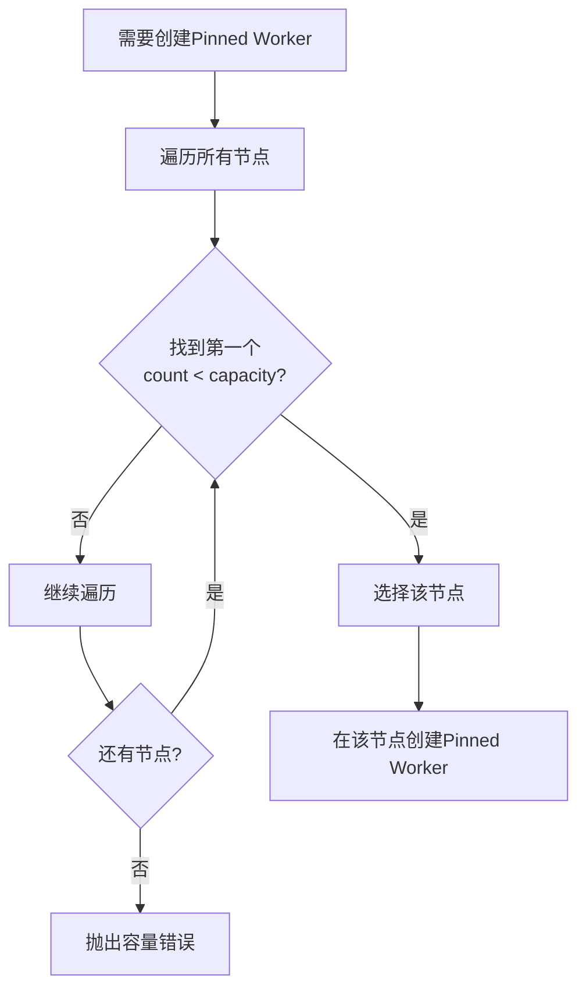
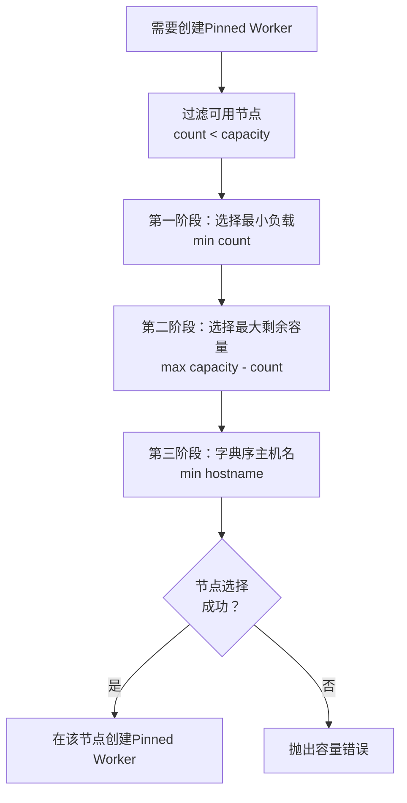
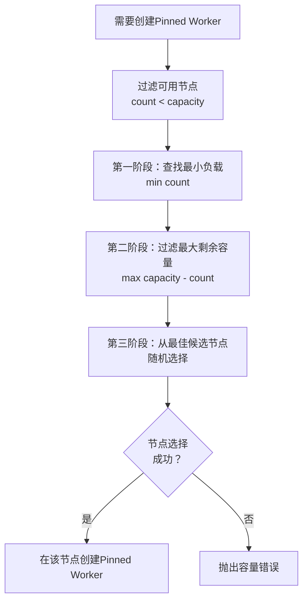
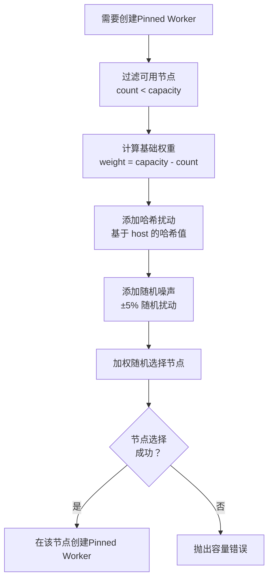

# 任务调度器

NetPulse 提供了多种调度器插件，用于为 Pinned Worker 选择运行节点（Node）。调度器在任务需要创建新的 Pinned Worker 时被调用，根据节点的负载和容量选择最合适的节点来运行 Pinned Worker。

!!! note "调度器的作用"
    调度器不是直接分配任务给 Pinned Worker，而是为 Pinned Worker 选择运行节点。任务通过 Redis 队列分配给对应的 Pinned Worker。

## 调度算法概述

NetPulse 目前支持四种调度算法，每种算法针对不同的使用场景进行了优化。**默认算法为 `load_weighted_random`**，适合大多数生产环境。

### 算法对比表

| 算法 | 确定性 | 负载均衡 | 调度冲突 | 节点利用率 | 公平性 | 复杂度 | 推荐场景 |
|------|--------|----------|----------|------------|--------|--------|----------|
| **贪婪调度器** (greedy) | ✅ 是 | ⭐⭐ | 高 | 极高 | 低 | O(N) | 单节点部署 |
| **最小负载调度器** (least_load) | ✅ 是 | ⭐⭐⭐⭐⭐ | 中 | 高 | 高 | O(N log N) | 多节点均衡 |
| **最小负载随机调度器** (least_load_random) | ❌ 否 | ⭐⭐⭐⭐ | 低 | 高 | 中 | O(N log N) | 高并发场景 |
| **负载加权随机调度器** (load_weighted_random) ⭐默认 | ❌ 否 | ⭐⭐⭐⭐ | 极低 | 高 | 中高 | O(M*N) | 大规模并发 |

### 快速选择指南

- **单节点或小规模部署（1-2个节点）** → `greedy`
- **多节点部署，需要负载均衡（3-5个节点）** → `least_load`
- **高并发场景（短时间内大量任务）** → `least_load_random`
- **大规模高并发场景（5+节点，极高并发）** → `load_weighted_random` ⭐默认

## 调度算法详解

### 1. 贪婪调度器 (Greedy Scheduler)

**算法名称**：`greedy`

**核心思想**：选择第一个可用的节点，尽可能占满节点容量。



**算法实现**：
```python
def node_select(self, nodes: List[NodeInfo], host: str) -> NodeInfo:
    for n in nodes:
        if n.count < n.capacity:
            return n  # 返回第一个可用节点
    raise WorkerUnavailableError("Insufficient capacity")
```

**特点**：
- ✅ **确定性**：相同输入总是产生相同输出
- ⚡ **高效**：算法简单，时间复杂度 O(N)
- 📊 **负载分布**：不保证负载均衡，可能造成节点负载不均
- ⚠️ **调度冲突**：高并发时多个请求可能选择同一节点

**适用场景**：
- 单节点或小规模部署（1-2个节点）
- 对负载均衡要求不高的场景
- 需要简单、可预测的调度行为

**批量调度**：
批量调度时，贪婪算法会尽可能用最少的节点来分配所有任务，优先填满已有节点。

### 2. 最小负载调度器 (Least Load Scheduler)

**算法名称**：`least_load`

**核心思想**：选择负载最小、剩余容量最大的节点，实现负载均衡。



**算法实现**：
```python
def node_select(self, nodes: List[NodeInfo], host: str) -> NodeInfo:
    available_nodes = [n for n in nodes if n.count < n.capacity]
    if not available_nodes:
        raise WorkerUnavailableError("Insufficient capacity in node selection")
    
    # 三阶段选择：
    # 1. 最小负载 (count)
    # 2. 最大剩余容量 (capacity - count)
    # 3. 字典序主机名 (hostname)
    selected_node = None
    for node in available_nodes:
        if not selected_node:
            selected_node = node
            continue
        
        # 1. 选择最小负载
        if node.count < selected_node.count:
            selected_node = node
        elif node.count == selected_node.count:
            # 2. 选择最大剩余容量
            node_remaining = node.capacity - node.count
            selected_remaining = selected_node.capacity - selected_node.count
            if node_remaining > selected_remaining:
                selected_node = node
            elif node_remaining == selected_remaining:
                # 3. 选择字典序最小的主机名
                if node.hostname < selected_node.hostname:
                    selected_node = node
    
    return selected_node
```

**特点**：
- ✅ **确定性**：相同输入总是产生相同输出（通过字典序保证）
- ⚖️ **负载均衡**：优先选择负载最小的节点，保证各节点负载相近
- 📊 **公平性**：考虑剩余容量，避免节点过载
- ⚠️ **调度冲突**：高并发时仍可能发生冲突（虽然比贪婪算法好）

**适用场景**：
- 多节点部署（3+ 个节点）
- 需要负载均衡的场景
- 对调度结果有确定性要求的场景

**批量调度**：
批量调度时，算法会按负载级别分组，优先填满负载最低的节点，然后依次填充更高负载的节点，确保整体负载分布均匀。

### 3. 最小负载随机调度器 (Least Load Random Scheduler)

**算法名称**：`least_load_random`

**核心思想**：在负载最小、剩余容量最大的候选节点中随机选择，兼顾负载均衡和降低冲突。



**算法实现**：
```python
def node_select(self, nodes: List[NodeInfo], host: str) -> NodeInfo:
    available_nodes = [n for n in nodes if n.count < n.capacity]
    
    # 1. 找到最小负载
    min_count = min(n.count for n in available_nodes)
    phase1_candidates = [n for n in available_nodes if n.count == min_count]
    
    # 2. 找到最大剩余容量
    max_remaining = max(n.capacity - n.count for n in phase1_candidates)
    phase2_candidates = [n for n in phase1_candidates 
                        if (n.capacity - n.count) == max_remaining]
    
    # 3. 随机选择
    return random.choice(phase2_candidates)
```

**特点**：
- ❌ **非确定性**：相同输入可能产生不同输出（随机性）
- ⚖️ **负载均衡**：优先选择负载最小的节点
- 🎲 **降低冲突**：随机化降低了多个请求同时选择同一节点的概率
- 📊 **公平性**：在最佳候选节点中随机分配

**适用场景**：
- 多节点部署（3+ 个节点）
- 高并发场景（短时间内大量任务）
- 需要负载均衡但可以接受非确定性结果

**批量调度**：
批量调度时，算法会按负载级别分组，在每个负载级别内，从具有最大剩余容量的节点中随机分配任务，确保负载均衡的同时降低冲突。

### 4. 负载加权随机调度器 (Load Weighted Random Scheduler)

**算法名称**：`load_weighted_random`

**核心思想**：根据节点剩余容量计算权重，加入随机扰动，使用加权随机选择节点，最大化降低调度冲突。



**算法实现**：
```python
def node_select(self, nodes: List[NodeInfo], host: str) -> NodeInfo:
    available_nodes = [n for n in nodes if n.count < n.capacity]
    
    # 1. 计算基础权重（剩余容量）
    base_weights = [n.capacity - n.count for n in available_nodes]
    
    # 2. 基于 host 的哈希值添加扰动
    host_hash = hash(host) % 1000 / 1000  # 0 <= host_hash < 1
    perturbed_weights = [
        w * (0.95 + 0.1 * ((host_hash + i / len(available_nodes)) % 1))
        for i, w in enumerate(base_weights)
    ]
    
    # 3. 加权随机选择
    return weighted_random_choice(available_nodes, perturbed_weights)
```

**批量调度实现**：
```python
def batch_node_select(self, nodes: List[NodeInfo], hosts: List[str]):
    remaining = {n: n.capacity - n.count for n in nodes}
    
    for host in hosts:
        candidates = [n for n in nodes if remaining[n] > 0]
        
        # 权重 = (剩余容量 + 1)^2，偏向空节点
        weights = [(remaining[n] + 1) ** 2 for n in candidates]
        
        # 添加 ±5% 随机噪声
        noisy_weights = [w * random.uniform(0.95, 1.05) for w in weights]
        
        # 加权随机选择
        selected = weighted_random_choice(candidates, noisy_weights)
        remaining[selected] -= 1
```

**特点**：
- ❌ **非确定性**：随机性最强，相同输入几乎总是产生不同输出
- ⚖️ **负载均衡**：权重偏向剩余容量大的节点，自然实现负载均衡
- 🎯 **极低冲突**：随机性 + 权重扰动 + 哈希扰动，最大化降低调度冲突
- 📊 **公平性**：剩余容量大的节点被选中的概率更高
- ⚡ **复杂度**：单次选择 O(N)，批量选择 O(M*N)，M 为任务数，N 为节点数

**适用场景**：
- 大规模多节点部署（5+ 个节点）
- 极高并发场景（短时间内大量任务）
- 调度冲突严重的场景
- 可以接受非确定性结果

**权重计算策略**：
- **基础权重**：`weight = capacity - count`（剩余容量）
- **平方加权**：批量调度时使用 `(remaining + 1)^2`，更偏向空节点
- **哈希扰动**：基于 host 的哈希值添加扰动，相同 host 总是选择相同节点（在单次调度中）
- **随机噪声**：添加 ±5% 的随机噪声，打破一致性，降低冲突

## 配置与使用

### 默认算法

NetPulse 的**默认调度算法为 `load_weighted_random`**，该算法在大多数场景下都能提供良好的性能，特别是在多节点、高并发环境中能够有效降低调度冲突。

### 如何修改调度算法

调度算法在 `config/config.yaml` 文件中配置，修改 `worker.scheduler` 字段即可：

```yaml
worker:
  scheduler: "load_weighted_random"  # 修改为其他算法：greedy/least_load/least_load_random/load_weighted_random

plugin:
  scheduler: netpulse/plugins/schedulers/  # 调度器插件目录
```

**修改步骤**：

1. **编辑配置文件**：
   ```bash
   vim config/config.yaml
   ```

2. **修改调度器配置**：
   ```yaml
   worker:
     scheduler: "least_load"  # 改为你需要的算法
   ```

3. **重启服务**：
   ```bash
   # Docker Compose 部署
   docker compose restart controller node-worker
   
   # 或重新部署
   docker compose down
   docker compose up -d
   ```

!!! warning "注意事项"
    - 修改调度算法后需要重启 Controller 和 Node Worker 才能生效
    - 正在运行的任务不会受到影响，新任务会使用新的调度算法
    - 建议在低峰期进行算法切换，避免影响正在执行的任务

### 何时需要调整调度算法？

在以下场景或遇到以下问题时，建议调整调度算法：

#### 1. 单节点部署场景
**问题**：当前使用默认的 `load_weighted_random`，但只有单个节点，算法复杂度较高
**建议**：切换到 `greedy`
**原因**：单节点无需负载均衡，贪婪算法简单高效

#### 2. 节点负载严重不均
**问题**：观察到某些节点负载很高，而其他节点负载很低
**建议**：切换到 `least_load` 或 `least_load_random`
**原因**：这些算法优先选择负载最小的节点，能够实现负载均衡

#### 3. 调度冲突频繁
**问题**：日志中频繁出现 `HostAlreadyPinnedError` 或 `WorkerUnavailableError`
**建议**：切换到 `least_load_random` 或 `load_weighted_random`
**原因**：随机化算法能够降低多个请求同时选择同一节点的概率

#### 4. 需要确定性的调度结果
**问题**：需要可预测的调度行为，用于调试或测试
**建议**：切换到 `greedy` 或 `least_load`
**原因**：这两个算法是确定性的，相同输入总是产生相同输出

#### 5. 高并发场景性能下降
**问题**：在高并发场景下，任务执行延迟增加，吞吐量下降
**建议**：切换到 `load_weighted_random`
**原因**：该算法通过随机化和权重扰动最大化降低调度冲突，提升高并发性能

#### 6. 批量操作效率低
**问题**：批量操作时，任务分配不合理，执行时间过长
**建议**：根据节点数量选择：
- 单节点：`greedy`
- 多节点：`least_load` 或 `least_load_random`
**原因**：不同算法在批量调度时的策略不同，选择合适的算法可以提升批量操作效率

### 算法选择决策树

```
开始
  │
  ├─ 单节点部署？
  │   └─ 是 → 使用 greedy
  │
  ├─ 需要确定性结果？
  │   └─ 是 → 使用 least_load
  │
  ├─ 调度冲突频繁？
  │   └─ 是 → 使用 load_weighted_random（默认）
  │
  ├─ 节点负载不均？
  │   └─ 是 → 使用 least_load 或 least_load_random
  │
  └─ 其他场景 → 使用 load_weighted_random（默认）
```

### 调度冲突说明

**什么是调度冲突？**

当多个 Controller 同时为不同设备选择节点时，可能会选择同一个节点。由于节点容量限制，其中一个请求会失败，需要重试。这就是调度冲突。

**冲突的影响**：
- 导致任务失败，需要重试
- 增加系统延迟
- 降低系统吞吐量

**如何降低冲突？**

1. **随机化**：`least_load_random` 和 `load_weighted_random` 通过随机选择降低冲突概率
2. **权重扰动**：`load_weighted_random` 使用哈希和随机噪声进一步降低冲突
3. **批量调度**：批量调度时，算法会考虑整体负载分布，避免集中分配

**冲突概率对比**（假设 3 个节点，每个容量 10，当前负载均为 5）：
- `greedy`：高（多个请求总是选择第一个节点）
- `least_load`：中（多个请求可能选择同一节点）
- `least_load_random`：低（随机化分散选择）
- `load_weighted_random`：极低（随机性 + 权重扰动）

## 实现细节

### 节点选择流程

所有调度器都实现 `node_select` 方法，核心流程如下：

```python
def node_select(self, nodes: List[NodeInfo], host: str) -> NodeInfo:
    # 1. 过滤可用节点（count < capacity）
    available_nodes = [n for n in nodes if n.count < n.capacity]
    
    # 2. 根据算法选择节点
    selected_node = self._select_from_available(available_nodes, host)
    
    # 3. 返回选中的节点
    return selected_node
```

### 负载计算

节点的负载通过 `NodeInfo.count` 表示，即当前节点上运行的 Pinned Worker 数量。容量通过 `NodeInfo.capacity` 表示，即节点最大可运行的 Pinned Worker 数量。

### 批量调度

所有调度器还实现了 `batch_node_select` 方法，用于批量选择节点，提高调度效率。批量调度时，算法会考虑整体负载分布，避免将所有任务分配到同一个节点。
