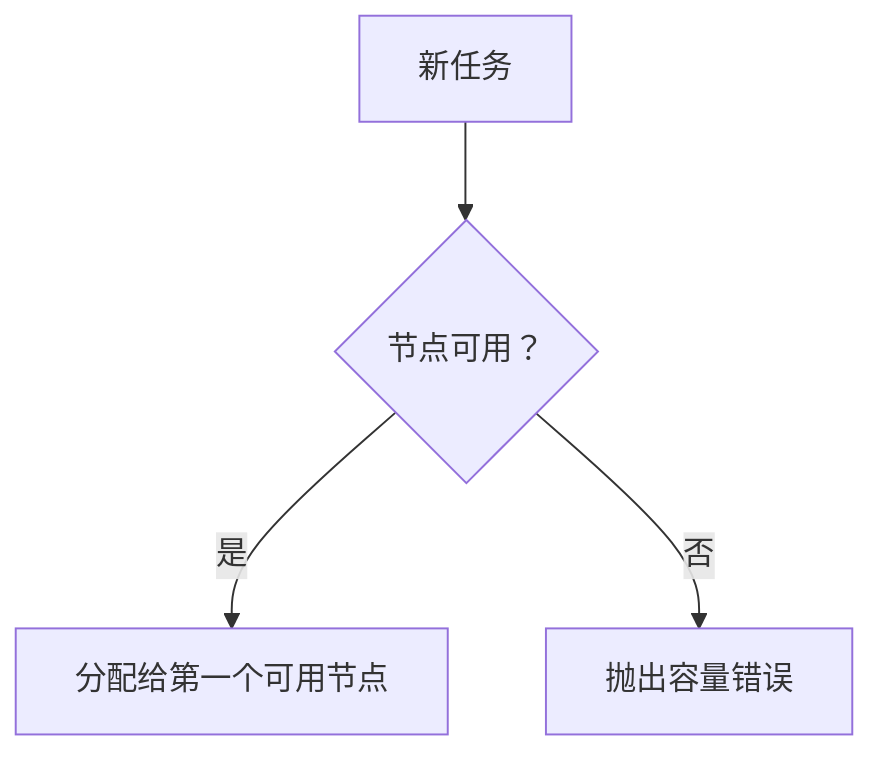
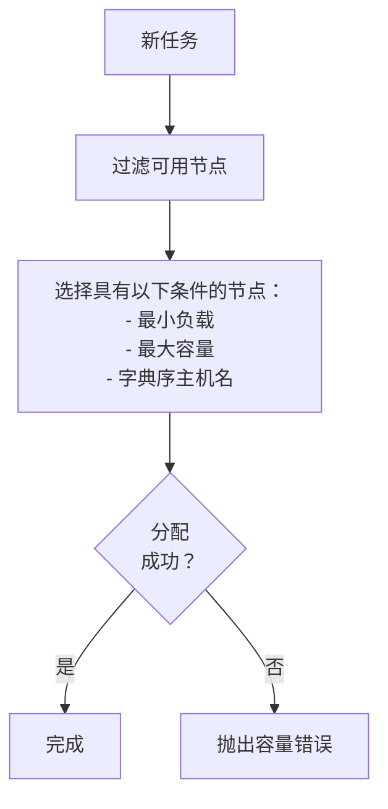
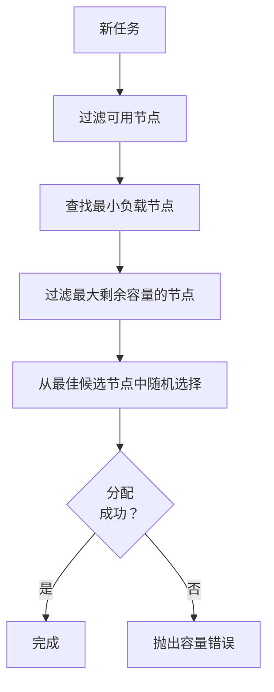
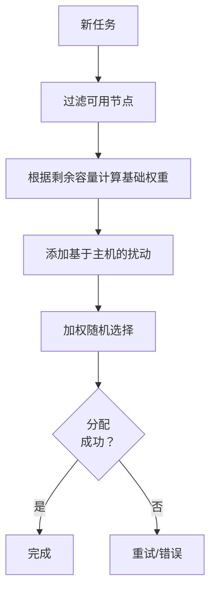

# 任务调度器

NetPulse 提供了多种调度器插件，用于为 Pinned Worker 分配任务。调度器的选择会影响任务的分配方式和负载均衡策略。

## 调度算法

目前支持以下四种调度算法。

### 贪婪调度器


- **策略**：尽可能占满节点
- **适用场景**：
    - 单物理节点的简单部署
    - 希望节点占用率尽可能高
- **特性**：
    - 选择算法简单、开销少
    - 具有确定性
- **复杂度**：O(N)

### 最小负载调度器


- **策略**：各节点负载均衡
- **适用场景**：
    - 多个物理节点
    - 希望各个节点的负载水平相近
- **特性**：
    - 两阶段节点过滤（负载、容量）
    - 字典序保证了确定性
- **复杂度**：O(N log N)

### 最小负载随机调度器


- **策略**：带有随机化的各节点负载均衡
- **适用场景**：
    - 多个物理节点
    - 短时间内提交大量任务
- **特性**：
    - 两阶段节点过滤（负载、容量）
    - 在最佳候选节点中随机分配，降低调度冲突的概率
- **复杂度**：O(N log N)

### 负载加权随机调度器


- **策略**：按剩余容量加权随机分配
- **适用场景**：
    - 多个物理节点
    - 短时间内提交大量任务，且调度冲突严重
- **特性**：
    - 使用主机名的哈希进行权重扰动
    - 对剩余容量进行平方以偏向空节点
    - 随机性更强，大幅降低调度冲突的概率
- **复杂度**：O(M*N)

## 配置
在 `config/config.yaml` 中配置调度器：
```yaml
worker:
  scheduler: "load_weighted_random"  # 选项：greedy/least_load/least_load_random/load_weighted_random

plugin:
  scheduler: netpulse/plugins/schedulers/
```

## 性能比较
| 算法               | 节点利用率 | 公平性 | 确定性 |
|-------------------|------------|--------|--------|
| 贪婪调度器          | 极高       | 低     | 是     |
| 最小负载调度器      | 高         | 高     | 是     |
| 最小负载随机调度器  | 高         | 中     | 否     |
| 负载加权随机调度器  | 高         | 中高   | 否     |
