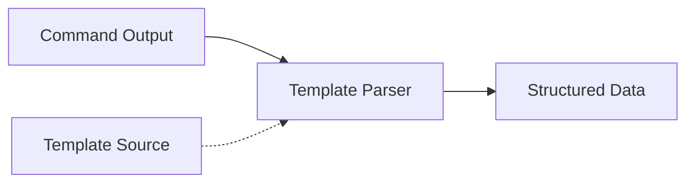
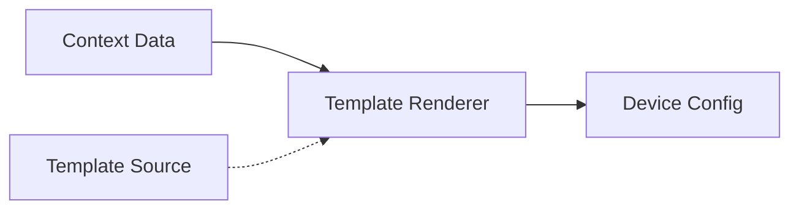

# 模板模块

NetPulse 通过其插件系统提供可拓展的模板功能。模板模块具备两大功能：命令输出解析和配置渲染。模板模块还支持从本地文件、HTTP(S)、FTP 等多种来源加载模板。

## 核心功能

模板模块的核心功能是将命令输出解析为结构化数据，或将结构化数据渲染为设备配置。

解析模式将命令输出转换为结构化数据，一般在设备命令执行后使用。



渲染模式从模板生成设备配置，一般在推送配置前使用。



## 模板 API

模板模块既提供独立的 API 接口，也可以和设备操作相关 API 集成使用。

!!! tip
    详细的 API 使用文档请参考 Postman 文档。


### 独立模板接口

#### 渲染模板
```http
POST /template/render/{name} HTTP/1.1
```

请求体：
```json
{
  "name": "jinja2",
  "template": "interface {{ interface }}\n description {{ description }}",
  "context": {
    "interface": "GigabitEthernet1/0/1",
    "description": "Core Link"
  }
}
```

响应：
```json
{
  "code": 0,
  "message": "success",
  "data": "interface GigabitEthernet1/0/1\n description Core Link"
}
```

#### 解析输出
```http
POST /template/parse/{name} HTTP/1.1
```

请求体：
```json
{
  "name": "textfsm",
  "template": "Value INTERFACE (\\S+)\nValue IP ([\\d\\.]+)\n\nStart\n  ^${INTERFACE}\\s+${IP} -> Record",
  "context": "GigabitEthernet1/0/1    192.168.1.1"
}
```

响应：
```json
{
  "code": 0,
  "message": "success",
  "data": [
    {
      "INTERFACE": "GigabitEthernet1/0/1",
      "IP": "192.168.1.1"
    }
  ]
}
```

### 设备操作集成接口

#### 拉取后解析
```json
{
  "driver": "netmiko",
  "connection_args": {
    "device_type": "cisco_ios",
    "host": "192.168.1.1",
    "username": "admin",
    "password": "pwd123"
  },
  "command": "show ip interface brief",
  "parsing": {
    "name": "textfsm",
    "template": "file:///templates/show_ip_int_brief.textfsm"
  }
}
```

#### 推送前渲染
```json
{
  "driver": "netmiko",
  "connection_args": {
    "device_type": "cisco_ios",
    "host": "192.168.1.1",
    "username": "admin",
    "password": "pwd123"
  },
  "config": {
    "interfaces": [
      {"name": "Gi1/0/1", "description": "Server Port"},
      {"name": "Gi1/0/2", "description": "Uplink Port"}
    ]
  },
  "rendering": {
    "name": "jinja2",
    "template": "file:///templates/interfaces.j2"
  }
}
```

## 模板源

模板可以使用 URI 格式从各种源加载：

- **纯文本**：直接模板内容（默认）
  ```json
  {
    "template": "interface {{ interface }}\n description {{ description }}"
  }
  ```

- **文件系统**：本地文件路径
  ```json
  {
    "template": "file:///templates/interfaces.j2"
  }
  ```

- **HTTP(S)**：远程模板
  ```json
  {
    "template": "https://templates.example.com/acl.j2"
  }
  ```

!!! note
    在容器中部署时，本地文件路径必须是容器内可读取的路径。

开发者可以修改模板源的 URI 解析器，以支持更多的源类型。

## 模板引擎

!!! tip
    具体的模板语法和引擎实现，请参考相关项目的文档。

### Jinja2
用于渲染模板，生成网络设备配置。

```json
{
  "name": "jinja2",
  "template": "file:///templates/interface.j2",
  "context": {
    "interface": "GigabitEthernet1/0/1",
    "description": "Access Port"
  },
  "args": {
    "trim_blocks": true,
    "lstrip_blocks": true,
    "variable_start_string": "{{",
    "variable_end_string": "}}"
  }
}
```

### TextFSM
用于解析命令输出，支持使用 ntc_template 中的内置模板。 

```json
{
  "name": "textfsm",
  "template": "file:///templates/show_ip_int_brief.textfsm",
  "context": "GigabitEthernet1/0/1    172.16.1.1    YES manual up    up"
}
```

### TTP
模板文本解析器，支持使用 ttp_template 中的内置模板。

```json
{
  "name": "ttp",
  "use_ttp_template": true,
  "ttp_template_args": {
    "platform": "cisco_ios",
    "command": "show ip interface brief"
  },
  "context": "GigabitEthernet1/0/1    172.16.1.1    YES manual up    up"
}
```
