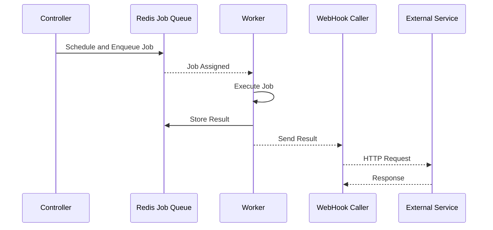

# Webhooks

NetPulse 支持通过网络钩子（Webhooks）将任务执行结果通知到外部系统，从而无缝集成监控系统、自动化工作流或任何支持 HTTP 的服务。

## 调用流程

任务执行和 Webhook 调用的流程如下：



## Webhook 配置

### 基本配置

```json
{
  "name": "basic",
  "url": "http://monitor.example.com/callback",
  "method": "POST",
  "headers": {
    "Content-Type": "application/json",
    "Authorization": "Bearer your-token"
  }
}
```

### 配置选项

| 字段     | 类型    | 描述                         | 默认值 |
|----------|---------|-------------------------------------|---------|
| name     | string  | WebHook 调用类型 ("basic")       | "basic" |
| url      | string  | Webhook 端点 URL                | 必填    |
| method   | string  | HTTP 方法 (GET/POST/PUT/DELETE)   | "POST"  |
| headers  | object  | 自定义 HTTP 头                 | null    |
| cookies  | object  | 自定义 cookies                  | null    |
| auth     | array   | 基本认证 [用户名, 密码]     | null    |
| timeout  | number  | 请求超时时间（秒）          | 5.0     |

## 示例

1. 请求时设置 Webhook
   
    使用 `webhook` 字段在任务请求中附加 Webhook 配置：

    ```json
    {
      "driver": "netmiko",
      "connection_args": {
        "device_type": "cisco_ios",
        "host": "192.168.1.1",
        "username": "admin",
        "password": "pwd123"
      },
      "command": "show version",
      "webhook": {
        "name": "basic",
        "url": "http://monitor.example.com/callback",
        "method": "POST",
        "headers": {
          "Content-Type": "application/json"
        },
        "timeout": 5.0
      }
    }
    ```

2. 在外部服务中处理 Webhook 消息

    默认的 Basic Webhook 会将任务执行结果发送到指定的 URL。以下是一个示例回调：

    ```json
    {
      "id": "job-uuid-here",
      "result": {
        "type": 1,
        "retval": "Interface GigabitEthernet1/0/1",
        "error": null
      }
    }
    ```

## 注意事项

1. **超时限制**
    - 最小值：0.5 秒
    - 最大值：120.0 秒
    - 默认值：5.0 秒

2. **HTTP 方法**
    - 支持：GET, POST, PUT, DELETE, PATCH
    - 默认：POST

3. **错误处理**
    - 请求失败时会输出日志，但不会影响任务执行结果
    - 请求失败时不会重试

## 自定义 Webhook 开发

NetPulse 内置的 Basic Webhook 可以满足大部分需求，但如果需要更复杂的逻辑，可以通过实现 `BaseWebHookCaller` 类来创建自定义 Webhook。

1. 在 `netpulse/plugins/webhooks/` 中创建新目录
2. 继承 `BaseWebHookCaller` 类并实现所需方法
  ```python
  class CustomWebHookCaller:
    webhook_name: str = "custom"

    def call(self, req: Any, job: rq.job.Job, result: Any, **kwargs):
    # ...

    # 具体方法请参考 BaseWebHookCaller 类
  ```
3. 在 `__init__.py` 中注册 Webhook
  ```python
  __all__ = [CustomWebHookCaller]
  ```

关于插件系统的详细介绍，请参考[插件开发指南](./plugins.md)。