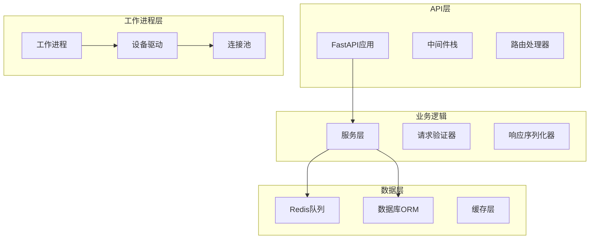

# 开发指南

欢迎来到 NetPulse 开发指南！本部分文档将帮助您了解如何参与 NetPulse 项目的开发工作。

## 开发环境设置

### 系统要求

- Python 3.12+
- Redis 6.0+
- Git

### 本地开发环境

1. **克隆项目**
```bash
git clone https://github.com/your-org/netpulse.git
cd netpulse
```

2. **创建虚拟环境**
```bash
python -m venv .venv
source .venv/bin/activate  # Linux/macOS
# 或
.venv\Scripts\activate  # Windows
```

3. **安装依赖**
```bash
pip install -e .[dev]
```

4. **启动 Redis**
```bash
docker run -d -p 6379:6379 redis:7-alpine
```

5. **运行测试**
```bash
pytest tests/
```

## 项目结构

```
netpulse/
├── netpulse/                 # 核心代码
│   ├── cli/                 # CLI 工具
│   ├── models/              # 数据模型
│   ├── plugins/             # 插件系统
│   │   ├── drivers/         # 设备驱动
│   │   ├── parsers/         # 解析器
│   │   └── renderers/       # 渲染器
│   ├── routes/              # API 路由
│   ├── services/            # 业务逻辑
│   └── utils/               # 工具函数
├── tests/                   # 测试代码
├── docs/                    # 文档
├── scripts/                 # 脚本工具
└── config/                  # 配置文件
```

## 开发工作流

### 1. 创建功能分支
```bash
git checkout -b feature/your-feature-name
```

### 2. 编写代码
- 遵循 PEP 8 代码风格
- 添加适当的注释和文档字符串
- 编写单元测试

### 3. 运行测试
```bash
pytest tests/ -v
```

### 4. 代码格式化
```bash
black netpulse/
ruff check netpulse/
```

### 5. 提交代码
```bash
git add .
git commit -m "feat: add new feature"
```

### 6. 创建 Pull Request

## 贡献指南

### 代码规范

- 使用 Python 类型注解
- 遵循 PEP 8 代码风格
- 使用 Black 进行代码格式化
- 使用 Ruff 进行代码检查

### 提交信息规范

使用 [Conventional Commits](https://www.conventionalcommits.org/) 格式：

```
<type>[optional scope]: <description>

[optional body]

[optional footer(s)]
```

类型包括：
- `feat`: 新功能
- `fix`: 修复 bug
- `docs`: 文档更新
- `style`: 代码格式调整
- `refactor`: 代码重构
- `test`: 测试相关
- `chore`: 构建过程或辅助工具的变动

### 测试要求

- 新功能必须包含单元测试
- 测试覆盖率不低于 80%
- 所有测试必须通过

## 插件开发

NetPulse 采用插件化架构，支持自定义驱动、解析器和渲染器。

### 驱动插件

驱动插件用于连接不同类型的网络设备。

### 解析器插件

解析器插件用于解析命令输出。

### 渲染器插件

渲染器插件用于渲染配置模板。

## 调试技巧

### 日志配置

```python
import logging
logging.basicConfig(level=logging.DEBUG)
```

### 使用调试器

```python
import pdb; pdb.set_trace()
```

### 性能分析

```bash
python -m cProfile -o profile.stats your_script.py
python -c "import pstats; pstats.Stats('profile.stats').sort_stats('cumulative').print_stats(10)"
```

## 常见问题

### Q: 如何添加新的设备驱动？

A: 参考现有的驱动实现，在 `netpulse/plugins/drivers/` 目录下创建新的驱动模块。

### Q: 如何调试 API 请求？

A: 使用 FastAPI 的自动文档功能，访问 `http://localhost:9000/docs`。

### Q: 如何测试批量操作？

A: 使用提供的测试设备文件，或创建自己的测试环境。

## 获取帮助

- 查看 [GitHub Issues](https://github.com/your-org/netpulse/issues)
- 阅读 [API 参考](../guides/api.md)
- 参考 [最佳实践](../reference/best-practices.md)

## 开发主题

### 核心开发
- 贡献指南 - 如何参与 NetPulse 开发
- 环境配置 - 设置开发环境
- 测试指南 - 编写和运行测试
- 代码规范 - 编码标准和约定

### 扩展开发
- 插件系统 - 创建自定义插件
- 驱动系统 - 实现新的设备驱动
- 模板系统 - 创建自定义模板
- Webhook系统 - 构建 Webhook 集成

### 高级主题
- API 指南 - 扩展 REST API
- 工作进程 - 自定义工作进程实现
- 数据库指南 - 数据库结构和迁移
- 性能指南 - 性能分析和优化

## 开发者架构

### 核心组件


### 开发原则
1. **模块化**: 保持组件松耦合
2. **可测试性**: 编写可测试的代码，保持良好的覆盖率
3. **文档**: 为所有公共API编写文档
4. **性能**: 考虑性能影响
5. **安全**: 遵循安全最佳实践

## 开发资源
- [API 文档](../guides/api.md)
- [架构概览](../architecture/overview.md)
- [最佳实践](../reference/best-practices.md)
- [日志分析](../troubleshooting/log-analysis.md)

## 社区

### 获取帮助
- **GitHub Issues**: 报告问题和请求功能
- **讨论**: 提问和分享想法
- **Discord/Slack**: 实时社区聊天
- **文档**: 全面的指南和参考

### 贡献
我们欢迎来自社区的贡献！无论是修复bug、添加功能、改进文档，还是帮助测试，您的贡献都是宝贵的。

---

从菜单中选择一个主题，深入了解 NetPulse 开发！ 