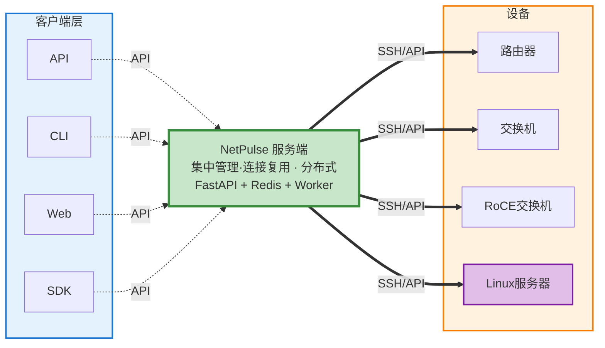

# NetPulse 文档

NetPulse 是一个网络设备管理的 RESTful API 服务器，提供统一的多厂商网络设备管理接口。


## 什么是 NetPulse？

NetPulse 作为客户端和网络设备之间的中间层代理，提供统一的网络设备管理服务：



NetPulse 是一个**服务端网络自动化控制器**，通过 RESTful API 提供统一的网络设备管理接口。与传统的客户端工具（如 Netmiko、NAPALM）不同，NetPulse 采用服务端架构，集中部署在服务器上，客户端只需通过 HTTP 请求即可完成设备操作。

### 为什么选择服务端模式？

传统客户端工具需要在每台机器上安装，每个程序都要自己处理并发调度、连接管理、任务队列等复杂问题。而服务端模式将这些复杂性集中在服务端解决：

- **简化客户端**：客户端无需处理并发调度、连接复用、任务队列等逻辑，只需调用 API
- **集中管理**：统一管理所有网络设备，资源共享，无需在每个客户端安装工具
- **高可用性**：通过分布式架构实现高可用，单点故障不影响服务
- **易于集成**：通过标准 RESTful API 轻松集成到现有系统

!!! info "关于类似框架"
    在设计过程中，我们借鉴了 [NetPalm](https://github.com/tbotnz/netpalm) 的框架设计思路，体现了开源精神的共享与学习。两者在**产品层面**都使用了相同的开源组件（如 Netmiko、NAPALM、Redis + RQ），但在**设计和实现**上有很大不同，特别是在长连接管理、调度算法、Worker 架构等核心组件上进行了独立的设计和开发。

## 主要特性

- **RESTful API** - 统一的异步API接口，支持多厂商网络设备
- **持久化连接** - 通过SSH长连接技术提升操作效率
- **分布式架构** - 支持多节点部署和水平扩展
- **多驱动支持** - Netmiko、NAPALM、PyEAPI、Paramiko等多种驱动
- **模板支持** - 支持Jinja2、TextFSM、TTP模板引擎
- **批量操作** - 支持大规模设备管理和配置

## 快速开始

```bash
git clone https://github.com/scitix/netpulse.git
cd netpulse
bash ./scripts/docker_auto_deploy.sh
```

!!! tip "前置要求"
    - Docker 20.10+ 和 Docker Compose 2.0+
    - 至少 2GB 可用内存
    - 端口 9000 未被占用

详细部署说明请查看 [快速开始](getting-started/quick-start.md)。

## 新手学习路径

如果您是第一次使用 NetPulse，建议按以下顺序阅读文档：

1. **[快速开始](getting-started/quick-start.md)** - 5分钟快速上手，体验基本功能
2. **[基础概念](getting-started/basic-concepts.md)** - 理解核心概念（驱动、队列、任务等）
3. **[驱动选择](drivers/index.md)** - 了解如何选择合适的驱动
4. **[API概览](api/api-overview.md)** - 了解所有API接口
5. **深入使用** - 根据需要阅读架构文档和参考手册

## 文档导航

### 快速开始
- [快速开始](getting-started/quick-start.md) - 快速上手
- [基础概念](getting-started/basic-concepts.md) - 核心概念
- [部署指南](getting-started/deployment-guide.md) - 部署说明

### API 参考
- [API概览](api/api-overview.md) - API 接口说明
- [设备操作 API](api/device-api.md) - 设备操作接口
- [API示例](api/api-examples.md) - 使用示例
- [驱动选择](drivers/index.md) - 驱动选择

### 技术架构
- [架构概览](architecture/architecture-overview.md) - 系统架构
- [任务调度器](architecture/scheduler-system.md) - 调度算法
- [插件系统](architecture/plugin-system.md) - 插件机制

### 参考手册
- [配置指南](reference/configuration-guide.md) - 配置说明
- [环境变量](reference/environment-variables.md) - 环境变量
- [错误代码](reference/error-codes.md) - 错误说明
- [性能调优](reference/performance-tuning.md) - 性能建议
- [术语表](reference/glossary.md) - 术语定义
- [故障排查](reference/troubleshooting.md) - 问题排查
- [开发指南](reference/development-guide.md) - 开发环境

## 常见问题快速解答

**Q: 设备操作是同步还是异步？**  
A: 设备操作（`/device/exec`、`/device/bulk`）是异步的，需要查询任务状态获取结果。只有 `/device/test` 是同步的。

**Q: 如何选择合适的驱动？**  
A: Linux服务器用Paramiko，Arista设备用PyEAPI，需要配置回滚用NAPALM，其他场景用Netmiko（推荐）。

**Q: 什么时候用FIFO队列，什么时候用Pinned队列？**  
A: 系统会根据驱动自动选择。Netmiko/NAPALM默认用Pinned（连接复用），PyEAPI/Paramiko默认用FIFO。通常无需手动指定。

**Q: 如何获取命令执行结果？**  
A: 提交任务后获得任务ID，然后通过 `/job?id=xxx` 接口查询结果。

## 获取帮助

- **文档问题**: 查看 [故障排查](reference/troubleshooting.md)
- **技术问题**: 提交 [GitHub Issue](https://github.com/scitix/netpulse/issues)
- **贡献文档**: 欢迎提交 Pull Request

---
